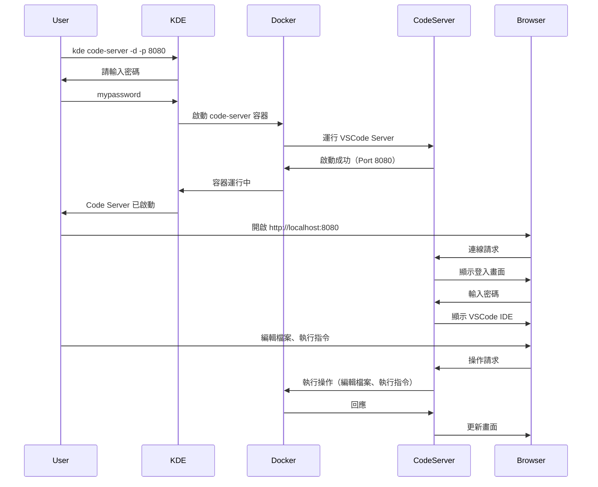

# Code Server

**透過 Web 瀏覽器使用 VSCode 進行開發，提供完整的 IDE 功能**

## 核心概念

### 什麼是 Code Server？

Code Server 是一個在瀏覽器中運行的 VSCode 開發環境。它讓您可以在任何地方透過 Web 瀏覽器存取完整的 VSCode IDE，無需在本地安裝任何開發工具。

### 主要特點

- **Web Based IDE**：透過瀏覽器存取完整的 VSCode 功能
- **跨平台存取**：可以從任何裝置（PC、Mac、iPad、甚至手機）存取開發環境
- **環境一致性**：所有開發都在容器內進行，確保環境一致
- **Docker 整合**：自動掛載 Docker socket，可以在 Code Server 內使用 Docker
- **專案整合**：自動掛載 KDE workspace，可以直接編輯所有專案
- **配置持久化**：設定和擴充功能儲存在本地，重啟後保留

### 使用場景

| 場景 | 說明 | 優點 |
|------|------|------|
| **遠端開發** | 從任何地方存取開發環境 | 不受本地硬體限制 |
| **團隊協作** | 共享開發環境給團隊成員 | 環境一致性、快速 onboarding |
| **輕量級裝置** | 在 iPad 或低規格電腦上開發 | 運算在伺服器端 |
| **多環境切換** | 快速在不同專案間切換 | 獨立的容器環境 |
| **臨時開發** | 快速啟動臨時開發環境 | 用完即刪、不污染本地 |

## 使用說明

### 基本指令語法

```bash
kde code-server [options]
```

### 選項說明

| 選項 | 簡寫 | 說明 | 預設值 |
|------|------|------|--------|
| `--help` | `-h` | 顯示說明 | - |
| `--daemon` | `-d` | 在背景執行 | false（前景執行） |
| `--port` | `-p` | 指定 code-server 的 port | 8080 |

### 基本使用方式

#### 1. 前景執行（預設）

```bash
# 啟動 code-server（前景執行，預設端口 8080）
kde code-server
# 輸入密碼
# 在瀏覽器存取 http://localhost:8080

# 指定端口
kde code-server -p 3000
# 在瀏覽器存取 http://localhost:3000
```

**特點**：
- 在終端機前景執行
- 可以直接看到日誌輸出
- 按 Ctrl+C 即可停止
- 適合臨時使用或除錯

#### 2. 背景執行

```bash
# 在背景執行 code-server
kde code-server -d
# 輸入密碼
# 在瀏覽器存取 http://localhost:8080

# 指定端口並在背景執行
kde code-server -d -p 3000
# 在瀏覽器存取 http://localhost:3000
```

**特點**：
- 在背景執行，不佔用終端機
- 適合長期使用
- 需要手動停止容器

#### 3. 停止 Code Server

```bash
# 停止 code-server 容器
docker stop code-server

# 查看運行狀態
docker ps | grep code-server

# 查看日誌
docker logs code-server
```

## 使用範例

### 範例 1：快速啟動開發環境

```bash
# 1. 啟動 code-server（前景執行）
kde code-server
# 輸入密碼：mypassword

# 2. 在瀏覽器中開啟
# http://localhost:8080

# 3. 輸入密碼登入

# 4. 開始開發
# - 左側檔案瀏覽器會顯示 KDE workspace 的所有檔案
# - 可以編輯所有專案
# - 可以使用終端機執行指令

# 5. 停止（按 Ctrl+C）
```

### 範例 2：長期背景運行

```bash
# 1. 在背景啟動 code-server
kde code-server -d
# 輸入密碼：mypassword

# 2. 在瀏覽器中開啟（可以隨時存取）
# http://localhost:8080

# 3. 開發完成後停止
docker stop code-server
docker rm code-server
```

### 範例 3：多端口管理

```bash
# 終端機 1：專案 A 的開發環境
kde code-server -d -p 8080
# 存取：http://localhost:8080

# 終端機 2：專案 B 的開發環境
kde code-server -d -p 8081
# 存取：http://localhost:8081

# 注意：需要使用不同的容器名稱，或先停止前一個
```

### 範例 4：與 KDE 專案整合

```bash
# 1. 建立 KDE 環境和專案
kde start dev-env kind
kde proj create myapp
kde proj pipeline myapp

# 2. 啟動 code-server
kde code-server -d

# 3. 在瀏覽器中開啟 code-server
# http://localhost:8080

# 4. 在 code-server 中：
# - 開啟 environments/dev-env/namespaces/myapp/
# - 編輯 build.sh, deploy.sh, project.env
# - 編輯應用程式碼

# 5. 在 code-server 的終端機中執行
kde proj pipeline myapp
kde proj tail myapp
```

### 範例 5：在 Code Server 內使用 Docker

```bash
# 1. 啟動 code-server
kde code-server

# 2. 在 code-server 的終端機中
# 可以直接使用 Docker 指令（Docker socket 已掛載）

# 查看容器
docker ps

# 建置映像
docker build -t myapp:latest .

# 運行容器
docker run -p 3000:3000 myapp:latest

# 載入映像到 K8s
kde load-image myapp:latest
```

### 範例 6：配置 VSCode 擴充功能

```bash
# 1. 啟動 code-server
kde code-server -d

# 2. 在瀏覽器中開啟並安裝擴充功能
# http://localhost:8080

# 3. 安裝常用擴充功能：
# - GitLens
# - Docker
# - Kubernetes
# - ESLint
# - Prettier
# - Python
# - Go

# 4. 擴充功能會儲存在 ${KDE_PATH}/.code-server/
# 下次啟動時會自動載入
```

### 範例 7：遠端存取（結合 Cloudflare Tunnel）

```bash
# 1. 啟動 code-server（背景執行）
kde code-server -d
# 輸入密碼：mypassword

# 2. 建立 Cloudflare Tunnel
kde cloudflare-tunnel url -d code.myapp.com -u http://localhost:8080

# 3. 在任何地方透過瀏覽器存取
# https://code.myapp.com
# 輸入密碼登入

# 4. 可以在 iPad、手機、其他電腦上開發
```

### 範例 8：團隊協作開發

```bash
# 管理員設定

# 1. 啟動 code-server
kde code-server -d -p 8080
# 輸入密碼：team-password-123

# 2. 建立外部存取
kde cloudflare-tunnel url -d dev.team.com -u http://localhost:8080

# 3. 分享給團隊成員
# URL: https://dev.team.com
# 密碼：team-password-123

# 團隊成員可以：
# - 透過瀏覽器存取相同的開發環境
# - 編輯程式碼、執行指令
# - 查看即時變更
```

## 運作原理

### 架構圖

```
┌─────────────────────────────────────────────────────────────┐
│                        瀏覽器                                 │
│                  http://localhost:8080                       │
│                  (輸入密碼登入)                               │
└────────────────────────┬────────────────────────────────────┘
                         │
┌────────────────────────┼────────────────────────────────────┐
│                  本地開發機器                                 │
│                         │                                    │
│  ┌──────────────────────▼──────────────────────────────┐   │
│  │          Code Server Container                      │   │
│  │  ┌─────────────────────────────────────────────┐   │   │
│  │  │  VSCode Server (Port 8080)                  │   │   │
│  │  │  - 完整的 VSCode IDE                         │   │   │
│  │  │  - 終端機                                     │   │   │
│  │  │  - 擴充功能                                   │   │   │
│  │  │  - Git 整合                                   │   │   │
│  │  └─────────────────────────────────────────────┘   │   │
│  │                                                     │   │
│  │  Volume 掛載：                                       │   │
│  │  - ${KDE_PATH} → 工作目錄（可編輯所有專案）          │   │
│  │  - ${KDE_PATH}/.code-server → VSCode 配置           │   │
│  │  - /var/run/docker.sock → Docker 整合（唯讀）       │   │
│  └─────────────────────────────────────────────────────┘   │
│                         │                                    │
│  ┌──────────────────────▼──────────────────────────────┐   │
│  │              KDE Workspace                          │   │
│  │  ├── kde.env                                        │   │
│  │  ├── environments/                                  │   │
│  │  │   └── dev-env/                                   │   │
│  │  │       └── namespaces/                            │   │
│  │  │           ├── project1/                          │   │
│  │  │           └── project2/                          │   │
│  │  └── .code-server/  (VSCode 配置和擴充功能)          │   │
│  └─────────────────────────────────────────────────────┘   │
└─────────────────────────────────────────────────────────────┘
```

### 啟動流程



### 容器配置

Code Server 容器包含以下配置：

```bash
# 容器設定
--name code-server                    # 容器名稱
--workdir ${KDE_PATH}                 # 工作目錄（KDE workspace）
-p ${PORT}:8080                       # 端口對應（預設 8080）
-e "PASSWORD=${PASSWORD}"             # 登入密碼

# Volume 掛載
-v "${KDE_PATH}/.code-server:/home/coder"           # VSCode 配置目錄
-v "${KDE_PATH}:${KDE_PATH}"                        # KDE workspace（可編輯所有專案）
-v /var/run/docker.sock:/var/run/docker.sock:ro    # Docker socket（唯讀）

# 使用者權限
-u "$(id -u):$(id -g)"                # 使用當前使用者的 UID/GID
--group-add $(stat -c '%g' /var/run/docker.sock)  # Docker 群組
-e "DOCKER_USER=$USER"                # Docker 使用者名稱
```

## 配置與管理

### 配置檔案位置

Code Server 的配置和擴充功能儲存在：

```
${KDE_PATH}/.code-server/
├── data/                    # VSCode 資料
│   ├── User/                # 使用者設定
│   │   ├── settings.json    # VSCode 設定
│   │   ├── keybindings.json # 快捷鍵設定
│   │   └── snippets/        # 程式碼片段
│   └── extensions/          # 擴充功能
└── .config/                 # Code Server 配置
```

### 持久化配置

所有的設定和擴充功能都會自動儲存，重新啟動後會保留：

```bash
# 1. 首次啟動並安裝擴充功能
kde code-server -d
# 在瀏覽器中安裝擴充功能、修改設定

# 2. 停止容器
docker stop code-server

# 3. 重新啟動
kde code-server -d
# 所有設定和擴充功能都會保留
```

### 清理配置

```bash
# 刪除所有 Code Server 配置（擴充功能、設定）
rm -rf ${KDE_PATH}/.code-server

# 下次啟動時會是全新的環境
kde code-server
```

### 備份配置

```bash
# 備份 Code Server 配置
tar -czf code-server-backup.tar.gz ${KDE_PATH}/.code-server

# 恢復配置
tar -xzf code-server-backup.tar.gz -C ${KDE_PATH}/
```

## 與其他功能整合

### 與專案管理整合

```bash
# 1. 啟動 code-server
kde code-server -d

# 2. 在 code-server 的終端機中執行 KDE 指令

# 建立專案
kde proj create myapp

# 編輯腳本
# 在 code-server 中開啟：
# environments/dev-env/namespaces/myapp/build.sh
# environments/dev-env/namespaces/myapp/deploy.sh

# 執行 Pipeline
kde proj pipeline myapp

# 查看日誌
kde proj tail myapp

# 進入開發容器
kde proj exec myapp develop
```

### 與環境管理整合

```bash
# 在 code-server 的終端機中管理環境

# 建立環境
kde start dev-env kind

# 切換環境
kde use dev-env

# 查看狀態
kde status

# 啟動監控工具
kde k9s
kde headlamp
```

### 與 Git 整合

```bash
# 在 code-server 中使用 Git

# 1. Code Server 自動整合 Git
# 左側會顯示 Git 變更

# 2. 在終端機中使用 Git 指令
git status
git add .
git commit -m "Update code"
git push

# 3. 或使用 VSCode 的 Git UI
# 左側的 Source Control 面板
```

### 與外部存取工具整合

```bash
# 結合 Cloudflare Tunnel 實現遠端開發

# 終端機 1：啟動 code-server
kde code-server -d

# 終端機 2：建立 Cloudflare Tunnel
kde cloudflare-tunnel url -d code.myapp.com -u http://localhost:8080

# 在任何地方存取：https://code.myapp.com

# 或使用 Ngrok（快速測試）
kde ngrok http://localhost:8080
```

## 故障排除

### 常見問題

#### 1. 無法啟動 Code Server

**症狀**：執行指令後容器無法啟動

**解決方法**：
```bash
# 檢查端口是否被佔用
netstat -tuln | grep 8080
lsof -i :8080

# 使用不同的端口
kde code-server -p 8081

# 檢查 Docker 狀態
docker ps -a | grep code-server

# 查看容器日誌
docker logs code-server

# 移除舊容器
docker rm -f code-server
```

#### 2. 密碼無法登入

**症狀**：輸入密碼後無法登入

**可能原因**：
- 密碼輸入錯誤
- 密碼包含特殊字元導致問題

**解決方法**：
```bash
# 停止容器
docker stop code-server
docker rm code-server

# 使用簡單密碼重新啟動
kde code-server
# 輸入簡單密碼（例如：password123）

# 或查看容器環境變數確認密碼
docker inspect code-server | grep PASSWORD
```

#### 3. 無法存取 Docker

**症狀**：在 code-server 中無法使用 Docker 指令

**解決方法**：
```bash
# 檢查 Docker socket 是否正確掛載
docker inspect code-server | grep docker.sock

# 檢查 Docker socket 權限
ls -la /var/run/docker.sock

# 重新啟動 code-server
docker stop code-server
docker rm code-server
kde code-server -d
```

#### 4. 擴充功能無法安裝

**症狀**：在 code-server 中無法安裝 VSCode 擴充功能

**解決方法**：
```bash
# 檢查 .code-server 目錄權限
ls -la ${KDE_PATH}/.code-server

# 修正權限
sudo chown -R $USER:$USER ${KDE_PATH}/.code-server

# 重新啟動 code-server
docker restart code-server
```

#### 5. 檔案修改無法儲存

**症狀**：在 code-server 中編輯檔案後無法儲存

**解決方法**：
```bash
# 檢查檔案權限
ls -la ${KDE_PATH}

# 確認容器使用者 ID
docker exec code-server id

# 修正權限（如果需要）
sudo chown -R $USER:$USER ${KDE_PATH}

# 重新啟動 code-server
docker restart code-server
```

#### 6. 背景運行的容器無法停止

**症狀**：使用 `-d` 啟動後，容器持續運行

**解決方法**：
```bash
# 查看運行中的 code-server 容器
docker ps | grep code-server

# 停止容器
docker stop code-server

# 強制停止（如果上述方法無效）
docker kill code-server

# 移除容器
docker rm code-server

# 或一次性停止並移除
docker rm -f code-server
```

### 除錯指令

```bash
# 查看容器狀態
docker ps -a | grep code-server

# 查看容器日誌
docker logs code-server
docker logs -f code-server  # 持續查看

# 進入容器除錯
docker exec -it code-server /bin/bash

# 檢查掛載的 Volume
docker inspect code-server | grep -A 20 Mounts

# 檢查端口對應
docker port code-server

# 檢查容器資源使用
docker stats code-server

# 測試網路連線
curl http://localhost:8080
```

## Best Practice

### 1. 密碼管理

- **開發環境**：使用簡單易記的密碼（如：`dev123`）
- **團隊協作**：使用共享的強密碼
- **對外開放**：使用強密碼並結合 HTTPS（Cloudflare Tunnel）
- **定期更換**：定期更換密碼以確保安全

### 2. 端口管理

- **預設端口**：使用 8080（避免衝突）
- **多實例**：需要同時運行多個 code-server 時使用不同端口
- **防火牆**：確保端口不對外開放（除非使用 Cloudflare Tunnel 等工具）

### 3. 配置管理

```bash
# 定期備份配置
tar -czf code-server-backup-$(date +%Y%m%d).tar.gz ${KDE_PATH}/.code-server

# 版控排除（加入 .gitignore）
echo ".code-server/" >> .gitignore

# 團隊共享配置（選擇性）
# 可以將 settings.json 加入版控供團隊使用
```

### 4. 效能優化

- **關閉不需要的擴充功能**：減少資源消耗
- **定期清理**：刪除不使用的擴充功能和設定
- **使用背景模式**：長期使用時在背景運行
- **監控資源**：使用 `docker stats` 監控容器資源使用

### 5. 安全性考量

- **不要使用弱密碼**：特別是對外開放時
- **限制存取**：使用防火牆限制存取來源
- **使用 HTTPS**：對外開放時使用 Cloudflare Tunnel
- **定期更新**：更新 Code Server 映像到最新版本
- **Docker Socket 權限**：預設為唯讀，避免潛在風險

### 6. 開發工作流程

```bash
# 推薦的工作流程

# 1. 啟動 Code Server（背景執行）
kde code-server -d

# 2. 在瀏覽器中開啟
# http://localhost:8080

# 3. 安裝必要的擴充功能（首次使用）
# - GitLens
# - Docker
# - Kubernetes
# - 語言相關擴充功能

# 4. 開發工作
# - 在 code-server 中編輯程式碼
# - 使用終端機執行 KDE 指令
# - 使用 Git 管理版本

# 5. 工作結束後停止（可選）
docker stop code-server
```

### 7. 團隊協作最佳實踐

```bash
# 1. 建立共享開發環境
kde code-server -d -p 8080

# 2. 設定共享密碼
# 輸入：team-dev-password

# 3. 建立安全的外部存取
kde cloudflare-tunnel url -d dev.team.com -u http://localhost:8080

# 4. 分享給團隊
# URL: https://dev.team.com
# 密碼：team-dev-password

# 5. 團隊成員協作
# - 同時編輯不同檔案
# - 共享終端機輸出
# - 即時查看變更
```

## 進階使用

### 自訂 Code Server 映像

如果需要額外的工具或配置，可以建立自訂映像：

```dockerfile
# Dockerfile.code-server
FROM r82wei/kde-code-server:latest

# 安裝額外的工具
RUN apt-get update && apt-get install -y \
    python3-pip \
    nodejs \
    npm \
    && rm -rf /var/lib/apt/lists/*

# 預裝 VSCode 擴充功能
RUN code-server --install-extension ms-python.python
RUN code-server --install-extension golang.go

# 自訂設定
COPY settings.json /home/coder/.local/share/code-server/User/settings.json
```

建置並使用：

```bash
# 建置自訂映像
docker build -t my-code-server:latest -f Dockerfile.code-server .

# 更新 kde.env
echo "CODE_SERVER_IMAGE=my-code-server:latest" >> kde.env

# 啟動
kde code-server
```

### 批次安裝擴充功能

```bash
# 建立擴充功能安裝腳本
cat > install-extensions.sh <<'EOF'
#!/bin/bash

# 進入 code-server 容器
docker exec code-server bash -c "
code-server --install-extension ms-python.python
code-server --install-extension golang.go
code-server --install-extension ms-azuretools.vscode-docker
code-server --install-extension ms-kubernetes-tools.vscode-kubernetes-tools
code-server --install-extension eamodio.gitlens
code-server --install-extension esbenp.prettier-vscode
code-server --install-extension dbaeumer.vscode-eslint
"
EOF

chmod +x install-extensions.sh
./install-extensions.sh
```

### 多使用者環境

```bash
# 為不同使用者建立獨立的 code-server 實例

# 使用者 1
kde code-server -d -p 8080
# 配置儲存在：${KDE_PATH}/.code-server

# 使用者 2（需要先停止 code-server 或使用不同容器名稱）
# 手動啟動並指定不同的配置目錄
docker run -it -d \
    --name code-server-user2 \
    -p 8081:8080 \
    -e "PASSWORD=user2password" \
    -v "${KDE_PATH}/.code-server-user2:/home/coder" \
    -v "${KDE_PATH}:${KDE_PATH}" \
    ${CODE_SERVER_IMAGE} \
    ${KDE_PATH}
```

## 與本地 VSCode 比較

| 特性 | Code Server | 本地 VSCode |
|------|-------------|-------------|
| **存取方式** | 瀏覽器 | 本地應用程式 |
| **跨平台** | 任何裝置（包含 iPad） | 需要安裝 |
| **環境一致性** | 容器內，完全一致 | 依賴本地環境 |
| **資源消耗** | 伺服器端 | 本地端 |
| **遠端開發** | 原生支援 | 需要 Remote SSH |
| **效能** | 取決於網路和伺服器 | 本地效能最佳 |
| **擴充功能** | 大部分相容 | 完全支援 |
| **團隊協作** | 可共享環境 | 個別安裝 |

### 使用建議

- **使用 Code Server**：
  - 需要遠端存取
  - 團隊協作開發
  - 使用輕量級裝置（iPad、Chromebook）
  - 需要快速切換環境

- **使用本地 VSCode**：
  - 主要在本地開發
  - 需要最佳效能
  - 使用特殊擴充功能
  - 網路不穩定的環境

---

**相關文檔**：
- **[KDE-cli 概述](../overview.md)** - 完整的工具生態系統
- **[專案管理文檔](../project.md)** - 專案開發和管理
- **[開發容器文檔](../environment/dev-container.md)** - 開發容器環境
- **[Cloudflare Tunnel 文檔](./cloudflare-tunnel.md)** - 安全的外部存取
- **[Ngrok 文檔](./ngrok.md)** - 快速外部存取
