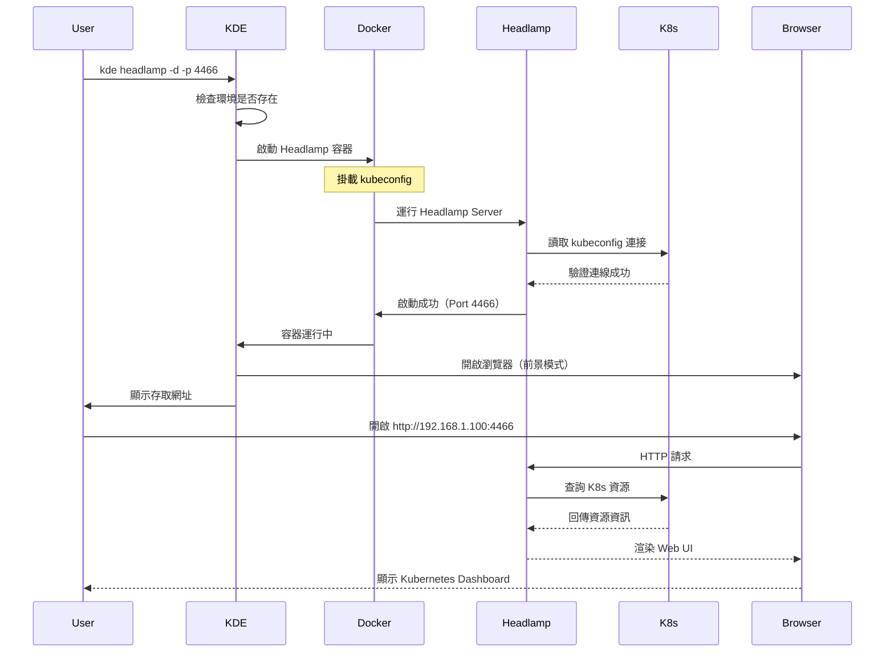

# Headlamp

**透過 Web UI 管理和監控 Kubernetes 環境，提供現代化的圖形化介面**

## 核心概念

### 什麼是 Headlamp？

Headlamp 是一個易於使用的 Kubernetes Web UI，提供現代化的圖形化介面來管理和監控 Kubernetes 資源。它是 Kubernetes Dashboard 的現代化替代方案，具有更好的使用者體驗和更豐富的功能。

### 主要特點

- **現代化 UI**：清晰直觀的介面設計，易於使用
- **即時監控**：即時查看 Pod、Deployment、Service 等資源狀態
- **資源管理**：建立、編輯、刪除 Kubernetes 資源
- **日誌查看**：直接在 Web UI 中查看 Pod 日誌
- **終端機存取**：在瀏覽器中直接進入 Pod Shell
- **多叢集支援**：可以管理多個 Kubernetes 叢集
- **自動整合**：自動連接到當前 KDE 環境的 kubeconfig
- **無需認證**：在本地開發環境中無需複雜的認證設定

### 與 K9s 和 Kubernetes Dashboard 比較

| 特性 | Headlamp | K9s | Kubernetes Dashboard |
|------|----------|-----|---------------------|
| **介面類型** | Web UI | 終端機 TUI | Web UI |
| **學習曲線** | 低（圖形化） | 中（需記快捷鍵） | 中 |
| **效能** | 良好 | 優秀 | 良好 |
| **資源監控** | ✅ 即時圖表 | ✅ 即時更新 | ✅ 基本監控 |
| **日誌查看** | ✅ | ✅ | ✅ |
| **終端機存取** | ✅ | ✅ | ✅ |
| **資源編輯** | ✅ YAML 編輯器 | ✅ | ✅ |
| **跨平台** | ✅ 任何瀏覽器 | 需要終端機 | ✅ 任何瀏覽器 |
| **適用場景** | 團隊協作、新手 | 進階使用者、快速操作 | 基本管理 |

## 使用說明

### 基本指令語法

```bash
kde headlamp [options]
```

### 選項說明

| 選項 | 簡寫 | 說明 | 預設值 |
|------|------|------|--------|
| `--help` | `-h` | 顯示說明 | - |
| `--port` | `-p` | 指定 Headlamp 的 port | 4466 |
| `-d` | | 在背景執行 | false（前景執行） |

### 基本使用方式

#### 1. 前景執行（預設）

```bash
# 啟動 Headlamp（前景執行，預設端口 4466）
kde headlamp
# 自動開啟瀏覽器 http://<本機IP>:4466

# 指定端口
kde headlamp -p 8080
# 存取 http://<本機IP>:8080
```

**特點**：
- 在終端機前景執行
- 自動開啟瀏覽器
- 可以直接看到日誌輸出
- 按 Ctrl+C 即可停止
- 適合臨時使用或除錯

#### 2. 背景執行

```bash
# 在背景執行 Headlamp
kde headlamp -d
# 輸出：
# ✓ Headlamp 已在背景啟動
# 存取網址: http://192.168.1.100:4466
# 停止服務: docker stop headlamp-dev-env

# 指定端口並在背景執行
kde headlamp -p 8080 -d
# 存取 http://<本機IP>:8080
```

**特點**：
- 在背景執行，不佔用終端機
- 適合長期使用
- 需要手動停止容器

#### 3. 停止 Headlamp

```bash
# 停止 Headlamp 容器
docker stop headlamp-<env_name>

# 例如：停止 dev-env 環境的 Headlamp
docker stop headlamp-dev-env

# 查看運行狀態
docker ps | grep headlamp

# 查看日誌
docker logs headlamp-<env_name>
```

## 使用範例

### 範例 1：快速監控 Kubernetes 環境

```bash
# 1. 啟動 Kubernetes 環境
kde start dev-env kind

# 2. 部署應用
kde proj create myapp
kde proj pipeline myapp

# 3. 啟動 Headlamp（前景執行，自動開啟瀏覽器）
kde headlamp

# 4. 在 Headlamp Web UI 中：
# - 查看 Pods 狀態
# - 查看 Deployments
# - 查看 Services
# - 查看日誌
# - 監控資源使用

# 5. 停止（按 Ctrl+C）
```

### 範例 2：長期背景運行

```bash
# 1. 啟動環境
kde start dev-env kind

# 2. 在背景啟動 Headlamp
kde headlamp -d

# 輸出範例：
# ✓ Headlamp 已在背景啟動
# 存取網址: http://192.168.1.100:4466
# 停止服務: docker stop headlamp-dev-env

# 3. 隨時在瀏覽器中存取 http://192.168.1.100:4466

# 4. 開發完成後停止
docker stop headlamp-dev-env
```

### 範例 3：多環境監控

```bash
# 環境 1：開發環境（port 4466）
kde use dev-env
kde headlamp -d

# 環境 2：測試環境（port 4467）
kde use test-env
kde headlamp -d -p 4467

# 環境 3：Staging 環境（port 4468）
kde use staging-env
kde headlamp -d -p 4468

# 現在可以同時監控三個環境：
# - http://192.168.1.100:4466 (dev-env)
# - http://192.168.1.100:4467 (test-env)
# - http://192.168.1.100:4468 (staging-env)
```

### 範例 4：查看應用部署狀態

```bash
# 1. 部署應用
kde proj pipeline myapp

# 2. 啟動 Headlamp
kde headlamp

# 3. 在 Headlamp Web UI 中：
# 步驟 1：左側選單 → Namespaces
# 步驟 2：選擇 myapp namespace
# 步驟 3：查看資源：
#   - Workloads → Deployments：查看 Deployment 狀態
#   - Workloads → Pods：查看 Pod 狀態和日誌
#   - Network → Services：查看 Service 配置
#   - Config → ConfigMaps：查看配置
#   - Config → Secrets：查看密鑰（需要權限）

# 4. 查看 Pod 日誌：
#   - 點選 Pod
#   - 切換到 Logs 標籤
#   - 即時查看應用日誌
```

### 範例 5：進入 Pod Shell

```bash
# 1. 啟動 Headlamp
kde headlamp

# 2. 在 Headlamp Web UI 中：
# 步驟 1：Workloads → Pods
# 步驟 2：選擇目標 Pod
# 步驟 3：點選右上角的「Terminal」按鈕
# 步驟 4：在瀏覽器中直接操作 Shell

# 可以執行：
ls -la
env
ps aux
curl http://api-service:8080/health
```

### 範例 6：編輯 Kubernetes 資源

```bash
# 1. 啟動 Headlamp
kde headlamp

# 2. 在 Headlamp Web UI 中編輯資源：
# 步驟 1：找到要編輯的資源（例如 Deployment）
# 步驟 2：點選資源進入詳細頁面
# 步驟 3：點選右上角的「Edit」按鈕
# 步驟 4：在 YAML 編輯器中修改
# 步驟 5：點選「Apply」套用變更

# 例如：修改 Deployment 的副本數
# 將 replicas: 1 改為 replicas: 3
# 儲存後立即生效
```

### 範例 7：監控資源使用

```bash
# 1. 啟動 Headlamp
kde headlamp

# 2. 在 Headlamp Web UI 中查看資源使用：
# 步驟 1：左側選單 → Cluster
# 步驟 2：選擇 Nodes
# 步驟 3：查看節點的 CPU 和記憶體使用情況

# 步驟 4：查看 Pod 資源使用
# Workloads → Pods
# 每個 Pod 都會顯示 CPU 和記憶體使用量
```

### 範例 8：團隊協作（結合 Cloudflare Tunnel）

```bash
# 1. 啟動 Headlamp（背景執行）
kde headlamp -d

# 2. 建立 Cloudflare Tunnel
kde cloudflare-tunnel url -d headlamp.dev.myapp.com -u http://localhost:4466

# 3. 分享給團隊成員
# URL: https://headlamp.dev.myapp.com
# 團隊成員可以透過瀏覽器存取相同的 Kubernetes 環境

# 4. 團隊可以：
# - 查看部署狀態
# - 查看 Pod 日誌
# - 監控資源使用
# - 進行故障排除
```

### 範例 9：故障排除工作流程

```bash
# 1. 收到應用異常報告
# 2. 啟動 Headlamp
kde headlamp

# 3. 在 Headlamp 中進行故障排除：

# 步驟 1：查看 Pod 狀態
# Workloads → Pods → 找到問題 Pod
# 查看 Status、Restart Count、Events

# 步驟 2：查看日誌
# 點選 Pod → Logs 標籤
# 查找錯誤訊息

# 步驟 3：查看 Events
# 點選 Pod → Events 標籤
# 查看 Kubernetes 事件

# 步驟 4：進入 Pod Shell 除錯
# 點選 Terminal 按鈕
# 執行除錯指令

# 步驟 5：查看配置
# Config → ConfigMaps
# Config → Secrets
# 確認配置是否正確

# 步驟 6：重啟 Pod（如果需要）
# 點選 Pod → 右上角三個點 → Delete
# Deployment 會自動建立新 Pod
```

## 運作原理

### 架構圖

```
┌─────────────────────────────────────────────────────────────┐
│                        瀏覽器                                 │
│                  http://<本機IP>:4466                         │
└────────────────────────┬────────────────────────────────────┘
                         │
┌────────────────────────┼────────────────────────────────────┐
│                  本地開發機器                                 │
│                         │                                    │
│  ┌──────────────────────▼──────────────────────────────┐   │
│  │          Headlamp Container                         │   │
│  │  ┌─────────────────────────────────────────────┐   │   │
│  │  │  Headlamp Server (Port 4466)                │   │   │
│  │  │  - Web UI 前端                               │   │   │
│  │  │  - Kubernetes API 代理                       │   │   │
│  │  │  - WebSocket 支援                            │   │   │
│  │  └─────────────────┬───────────────────────────┘   │   │
│  │                    │                                │   │
│  │  Volume 掛載：      │                                │   │
│  │  - kubeconfig      │                                │   │
│  │                    │                                │   │
│  └────────────────────┼────────────────────────────────┘   │
│                       │                                     │
│  ┌────────────────────▼────────────────────────────────┐   │
│  │         Kind/K3D/外部 K8s 環境                       │   │
│  │  ┌─────────────────────────────────────────────┐   │   │
│  │  │  Kubernetes API Server                      │   │   │
│  │  └─────────────────────────────────────────────┘   │   │
│  │  ┌─────────────────────────────────────────────┐   │   │
│  │  │  Pods, Services, Deployments...             │   │   │
│  │  └─────────────────────────────────────────────┘   │   │
│  └─────────────────────────────────────────────────────┘   │
└─────────────────────────────────────────────────────────────┘
```

### 啟動流程



### 容器配置

Headlamp 容器包含以下配置：

```bash
# 容器設定
--name headlamp-${CUR_ENV}           # 容器名稱（包含環境名稱）
-p ${PORT}:4466                      # 端口對應（預設 4466）

# Volume 掛載
-v ${KUBECONFIG}:/home/headlamp/.kube/config  # kubeconfig 檔案

# 網路設定
--network ${DOCKER_NETWORK}          # 使用環境的 Docker 網路

# 執行指令
/headlamp/headlamp-server \
  -html-static-dir /headlamp/frontend \
  -plugins-dir=/headlamp/plugins
```

## Headlamp 功能詳解

### 1. 資源瀏覽

**支援的資源類型**：
- **Workloads**：Pods, Deployments, StatefulSets, DaemonSets, Jobs, CronJobs
- **Network**：Services, Ingresses, NetworkPolicies
- **Config**：ConfigMaps, Secrets
- **Storage**：PersistentVolumes, PersistentVolumeClaims, StorageClasses
- **RBAC**：ServiceAccounts, Roles, RoleBindings, ClusterRoles, ClusterRoleBindings
- **Cluster**：Nodes, Namespaces, Events

**操作功能**：
- 列表查看：查看所有資源列表
- 詳細資訊：點選資源查看詳細配置
- 即時更新：資源狀態自動刷新
- 篩選搜尋：按名稱、標籤篩選資源

### 2. 日誌查看

**功能特點**：
- 即時串流：即時查看 Pod 日誌
- 多容器支援：Pod 有多個容器時可切換查看
- 自動捲動：新日誌自動捲動到最底部
- 下載日誌：可以下載完整日誌
- 時間戳記：顯示日誌時間戳記

**使用方式**：
1. Workloads → Pods
2. 選擇 Pod
3. 切換到「Logs」標籤
4. 選擇容器（如果有多個）
5. 查看即時日誌

### 3. 終端機存取

**功能特點**：
- 瀏覽器內終端機：在 Web UI 中直接操作 Shell
- 多容器支援：可以選擇要進入的容器
- 全螢幕模式：支援全螢幕終端機
- 複製貼上：支援文字複製貼上

**使用方式**：
1. 選擇 Pod
2. 點選右上角「Terminal」按鈕
3. 選擇容器
4. 開始使用 Shell

### 4. 資源編輯

**功能特點**：
- YAML 編輯器：直接編輯資源 YAML
- 語法高亮：YAML 語法高亮顯示
- 即時驗證：編輯時即時驗證語法
- 套用變更：直接套用到 Kubernetes

**使用方式**：
1. 選擇要編輯的資源
2. 點選「Edit」按鈕
3. 在 YAML 編輯器中修改
4. 點選「Apply」套用

### 5. 資源監控

**監控項目**：
- 節點資源：CPU、記憶體使用率
- Pod 資源：CPU、記憶體使用量
- 資源配額：Namespace 的資源配額使用情況
- 儲存使用：PVC 使用情況

### 6. 事件查看

**功能特點**：
- 叢集事件：查看整個叢集的事件
- 資源事件：查看特定資源的相關事件
- 事件類型：Normal、Warning、Error
- 時間排序：按時間順序顯示

## 與 KDE 功能整合

### 與專案管理整合

```bash
# 1. 建立並部署專案
kde proj create myapp
kde proj pipeline myapp

# 2. 啟動 Headlamp 監控
kde headlamp

# 3. 在 Headlamp 中：
# - 切換到 myapp namespace
# - 查看 Deployment 狀態
# - 查看 Pod 日誌
# - 監控資源使用

# 4. 發現問題後在終端機中修復
kde proj redeploy myapp

# 5. 在 Headlamp 中驗證修復結果
```

### 與環境管理整合

```bash
# 切換環境會自動使用對應的 kubeconfig

# 環境 1
kde use dev-env
kde headlamp -d -p 4466

# 環境 2
kde use test-env
kde headlamp -d -p 4467

# Headlamp 會自動連接到對應環境的 Kubernetes
```

### 與其他監控工具整合

```bash
# 同時使用 Headlamp 和 K9s

# 終端機 1：啟動 Headlamp（Web UI）
kde headlamp -d

# 終端機 2：啟動 K9s（終端機 UI）
kde k9s

# 優勢：
# - Headlamp：適合查看整體狀態、團隊協作
# - K9s：適合快速操作、鍵盤操作
```

## 故障排除

### 常見問題

#### 1. Headlamp 無法啟動

**症狀**：執行指令後容器無法啟動

**解決方法**：
```bash
# 檢查環境是否存在
kde status

# 檢查端口是否被佔用
netstat -tuln | grep 4466
lsof -i :4466

# 使用不同的端口
kde headlamp -p 8080

# 查看容器日誌
docker logs headlamp-<env_name>

# 移除舊容器
docker rm -f headlamp-<env_name>
```

#### 2. 無法連接到 Kubernetes

**症狀**：Headlamp 啟動成功但顯示無法連接到 Kubernetes

**解決方法**：
```bash
# 檢查 kubeconfig 是否存在
ls -la environments/<env_name>/kubeconfig/config

# 檢查 Kubernetes 環境是否運行
kde status
kubectl get nodes

# 檢查 Docker 網路
docker network ls
docker inspect headlamp-<env_name> | grep -A 10 Networks

# 重新啟動環境
kde restart <env_name>

# 重新啟動 Headlamp
docker stop headlamp-<env_name>
kde headlamp -d
```

#### 3. 瀏覽器無法自動開啟

**症狀**：執行 `kde headlamp` 後瀏覽器未自動開啟

**解決方法**：
```bash
# 手動開啟瀏覽器
# 查看終端機輸出的本機 IP 和端口
# 例如：http://192.168.1.100:4466

# 或使用 localhost
firefox http://localhost:4466
# 或
google-chrome http://localhost:4466

# 背景執行模式（不會自動開啟瀏覽器）
kde headlamp -d
# 手動開啟輸出的網址
```

#### 4. 無法查看某些資源

**症狀**：在 Headlamp 中某些資源顯示「No permissions」

**可能原因**：
- kubeconfig 的權限不足
- RBAC 設定限制

**解決方法**：
```bash
# 檢查當前使用者的權限
kubectl auth can-i --list

# 本地 Kind/K3D 環境通常有完整權限
# 外部 K8s 可能需要調整 RBAC

# 檢查 kubeconfig 中的使用者
kubectl config view
```

#### 5. Pod 終端機無法使用

**症狀**：點選 Terminal 按鈕後無法開啟 Shell

**解決方法**：
```bash
# 檢查 Pod 是否正在運行
kubectl get pods -n <namespace>

# 檢查 Pod 是否有 Shell
kubectl exec -n <namespace> <pod_name> -- /bin/sh -c "echo test"

# 某些最小化映像可能沒有 Shell
# 例如：distroless, scratch

# 使用 kubectl 作為替代方案
kubectl exec -it -n <namespace> <pod_name> -- /bin/sh
```

#### 6. 背景運行的容器無法停止

**症狀**：使用 `-d` 啟動後，容器持續運行

**解決方法**：
```bash
# 查看運行中的 Headlamp 容器
docker ps | grep headlamp

# 停止容器
docker stop headlamp-<env_name>

# 強制停止（如果上述方法無效）
docker kill headlamp-<env_name>

# 或一次性停止並移除
docker rm -f headlamp-<env_name>
```

### 除錯指令

```bash
# 查看容器狀態
docker ps -a | grep headlamp

# 查看容器日誌
docker logs headlamp-<env_name>
docker logs -f headlamp-<env_name>  # 持續查看

# 進入容器除錯
docker exec -it headlamp-<env_name> /bin/sh

# 檢查掛載的 kubeconfig
docker exec headlamp-<env_name> cat /home/headlamp/.kube/config

# 檢查容器網路
docker inspect headlamp-<env_name> | grep -A 20 Networks

# 檢查端口對應
docker port headlamp-<env_name>

# 測試網路連線
curl http://localhost:4466
```

## Best Practice

### 1. 端口管理

- **預設端口**：使用 4466（Headlamp 的慣用端口）
- **多環境**：為不同環境使用不同端口（4466, 4467, 4468...）
- **避免衝突**：檢查端口是否被佔用
- **團隊標準**：團隊內統一使用的端口範圍

### 2. 執行模式選擇

```bash
# 臨時查看：使用前景模式
kde headlamp

# 長期監控：使用背景模式
kde headlamp -d

# 團隊協作：背景模式 + Cloudflare Tunnel
kde headlamp -d
kde cloudflare-tunnel url -d headlamp.team.com -u http://localhost:4466
```

### 3. 多環境管理

```bash
# 為每個環境建立獨立的 Headlamp 實例

# 開發環境
kde use dev-env
kde headlamp -d -p 4466

# 測試環境
kde use test-env
kde headlamp -d -p 4467

# Staging 環境
kde use staging-env
kde headlamp -d -p 4468

# 在瀏覽器中加入書籤：
# Dev: http://localhost:4466
# Test: http://localhost:4467
# Staging: http://localhost:4468
```

### 4. 效能優化

- **關閉不需要的 Namespace**：只查看需要的 Namespace
- **限制日誌行數**：查看日誌時不要一次載入過多
- **定期重啟**：長期運行後可能變慢，定期重啟
- **監控資源**：使用 `docker stats` 監控容器資源使用

### 5. 安全性考量

- **本地環境**：無需特別設定，預設安全
- **團隊協作**：使用 Cloudflare Tunnel 提供 HTTPS
- **外部 K8s**：確保 kubeconfig 權限適當
- **RBAC**：為不同角色設定適當的 RBAC 權限
- **定期更新**：更新 Headlamp 映像到最新版本

### 6. 工作流程整合

```bash
# 推薦的開發工作流程

# 1. 啟動環境和 Headlamp
kde start dev-env kind
kde headlamp -d

# 2. 部署應用
kde proj pipeline myapp

# 3. 在 Headlamp 中監控部署狀態
# - 查看 Pod 是否 Ready
# - 查看部署進度
# - 檢查是否有錯誤

# 4. 開發和測試
# - 修改程式碼（自動同步到 Pod）
# - 在 Headlamp 中查看日誌
# - 使用 Headlamp Terminal 進入 Pod 除錯

# 5. 發現問題時
# - 在 Headlamp 中查看 Events
# - 查看 Pod 日誌找出錯誤
# - 使用 Terminal 進入 Pod 除錯
# - 修復問題並重新部署

# 6. 工作結束
docker stop headlamp-dev-env
kde stop dev-env
```

### 7. 團隊協作最佳實踐

```bash
# 1. 管理員建立共享監控環境
kde headlamp -d -p 4466

# 2. 建立安全的外部存取
kde cloudflare-tunnel url -d monitor.team.com -u http://localhost:4466

# 3. 分享給團隊
# URL: https://monitor.team.com
# 團隊成員可以：
# - 查看部署狀態
# - 查看 Pod 日誌
# - 進行故障排除
# - 監控資源使用

# 4. 權限管理
# 透過 K8s RBAC 控制不同團隊成員的權限
# 例如：開發者只能查看，運維人員可以編輯
```

## 進階使用

### 自訂 Headlamp 配置

```bash
# Headlamp 支援外掛程式和自訂配置
# 可以透過掛載自訂配置目錄

# 建立外掛程式目錄
mkdir -p ${KDE_PATH}/.headlamp/plugins

# 啟動時掛載外掛程式
docker run --rm -it \
  --name headlamp-${CUR_ENV} \
  -p 4466:4466 \
  -v ${KUBECONFIG}:/home/headlamp/.kube/config \
  -v ${KDE_PATH}/.headlamp/plugins:/headlamp/plugins \
  --network ${DOCKER_NETWORK} \
  ghcr.io/headlamp-k8s/headlamp:latest \
  /headlamp/headlamp-server \
  -html-static-dir /headlamp/frontend \
  -plugins-dir=/headlamp/plugins
```

### 整合 Prometheus Metrics

如果 Kubernetes 環境有安裝 Prometheus，Headlamp 可以顯示更詳細的監控指標：

```bash
# 1. 在 Kind/K3D 環境中安裝 Prometheus
kubectl apply -f https://raw.githubusercontent.com/prometheus-operator/prometheus-operator/main/bundle.yaml

# 2. 重新啟動 Headlamp
docker restart headlamp-dev-env

# 3. Headlamp 會自動偵測並顯示 Prometheus 指標
# - CPU 使用圖表
# - 記憶體使用圖表
# - 網路流量圖表
```

### 批次管理多個環境的 Headlamp

```bash
# 建立腳本批次啟動所有環境的 Headlamp

cat > start-all-headlamp.sh <<'EOF'
#!/bin/bash

# 開發環境
kde use dev-env
kde headlamp -d -p 4466 &

# 測試環境
kde use test-env
kde headlamp -d -p 4467 &

# Staging 環境
kde use staging-env
kde headlamp -d -p 4468 &

echo "所有 Headlamp 實例已啟動："
echo "Dev: http://localhost:4466"
echo "Test: http://localhost:4467"
echo "Staging: http://localhost:4468"
EOF

chmod +x start-all-headlamp.sh
./start-all-headlamp.sh
```

## 使用技巧

### 1. 快速導航

- 使用左側選單快速切換不同的資源類型
- 使用搜尋功能（右上角）快速找到資源
- 使用 Namespace 切換器快速切換 Namespace
- 加入書籤常用的頁面

### 2. 日誌查看技巧

- 使用「Follow」選項自動捲動到最新日誌
- 使用「Previous」選項查看前一個容器的日誌（Pod 重啟後）
- 使用下載功能儲存日誌進行離線分析
- 在日誌中搜尋關鍵字（Ctrl+F）

### 3. 資源編輯技巧

- 編輯前先複製原始 YAML（以防出錯）
- 使用 YAML 驗證器確認語法正確
- 小步修改，頻繁驗證
- 編輯後立即查看 Events 確認套用結果

### 4. 監控技巧

- 建立多個瀏覽器標籤監控不同資源
- 使用全螢幕模式查看大型 YAML
- 定期刷新（F5）確保資料最新
- 使用篩選器減少資訊過載

## Headlamp 與其他工具的協同使用

### Headlamp + K9s

```bash
# 同時使用兩者的優勢

# 終端機 1：Headlamp（Web UI，適合整體查看）
kde headlamp -d

# 終端機 2：K9s（終端機 UI，適合快速操作）
kde k9s

# 使用場景：
# - Headlamp：查看整體狀態、團隊分享、編輯 YAML
# - K9s：快速操作、鍵盤導航、進階篩選
```

### Headlamp + Cloudflare Tunnel

```bash
# 讓團隊遠端存取 Headlamp

# 終端機 1：啟動 Headlamp
kde headlamp -d

# 終端機 2：建立 Cloudflare Tunnel
kde cloudflare-tunnel url -d monitor.team.com -u http://localhost:4466

# 優勢：
# - 團隊成員可以遠端查看 K8s 狀態
# - HTTPS 加密傳輸
# - 無需 VPN
```

### Headlamp + 專案管理

```bash
# 完整的開發監控流程

# 1. 部署專案
kde proj pipeline myapp

# 2. 啟動 Headlamp 監控
kde headlamp

# 3. 使用 Headlamp：
# - 查看部署進度
# - 監控 Pod 狀態
# - 查看應用日誌
# - 進入 Pod Shell 除錯

# 4. 發現問題後修復
kde proj redeploy myapp

# 5. 在 Headlamp 中驗證
```

---

**相關文檔**：
- **[K9s 工具文檔](./k9s.md)** - 終端機 Kubernetes 管理工具
- **[Kubernetes Dashboard 文檔](./dashboard.md)** - 官方 Kubernetes Web UI
- **[專案管理文檔](../project.md)** - 專案部署和管理
- **[環境管理文檔](../environment/environment-overview.md)** - Kubernetes 環境管理
- **[Cloudflare Tunnel 文檔](./cloudflare-tunnel.md)** - 安全的外部存取
