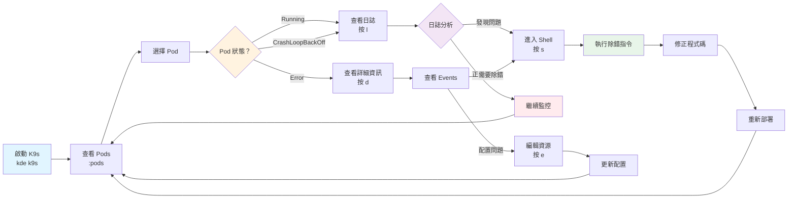

# K9s

**透過 K9s 終端機 UI 即時監控和管理 Kubernetes 集群資源。**

## 核心概念

### 什麼是 K9s？

K9s 是一個終端機 UI 工具，提供即時的 Kubernetes 集群管理介面。透過 K9s，開發者可以快速查看、監控和操作 Kubernetes 資源，無需記憶複雜的 kubectl 指令。

**官方資源**：
- 官方網站：https://k9scli.io/
- GitHub：https://github.com/derailed/k9s
- 文檔：https://k9scli.io/topics/commands
- 教學影片：https://k9scli.io/topics/video

### KDE 中的 K9s

KDE-cli 整合了 K9s，提供以下特性：

1. **自動環境連接** - 自動連接到當前 KDE 環境的 Kubernetes 集群
2. **容器化執行** - 透過 Docker 容器運行 K9s，無需本地安裝
3. **自訂配置支援** - 支援環境層級和全域層級的配置檔案
4. **Port 轉發支援** - 可以將 K9s 內的 Port Forward 對應到本機
5. **Namespace 篩選** - 快速切換和查看特定 Namespace

### 主要功能

根據官方網站，K9s 提供以下核心功能：

- **即時監控** - 持續追蹤 Kubernetes 資源的狀態變化
- **資源管理** - 支援 Pods、Deployments、Services、ConfigMaps、Secrets 等所有資源
- **叢集指標** - 即時顯示 Pods、Containers、Nodes 的資源使用率
- **日誌查看** - 即時查看和搜尋容器日誌
- **快速操作** - 提供 logs、scaling、port-forwards、restarts 等常用指令
- **自訂介面** - 支援 Skins、Aliases、HotKeys、Plugins 等客製化
- **RBAC 檢視** - 查看和分析 RBAC 權限設定
- **效能測試** - 內建 HTTP 服務壓力測試工具
- **資源圖遍歷** - Pulses 和 XRay 視圖提供資源關聯分析

詳細功能說明請參考：[K9s 官方文檔](https://k9scli.io/topics/commands)

## 使用說明

### 基本指令語法

```bash
kde k9s [options]
```

### 基本使用

#### 啟動 K9s

```bash
# 查看所有 namespace
kde k9s

# 指定 namespace
kde k9s -n myapp
kde k9s --namespace production

# 指定 port 對應
kde k9s -p 8080
kde k9s --port 8080

# 組合使用
kde k9s -n myapp -p 8080
```

### 指令選項

| 選項 | 簡寫 | 說明 | 範例 |
|------|------|------|------|
| `--port` | `-p` | 將 K9s 指定的 port 對應到本機 | `kde k9s -p 8080` |
| `--namespace` | `-n` | 指定要查看的 namespace | `kde k9s -n myapp` |
| `--help` | `-h` | 顯示幫助訊息 | `kde k9s -h` |

### K9s 操作指南

啟動 K9s 後，可以使用以下快捷鍵操作：

#### 基本導航

- `?` - 顯示所有快捷鍵說明
- `:` - 進入指令模式（輸入資源類型名稱）
- `/` - 搜尋/篩選當前資源
- `Esc` - 返回上一層
- `Ctrl-C` - 退出 K9s

#### 快速切換資源視圖

```
:pods        # 查看 Pods
:deploy      # 查看 Deployments
:svc         # 查看 Services
:cm          # 查看 ConfigMaps
:secret      # 查看 Secrets
:ns          # 查看 Namespaces
:node        # 查看 Nodes
:ing         # 查看 Ingress
:pv          # 查看 PersistentVolumes
:pvc         # 查看 PersistentVolumeClaims
```

#### 資源操作快捷鍵

選擇資源後可使用的快捷鍵：

| 快捷鍵 | 功能 | 說明 |
|--------|------|------|
| `Enter` | 查看詳細資訊 | 進入資源詳細視圖 |
| `d` | Describe | 顯示資源描述（kubectl describe） |
| `y` | YAML | 顯示資源的 YAML 定義 |
| `e` | Edit | 編輯資源 |
| `l` | Logs | 查看 Pod 日誌 |
| `s` | Shell | 進入 Pod Shell |
| `p` | Port-Forward | 建立 Port Forward |
| `Ctrl-K` | Delete | 刪除資源 |
| `Ctrl-D` | Delete | 刪除資源（確認） |
| `t` | Sort | 排序欄位 |
| `0` | Show All | 顯示所有 Namespace |

#### 特殊視圖

```
:pulses      # Cluster 概覽儀表板
:xray        # 資源依賴關係視圖
:popeye      # Cluster 健康檢查
```

詳細的快捷鍵說明請參考：[K9s Commands](https://k9scli.io/topics/commands)

## 自訂配置

### 配置檔案位置

KDE 支援兩種層級的 K9s 配置：

#### 1. 單一環境配置（優先）

```bash
# 配置位置
environments/<env_name>/k9s/config.yaml

# 建立配置目錄
mkdir -p environments/dev-env/k9s

# 建立配置檔案
cat > environments/dev-env/k9s/config.yaml <<'EOF'
k9s:
  refreshRate: 2
  maxConnRetry: 5
  readOnly: false
  noExitOnCtrlC: false
  ui:
    enableMouse: false
    headless: false
    logoless: false
    crumbsless: false
    noIcons: false
  skipLatestRevCheck: false
  disablePodCounting: false
  shellPod:
    image: busybox:1.35.0
    namespace: default
    limits:
      cpu: 100m
      memory: 100Mi
EOF
```

#### 2. 全域配置（所有環境共用）

```bash
# 配置位置
k9s/config.yaml

# 建立配置目錄
mkdir -p k9s

# 建立配置檔案
cat > k9s/config.yaml <<'EOF'
k9s:
  refreshRate: 2
  maxConnRetry: 5
  readOnly: false
EOF
```

**優先順序**：
1. 環境配置（`environments/<env_name>/k9s/`）
2. 全域配置（`k9s/`）
3. K9s 預設配置

### 配置檔案說明

K9s 支援豐富的配置選項，包括：

- **外觀客製化** - Skins、顏色主題、圖示
- **行為設定** - 刷新頻率、唯讀模式、快捷鍵
- **檢視客製化** - 欄位顯示、排序方式
- **指令別名** - 自訂快捷指令
- **外掛支援** - 擴充自訂功能

詳細的配置說明請參考：
- [K9s 配置](https://k9scli.io/topics/config)
- [Aliases](https://k9scli.io/topics/aliases)
- [HotKeys](https://k9scli.io/topics/hotkeys)
- [Skins](https://k9scli.io/topics/skins)
- [Plugins](https://k9scli.io/topics/plugins)

## 使用範例

### 範例 1：監控專案部署狀態

```bash
# 1. 啟動 K9s
kde k9s

# 2. 查看所有 Pods（預設視圖）
# 或輸入 :pods

# 3. 切換到專案的 namespace
# 輸入 :ns 查看 namespace 列表
# 選擇目標 namespace

# 4. 查看 Deployment
# 輸入 :deploy

# 5. 選擇 Deployment 並查看詳細資訊
# 使用方向鍵選擇
# 按 Enter 查看詳細資訊
# 按 d 查看 describe
# 按 y 查看 YAML
```

### 範例 2：查看 Pod 日誌

```bash
# 1. 啟動 K9s 並直接進入特定 namespace
kde k9s -n myapp

# 2. 選擇 Pod（預設已在 Pods 視圖）
# 使用方向鍵或 / 搜尋 Pod

# 3. 按 l 查看日誌
# 日誌會即時滾動顯示

# 4. 在日誌視圖中：
# - / 搜尋日誌內容
# - 0-9 切換不同的 container（如果 Pod 有多個 container）
# - s 切換自動滾動
# - w 切換 word wrap
# - f 切換 follow 模式
# - Esc 返回 Pods 視圖
```

### 範例 3：進入 Pod Shell 除錯

```bash
# 1. 啟動 K9s
kde k9s -n myapp

# 2. 選擇要除錯的 Pod

# 3. 按 s 進入 Shell
# 如果 Pod 有多個 container，會提示選擇

# 4. 在 Shell 中執行除錯指令
ls -la
ps aux
env
curl http://service-name:port/health

# 5. 輸入 exit 離開 Shell
```

### 範例 4：Port Forward 到本機

```bash
# 方式 1：在 K9s 內建立 Port Forward
# 1. 啟動 K9s
kde k9s

# 2. 選擇 Pod 或 Service

# 3. 按 Shift-F（大寫 F）
# 輸入本機 port 和容器 port
# 例如：8080:8080

# 4. 在瀏覽器存取 http://localhost:8080

# 方式 2：啟動時指定 port
kde k9s -p 8080 -n myapp
# 在 K9s 內建立 Port Forward 時，會對應到本機 8080
```

### 範例 5：刪除資源

```bash
# 1. 啟動 K9s
kde k9s

# 2. 切換到要刪除的資源類型
# 例如：:pods 或 :deploy

# 3. 選擇要刪除的資源

# 4. 按 Ctrl-K 刪除
# 系統會要求確認

# 5. 輸入資源名稱確認刪除
```

### 範例 6：查看 Cluster 概覽

```bash
# 1. 啟動 K9s
kde k9s

# 2. 輸入 :pulses
# 顯示 Cluster 的整體狀態

# 3. 輸入 :xray deployments
# 顯示 Deployments 的資源依賴關係圖

# 4. 輸入 :popeye
# 執行 Cluster 健康檢查
```

### 範例 7：使用自訂配置

```bash
# 1. 建立環境專用的 K9s 配置
mkdir -p environments/dev-env/k9s

# 2. 複製現有配置或建立新配置
cat > environments/dev-env/k9s/config.yaml <<'EOF'
k9s:
  refreshRate: 1
  ui:
    skin: dracula
EOF

# 3. 下載並安裝 skin
# 參考：https://k9scli.io/topics/skins

# 4. 啟動 K9s（會自動載入配置）
kde k9s

# 輸出：
# k9s 使用自訂設定檔目錄: /path/to/environments/dev-env/k9s
```

### 範例 8：RBAC 檢視

```bash
# 1. 啟動 K9s
kde k9s

# 2. 查看 Roles
# 輸入 :roles

# 3. 查看 ClusterRoles
# 輸入 :clusterroles

# 4. 查看 RoleBindings
# 輸入 :rolebindings

# 5. 查看使用者權限（Reverse Lookup）
# 輸入 :users
# 選擇使用者後按 Enter 查看權限
```

## 工作流程

### 開發環境監控流程



### 日常運維流程

1. **早上啟動時** - 快速查看 Cluster 健康狀態
   ```bash
   kde k9s
   # 輸入 :pulses 查看概覽
   # 輸入 :nodes 查看節點狀態
   ```

2. **部署新版本時** - 監控部署進度
   ```bash
   kde k9s -n myapp
   # 查看 Pods 的滾動更新
   # 按 l 查看新 Pod 的啟動日誌
   ```

3. **發現問題時** - 快速定位和除錯
   ```bash
   kde k9s
   # 使用 / 搜尋問題 Pod
   # 按 d 查看 describe
   # 按 l 查看日誌
   # 按 s 進入 Shell 除錯
   ```

4. **資源清理時** - 批次刪除資源
   ```bash
   kde k9s
   # 切換到目標資源視圖
   # 使用 / 篩選要刪除的資源
   # 按 Ctrl-K 刪除
   ```

## 與其他 KDE 工具整合

### K9s vs Headlamp

| 特性 | K9s | Headlamp |
|------|-----|----------|
| **介面** | 終端機 UI | Web UI |
| **啟動方式** | `kde k9s` | `kde headlamp` |
| **適用場景** | CLI 愛好者、快速操作 | 圖形化管理、詳細檢視 |
| **資源消耗** | 低 | 中 |
| **自訂性** | 高（Skins、Plugins） | 中 |
| **學習曲線** | 中 | 低 |

### 整合使用範例

```bash
# 1. 使用 K9s 快速監控和操作
kde k9s

# 2. 發現複雜問題時，切換到 Headlamp 詳細分析
# 在另一個終端機：
kde headlamp

# 3. 使用 Headlamp 的圖形化介面：
# - 查看資源拓撲
# - 編輯複雜的 YAML
# - 查看圖表和指標

# 4. 完成分析後，回到 K9s 進行快速操作
```

## 環境變數

### KDE 相關環境變數

| 環境變數 | 說明 | 預設值 |
|---------|------|--------|
| `K9S_IMAGE` | K9s Docker 映像 | `r82wei/k9s:v0.50.18` |
| `ENABLE_K9S` | 是否啟用 K9s | `true` |
| `K9S_CONFIG_DIR` | K9s 配置目錄 | 自動偵測 |

### 停用 K9s

如果不需要使用 K9s，可以在環境配置中停用：

```bash
# 在 kde.env 中設定
echo "ENABLE_K9S=false" >> kde.env
```

## 故障排除

### 常見問題

#### 1. K9s 啟動失敗

**症狀**：
```
請先建立 k8s 環境
```

**解決方法**：
```bash
# 1. 檢查環境是否存在
kde status

# 2. 建立或啟動環境
kde start dev-env kind

# 3. 重新啟動 K9s
kde k9s
```

#### 2. 無法連接到 Kubernetes

**症狀**：
K9s 顯示連線錯誤或無法載入資源

**解決方法**：
```bash
# 1. 檢查 kubeconfig
echo $KUBECONFIG
kubectl get nodes

# 2. 檢查環境是否運行
kde status

# 3. 重新啟動環境
kde restart

# 4. 重新啟動 K9s
kde k9s
```

#### 3. 配置檔案未載入

**症狀**：
自訂配置沒有生效

**解決方法**：
```bash
# 1. 檢查配置檔案位置
ls -la environments/<env_name>/k9s/config.yaml
ls -la k9s/config.yaml

# 2. 檢查配置檔案語法
cat environments/<env_name>/k9s/config.yaml

# 3. 確認啟動時的輸出
kde k9s
# 應該會看到：k9s 使用自訂設定檔目錄: /path/to/config

# 4. 如果仍未載入，檢查 YAML 語法是否正確
# 參考官方配置範例：https://k9scli.io/topics/config
```

#### 4. Port Forward 無法連接

**症狀**：
使用 `kde k9s -p 8080` 後，無法透過 localhost:8080 連接

**解決方法**：
```bash
# 1. 確認 port 未被佔用
lsof -i :8080

# 2. 檢查 Docker 容器是否正確啟動
docker ps | grep k9s

# 3. 在 K9s 內建立 Port Forward 時，確認使用正確的 port

# 4. 使用不同的 port 測試
kde k9s -p 9000
```

#### 5. 權限不足

**症狀**：
K9s 顯示某些資源無法存取

**解決方法**：
```bash
# 1. 檢查 RBAC 權限
kubectl auth can-i list pods --all-namespaces

# 2. 查看當前使用者/ServiceAccount
kubectl config view --minify

# 3. 使用唯讀模式
# 在 config.yaml 中設定：
# k9s:
#   readOnly: true

# 4. 聯繫管理員取得必要權限
```

### 除錯指令

```bash
# 檢查 K9s 映像
docker images | grep k9s

# 檢查 K9s 版本
kde k9s --version

# 手動運行 K9s 容器除錯
docker run --rm -it \
  --net ${DOCKER_NETWORK} \
  -e KUBECONFIG=${KUBECONFIG} \
  -v ${KUBECONFIG}:${KUBECONFIG} \
  ${K9S_IMAGE} version

# 檢查環境變數
echo $CUR_ENV
echo $KUBECONFIG
echo $K9S_IMAGE

# 測試 kubectl 連線
kubectl get nodes
kubectl get pods -A
```

## Best Practice

### 使用建議

1. **快捷鍵熟練度**
   - 記住常用的快捷鍵（`:pods`, `l`, `d`, `s`, `Ctrl-K`）
   - 按 `?` 隨時查看快捷鍵說明
   - 建立自己的 Aliases 提升效率

2. **配置檔案管理**
   - 將常用的配置加入版本控制
   - 為不同環境建立不同的配置
   - 使用 Skins 讓介面更舒適

3. **監控策略**
   - 定期查看 `:pulses` 了解整體狀態
   - 使用 `/` 搜尋功能快速定位資源
   - 善用 `:xray` 分析資源依賴

4. **安全操作**
   - 刪除資源前仔細確認
   - 生產環境考慮使用唯讀模式
   - 注意 namespace 切換

5. **效能優化**
   - 調整 `refreshRate` 降低資源消耗
   - 使用 namespace 篩選減少載入的資源
   - 關閉不需要的功能（如 Pod 計數）

### 進階技巧

#### 1. 自訂 Aliases

建立常用指令的別名：

```yaml
# environments/<env_name>/k9s/config.yaml
k9s:
  aliases:
    dp: deployments
    po: pods
    svc: services
    cm: configmaps
    sec: secrets
```

使用：在 K9s 中輸入 `:dp` 等同於 `:deployments`

#### 2. 自訂 HotKeys

建立自訂快捷鍵：

```yaml
# environments/<env_name>/k9s/config.yaml
k9s:
  hotKeys:
    # Shift-0 查看所有 namespace 的 pods
    shift-0:
      shortCut: Shift-0
      description: View all pods
      command: pods
```

#### 3. 自訂 Plugins

建立自訂外掛指令：

```yaml
# environments/<env_name>/k9s/plugins.yaml
plugins:
  # 查看 Pod 的環境變數
  env:
    shortCut: Shift-E
    description: View env
    scopes:
      - pods
    command: bash
    background: false
    args:
      - -c
      - kubectl get pod $NAME -n $NAMESPACE -o json | jq '.spec.containers[].env'
```

詳細的進階功能請參考：
- [K9s Aliases](https://k9scli.io/topics/aliases)
- [K9s HotKeys](https://k9scli.io/topics/hotkeys)
- [K9s Plugins](https://k9scli.io/topics/plugins)

### 工作流程建議

#### 開發流程

```bash
# 1. 部署應用
kde proj pipeline myapp

# 2. 啟動 K9s 監控
kde k9s -n myapp

# 3. 在 K9s 中：
# - 查看 Pods 狀態
# - 按 l 查看日誌
# - 發現問題時按 s 進入 Shell
# - 按 d 查看 describe

# 4. 修正問題後重新部署
kde proj redeploy myapp

# 5. 在 K9s 中繼續監控
```

#### 除錯流程

```bash
# 1. 快速定位問題 Pod
kde k9s
# 輸入 / 搜尋 Pod 名稱或狀態（如 CrashLoop）

# 2. 查看日誌
# 按 l

# 3. 分析問題
# 按 Esc 返回
# 按 d 查看 describe
# 檢查 Events、Conditions、Resource Limits

# 4. 進入 Shell 除錯
# 按 s
# 執行 curl、env、ls 等指令

# 5. 必要時編輯資源
# 按 e 修改 YAML

# 6. 或使用 Port Forward 測試
# 按 Shift-F 建立 Port Forward
```

## 相關文件

- [KDE-cli 概述](../overview.md) - 了解 KDE-cli 的核心價值與工具生態
- [環境管理](../environment/environment-overview.md) - 了解如何建立和管理環境
- [專案管理](../project.md) - 了解如何部署和監控專案
- [Headlamp](./headlamp.md) - Web UI 版的 Kubernetes 管理介面
- [K9s 官方文檔](https://k9scli.io/) - K9s 工具本身的詳細說明
