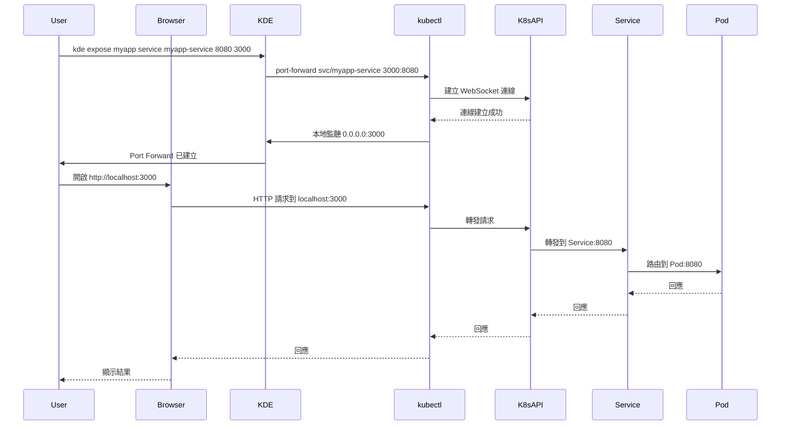

# Port Forward

**將 Kubernetes Service 或 Pod 的端口轉發到本地，方便開發和測試**

## 核心概念

### 什麼是 Port Forward？

Port Forward（端口轉發）是 Kubernetes 提供的功能，可以將集群內的 Service 或 Pod 端口映射到本地機器，讓您可以在本地直接存取 Kubernetes 中的服務。KDE 簡化了 Port Forward 的操作，提供互動式介面和背景執行支援。

### 主要特點

- **本地存取**：在本地直接存取 Kubernetes 服務
- **互動式選擇**：自動列出可用的資源供選擇
- **支援多種資源**：支援 Service 和 Pod
- **背景執行**：可以在背景運行，不佔用終端機
- **安全連線**：所有流量透過 Kubernetes API 加密傳輸
- **無需 Ingress**：不需要設定 Ingress 或 LoadBalancer

### 使用場景

| 場景 | 說明 |
|------|------|
| **本地開發** | 在本地瀏覽器或工具中存取 K8s 服務 |
| **除錯測試** | 快速測試服務連線和功能 |
| **資料庫存取** | 使用本地工具連接 K8s 中的資料庫 |
| **API 測試** | 使用 Postman 等工具測試 API |
| **服務整合** | 本地應用連接 K8s 服務 |

### 與其他工具比較

| 特性 | Port Forward | Ngrok | Cloudflare Tunnel |
|------|-------------|-------|-------------------|
| **存取範圍** | 僅本地 | 公開網路 | 公開網路 |
| **設定複雜度** | 簡單 | 簡單 | 中等 |
| **安全性** | 高（僅本地） | 中（需防護） | 高（HTTPS） |
| **效能** | 最佳（無中繼） | 良好 | 良好 |
| **適用場景** | 本地開發測試 | 外部分享 | 外部分享 |

## 使用說明

### 基本指令語法

```bash
kde expose [option] [namespace] [pod|service] [name] [target_port] [local_port]
```

### 選項說明

| 選項 | 說明 | 範例 |
|------|------|------|
| `-h, --help` | 顯示說明 | `kde expose -h` |
| `-d` | 在背景執行 | `kde expose -d` |

### 參數說明

| 參數 | 說明 | 必填 |
|------|------|------|
| `namespace` | Namespace 名稱 | 互動式選擇 |
| `pod\|service` | 資源類型（pod 或 service） | 互動式選擇 |
| `name` | 資源名稱 | 互動式選擇 |
| `target_port` | 目標端口（Service/Pod 的端口） | 互動式選擇 |
| `local_port` | 本地端口 | 需要輸入 |

### 使用方式

#### 1. 互動式模式（推薦）

```bash
# 啟動互動式 Port Forward
kde expose

# 系統會依序提示：
# 1. 選擇 namespace
# 2. 選擇資源類型（Service 或 Pod）
# 3. 選擇具體資源
# 4. 選擇端口
# 5. 輸入本地端口
```

#### 2. 完整參數模式

```bash
# 直接指定所有參數
kde expose <namespace> service <service_name> <target_port> <local_port>

# 範例：將 myapp namespace 的 myapp-service 的 8080 端口轉發到本地 3000
kde expose myapp service myapp-service 8080 3000
```

#### 3. 背景執行模式

```bash
# 在背景執行 Port Forward
kde expose -d

# 或直接指定參數並背景執行
kde expose -d myapp service myapp-service 8080 3000
```

## 使用範例

### 範例 1：轉發 Service 端口

```bash
# 1. 啟動互動式 Port Forward
kde expose

# 2. 選擇 namespace
# 選項：
# 1) default
# 2) myapp
# 3) backend
# 輸入：2

# 3. 選擇資源類型
# 請選擇要 Port forward 的服務類型：
# 1) Service
# 2) Pod
# 3) 退出
# 輸入：1

# 4. 選擇 Service
# 1) myapp-service
# 2) api-service
# 3) db-service
# 輸入：1

# 5. 選擇端口（如果 Service 有多個端口）
# 1) 8080 (http)
# 2) 8443 (https)
# 輸入：1

# 6. 輸入本地端口
# 請輸入本地 port: 3000

# 7. Port Forward 建立成功
# Forwarding from 127.0.0.1:3000 -> 8080
# Forwarding from [::1]:3000 -> 8080

# 8. 在瀏覽器中存取
# http://localhost:3000

# 9. 停止（按 Ctrl+C）
```

### 範例 2：轉發 Pod 端口

```bash
# 1. 啟動 Port Forward
kde expose

# 2. 選擇 namespace: myapp
# 3. 選擇資源類型: Pod
# 4. 選擇 Pod: myapp-deployment-abc123-xyz
# 5. 選擇端口: 8080
# 6. 輸入本地端口: 8080

# 7. Port Forward 建立成功
# Forwarding from 127.0.0.1:8080 -> 8080

# 8. 在本地存取
# curl http://localhost:8080
```

### 範例 3：完整參數模式

```bash
# 直接指定所有參數（快速建立）
kde expose myapp service myapp-service 8080 3000

# Port Forward 建立成功
# Forwarding from 127.0.0.1:3000 -> 8080

# 在瀏覽器存取
# http://localhost:3000
```

### 範例 4：背景執行

```bash
# 1. 在背景執行 Port Forward
kde expose -d myapp service myapp-service 8080 3000

# 2. Port Forward 在背景運行
# 可以繼續使用終端機執行其他指令

# 3. 查看背景運行的 Port Forward
ps aux | grep "port-forward"

# 4. 停止背景 Port Forward
# 找到 process ID 並 kill
kill <pid>
```

### 範例 5：存取資料庫

```bash
# 1. 轉發資料庫 Service
kde expose

# 2. 選擇：
# - namespace: database
# - 資源類型: Service
# - Service: postgres-service
# - 端口: 5432
# - 本地端口: 5432

# 3. 使用本地資料庫工具連接
# Host: localhost
# Port: 5432
# Database: mydb
# Username: postgres
# Password: ****

# 4. 或使用 psql 指令
psql -h localhost -p 5432 -U postgres -d mydb
```

### 範例 6：API 測試

```bash
# 1. 轉發 API Service
kde expose -d backend service api-service 8080 8080

# 2. 使用 Postman 測試 API
# URL: http://localhost:8080/api/users
# Method: GET

# 3. 或使用 curl
curl http://localhost:8080/api/users
curl -X POST http://localhost:8080/api/users \
  -H "Content-Type: application/json" \
  -d '{"name": "John", "email": "john@example.com"}'

# 4. 查看 API 回應和日誌
kde proj tail backend
```

### 範例 7：前端開發存取後端 API

```bash
# 1. 轉發後端 API Service（背景執行）
kde expose -d backend service api-service 8080 8080

# 2. 在前端開發環境中配置 API URL
# .env.local
API_URL=http://localhost:8080

# 3. 啟動前端開發伺服器
npm run dev

# 4. 前端可以直接存取 K8s 中的後端 API
```

### 範例 8：多個 Port Forward

```bash
# 需要開啟多個終端機

# 終端機 1：轉發前端 Service
kde expose frontend service frontend-service 80 8080

# 終端機 2：轉發後端 API Service
kde expose backend service api-service 8080 8081

# 終端機 3：轉發資料庫 Service
kde expose database service postgres-service 5432 5432

# 終端機 4：轉發 Redis Service
kde expose cache service redis-service 6379 6379

# 現在可以在本地存取所有服務：
# - 前端: http://localhost:8080
# - API: http://localhost:8081
# - PostgreSQL: localhost:5432
# - Redis: localhost:6379
```

### 範例 9：除錯特定 Pod

```bash
# 1. 找到有問題的 Pod
kde k9s
# 或
kubectl get pods -n myapp

# 2. 轉發該 Pod 的端口
kde expose myapp pod myapp-deployment-abc123-xyz 8080 8080

# 3. 直接存取該 Pod 進行除錯
curl http://localhost:8080/health
curl http://localhost:8080/debug/pprof/

# 4. 使用除錯工具
# 例如：Go 的 pprof、Node.js 的 inspector
```

### 範例 10：與專案管理整合

```bash
# 1. 部署專案
kde proj pipeline myapp

# 2. 在背景轉發 Service
kde expose -d myapp service myapp-service 3000 3000

# 3. 在本地瀏覽器測試
# http://localhost:3000

# 4. 同時查看日誌
kde proj tail myapp

# 5. 發現問題後修改程式碼

# 6. 重新部署
kde proj redeploy myapp

# 7. 繼續在 localhost:3000 測試（Port Forward 保持運行）
```

## 運作原理

### 架構圖

```
┌─────────────────────────────────────────────────────────────┐
│                  本地開發機器                                 │
│                                                              │
│  ┌──────────────────────────────────────────────────────┐  │
│  │  瀏覽器/工具                                          │  │
│  │  http://localhost:3000                               │  │
│  └────────────────────┬─────────────────────────────────┘  │
│                       │                                     │
│  ┌────────────────────▼─────────────────────────────────┐  │
│  │  kubectl port-forward                                │  │
│  │  - 監聽本地端口 3000                                  │  │
│  │  - 轉發到 K8s API Server                             │  │
│  └────────────────────┬─────────────────────────────────┘  │
└───────────────────────┼──────────────────────────────────────┘
                        │ 加密連線（透過 KUBECONFIG）
┌───────────────────────▼──────────────────────────────────────┐
│              Kubernetes 環境                                  │
│  ┌──────────────────────────────────────────────────────┐   │
│  │  Kubernetes API Server                               │   │
│  └────────────────────┬─────────────────────────────────┘   │
│                       │                                      │
│  ┌────────────────────▼─────────────────────────────────┐   │
│  │  Service: myapp-service                              │   │
│  │  Port: 8080                                           │   │
│  └────────────────────┬─────────────────────────────────┘   │
│                       │                                      │
│  ┌────────────────────▼─────────────────────────────────┐   │
│  │  Pod: myapp-deployment-abc123-xyz                     │   │
│  │  Container Port: 8080                                 │   │
│  └──────────────────────────────────────────────────────┘   │
└──────────────────────────────────────────────────────────────┘
```

### Port Forward 流程



### Service vs Pod Port Forward

**Service Port Forward**：
```bash
kde expose myapp service myapp-service 8080 3000
# 優勢：
# - 自動負載均衡到多個 Pods
# - Pod 重啟後連線不中斷
# - 推薦用於一般情況
```

**Pod Port Forward**：
```bash
kde expose myapp pod myapp-pod-xyz 8080 3000
# 優勢：
# - 直接連接特定 Pod
# - 適合除錯特定 Pod
# - 繞過 Service 層
```

## 管理 Port Forward

### 查看運行中的 Port Forward

```bash
# 查看所有 kubectl port-forward 程序
ps aux | grep "port-forward"

# 或使用 netstat 查看監聽的端口
netstat -tuln | grep LISTEN
```

### 停止 Port Forward

#### 前景執行的 Port Forward

```bash
# 按 Ctrl+C 停止
```

#### 背景執行的 Port Forward

```bash
# 1. 找到 port-forward 程序
ps aux | grep "port-forward"

# 2. 停止程序
kill <pid>

# 或使用 pkill（停止所有 port-forward）
pkill -f "port-forward"

# 或使用 killall
killall kubectl
```

### 檢查端口是否被佔用

```bash
# 使用 netstat
netstat -tuln | grep <port>

# 使用 lsof
lsof -i :<port>

# 範例：檢查 3000 端口
lsof -i :3000
```

### 批次管理 Port Forward

```bash
# 建立腳本批次啟動多個 Port Forward

cat > start-port-forwards.sh <<'EOF'
#!/bin/bash

# 前端
kde expose -d frontend service frontend-service 80 8080 &

# 後端 API
kde expose -d backend service api-service 8080 8081 &

# 資料庫
kde expose -d database service postgres-service 5432 5432 &

# Redis
kde expose -d cache service redis-service 6379 6379 &

echo "所有 Port Forward 已啟動"
echo "前端: http://localhost:8080"
echo "API: http://localhost:8081"
echo "PostgreSQL: localhost:5432"
echo "Redis: localhost:6379"

wait
EOF

chmod +x start-port-forwards.sh
./start-port-forwards.sh
```

## 故障排除

### 常見問題

#### 1. 端口被佔用

**症狀**：提示端口已被使用

**解決方法**：
```bash
# 1. 檢查端口佔用情況
lsof -i :3000
netstat -tuln | grep 3000

# 2. 停止佔用端口的程序
kill <pid>

# 3. 或使用不同的本地端口
kde expose myapp service myapp-service 8080 3001
```

#### 2. 連線中斷

**症狀**：Port Forward 突然中斷

**可能原因**：
- Pod 重啟
- Service 變更
- 網路問題

**解決方法**：
```bash
# 1. 檢查 Pod 狀態
kubectl get pods -n <namespace>

# 2. 檢查 Service 狀態
kubectl get svc -n <namespace>

# 3. 重新建立 Port Forward
kde expose <namespace> service <service> <port> <local_port>

# 4. 使用 Service 而非 Pod
# Service Port Forward 較穩定
```

#### 3. 無法連接

**症狀**：Port Forward 建立成功但無法存取

**解決方法**：
```bash
# 1. 檢查 Service/Pod 是否正常運行
kubectl get pods -n <namespace>
kubectl get svc -n <namespace>

# 2. 測試 Service/Pod 連線
kubectl exec -n <namespace> <test-pod> -- curl http://<service>:<port>

# 3. 檢查端口是否正確
kubectl get svc <service> -n <namespace> -o yaml

# 4. 查看 Port Forward 日誌
# Port Forward 會輸出詳細的連線資訊
```

#### 4. 權限問題

**症狀**：提示沒有權限執行 Port Forward

**解決方法**：
```bash
# 檢查 RBAC 權限
kubectl auth can-i create pods/portforward -n <namespace>

# 本地 Kind/K3D 環境通常有完整權限
# 外部 K8s 可能需要調整 RBAC

# 檢查 kubeconfig
kubectl config view
```

#### 5. 背景 Port Forward 無法停止

**症狀**：背景執行的 Port Forward 無法停止

**解決方法**：
```bash
# 1. 找到所有 port-forward 程序
ps aux | grep "port-forward"

# 2. 停止特定程序
kill <pid>

# 3. 強制停止所有 port-forward
pkill -9 -f "port-forward"

# 4. 或停止所有 kubectl 程序（謹慎使用）
killall kubectl
```

### 除錯指令

```bash
# 查看 Port Forward 程序
ps aux | grep "port-forward"

# 查看監聽的端口
netstat -tuln | grep LISTEN

# 測試本地連線
curl http://localhost:<local_port>

# 檢查 Service/Pod 狀態
kubectl get svc -n <namespace>
kubectl get pods -n <namespace>

# 檢查 Service/Pod 詳細資訊
kubectl describe svc <service> -n <namespace>
kubectl describe pod <pod> -n <namespace>

# 測試從其他 Pod 連線
kubectl run test --rm -it --image=busybox -- /bin/sh
wget -O- http://<service>:<port>
```

## Best Practice

### 1. 端口選擇

```bash
# 1. 使用與目標 Service 相同的端口（方便記憶）
kde expose myapp service myapp-service 8080 8080

# 2. 或使用慣用的本地端口
# - 3000: Node.js 應用
# - 8080: Java/Spring 應用
# - 5000: Python Flask 應用
# - 5432: PostgreSQL
# - 6379: Redis
# - 3306: MySQL
# - 27017: MongoDB

# 3. 避免使用系統保留端口（0-1023）
# 需要 sudo 權限
```

### 2. 使用場景選擇

```bash
# 本地開發測試：使用 Port Forward
kde expose myapp service myapp-service 8080 3000

# 團隊分享：使用 Cloudflare Tunnel 或 Ngrok
kde cloudflare-tunnel service -d dev.myapp.com
kde ngrok service

# 快速 Demo：使用 Ngrok
kde ngrok service
```

### 3. Service vs Pod

```bash
# 一般情況：優先使用 Service
kde expose myapp service myapp-service 8080 3000
# 優勢：自動負載均衡、Pod 重啟不影響連線

# 除錯特定 Pod：使用 Pod
kde expose myapp pod myapp-pod-xyz 8080 3000
# 優勢：直接連接特定 Pod、繞過 Service
```

### 4. 背景執行管理

```bash
# 1. 長期使用的 Port Forward 在背景執行
kde expose -d database service postgres-service 5432 5432

# 2. 記錄背景執行的 Port Forward
echo "PostgreSQL: localhost:5432" >> port-forwards.txt

# 3. 工作結束後清理
pkill -f "port-forward"
```

### 5. 安全性考量

```bash
# 1. Port Forward 僅監聽本地（127.0.0.1）
# 外部無法存取，安全性較高

# 2. 不要將 Port Forward 暴露到公網
# 如需外部存取，使用 Cloudflare Tunnel 或 Ngrok

# 3. 使用完畢立即停止 Port Forward
# 避免長期佔用端口

# 4. 注意敏感服務（資料庫、Redis）
# 確保本地機器安全
```

### 6. 開發工作流程整合

```bash
# 推薦的工作流程

# 終端機 1：Port Forward（背景執行）
kde expose -d myapp service myapp-service 8080 3000

# 終端機 2：監控日誌
kde proj tail myapp

# 終端機 3：開發
kde proj exec myapp develop

# 終端機 4：K9s 監控
kde k9s

# 瀏覽器：測試應用
# http://localhost:3000
```

### 7. 多環境管理

```bash
# 為不同環境使用不同的本地端口

# 開發環境
kde use dev-env
kde expose -d myapp service myapp-service 8080 3000

# 測試環境
kde use test-env
kde expose -d myapp service myapp-service 8080 3001

# Staging 環境
kde use staging-env
kde expose -d myapp service myapp-service 8080 3002

# 可以同時存取多個環境：
# Dev: http://localhost:3000
# Test: http://localhost:3001
# Staging: http://localhost:3002
```

## 進階使用

### 自動化 Port Forward 腳本

```bash
# 建立自動化腳本

cat > ~/kde-port-forward.sh <<'EOF'
#!/bin/bash

# 顏色定義
GREEN='\033[0;32m'
YELLOW='\033[1;33m'
NC='\033[0m' # No Color

echo -e "${GREEN}啟動 Port Forwards...${NC}"

# 前端
echo -e "${YELLOW}啟動前端 Port Forward...${NC}"
kde expose -d frontend service frontend-service 80 8080 &
sleep 1

# 後端 API
echo -e "${YELLOW}啟動後端 API Port Forward...${NC}"
kde expose -d backend service api-service 8080 8081 &
sleep 1

# 資料庫
echo -e "${YELLOW}啟動資料庫 Port Forward...${NC}"
kde expose -d database service postgres-service 5432 5432 &
sleep 1

echo -e "${GREEN}所有 Port Forwards 已啟動${NC}"
echo -e "前端: ${GREEN}http://localhost:8080${NC}"
echo -e "API: ${GREEN}http://localhost:8081${NC}"
echo -e "PostgreSQL: ${GREEN}localhost:5432${NC}"
echo ""
echo -e "停止所有 Port Forwards: ${YELLOW}pkill -f 'port-forward'${NC}"
EOF

chmod +x ~/kde-port-forward.sh
```

### 整合到 shell 別名

```bash
# 在 ~/.bashrc 或 ~/.zshrc 中加入

# Port Forward 快捷指令
alias pf='kde expose'
alias pfd='kde expose -d'

# 快速啟動常用的 Port Forward
alias pf-frontend='kde expose -d frontend service frontend-service 80 8080'
alias pf-api='kde expose -d backend service api-service 8080 8081'
alias pf-db='kde expose -d database service postgres-service 5432 5432'

# 停止所有 Port Forward
alias pf-stop='pkill -f port-forward'

# 查看 Port Forward
alias pf-list='ps aux | grep port-forward | grep -v grep'
```

### 與其他工具整合

```bash
# 與 K9s 整合
# 在 K9s 中可以直接執行 Port Forward（按 Shift+F）

# 與 Headlamp 整合
# 在 Headlamp 中查看 Service 後在終端機執行 Port Forward

# 與監控工具整合
# 終端機 1：Port Forward
kde expose -d myapp service myapp-service 8080 3000

# 終端機 2：K9s 監控
kde k9s

# 終端機 3：Headlamp Web UI
kde headlamp -d

# 瀏覽器：測試應用
firefox http://localhost:3000
```

## 使用技巧

### 1. 快速測試連線

```bash
# 建立 Port Forward 後立即測試
kde expose myapp service myapp-service 8080 3000 &
sleep 2
curl http://localhost:3000/health
```

### 2. 使用環境變數

```bash
# 在應用配置中使用環境變數
# .env.local
API_URL=http://localhost:8081
DATABASE_URL=postgresql://localhost:5432/mydb
REDIS_URL=redis://localhost:6379
```

### 3. 配合 /etc/hosts

```bash
# 在 /etc/hosts 中加入別名
sudo bash -c 'cat >> /etc/hosts << EOF
127.0.0.1 frontend.local
127.0.0.1 api.local
127.0.0.1 db.local
EOF'

# 建立 Port Forward
kde expose -d frontend service frontend-service 80 80
kde expose -d backend service api-service 8080 80

# 使用域名存取
curl http://frontend.local
curl http://api.local
```

### 4. 監控 Port Forward 狀態

```bash
# 建立監控腳本
cat > check-port-forwards.sh <<'EOF'
#!/bin/bash

echo "檢查 Port Forwards..."
ports=(3000 3001 5432 6379)

for port in "${ports[@]}"; do
    if lsof -i :$port > /dev/null 2>&1; then
        echo "✓ Port $port: Active"
    else
        echo "✗ Port $port: Inactive"
    fi
done
EOF

chmod +x check-port-forwards.sh
./check-port-forwards.sh
```

---

**相關文檔**：
- **[Ngrok 文檔](./ngrok.md)** - 快速外部存取工具
- **[Cloudflare Tunnel 文檔](./cloudflare-tunnel.md)** - 安全的外部存取工具
- **[K9s 文檔](./k9s.md)** - 終端機 Kubernetes 管理工具
- **[專案管理文檔](../project.md)** - 專案部署和管理
- **[環境管理文檔](../environment/environment-overview.md)** - Kubernetes 環境管理
