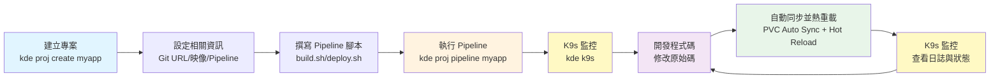
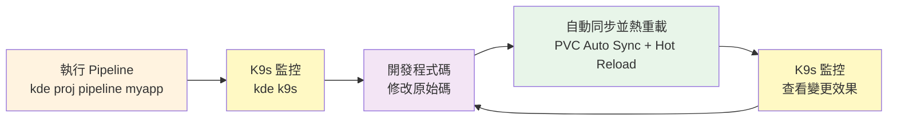

# 專案管理 (Project Management)
**透過專案管理機制，將應用程式從開發到部署的完整流程整合到 Kubernetes 環境中**

## 核心概念

### 什麼是專案？
- 專案可以是遠端的 Git Repository 或本地資料夾
- 每個專案對應一個 Kubernetes Namespace（Project = K8s Namespace）
- 專案包含應用程式的原始碼、建置腳本、部署腳本和配置檔案
- 專案權限基於 Git Repository 的權限管理（GitHub、GitLab 等）

### 專案類型
- **本地專案 (Local Directory)**: 純本地專案，適合快速測試和原型開發
- **遠端專案 (Git Remote)**: 從遠端 Git 倉庫拉取，支援版本控制和團隊協作

### 專案結構
```
environments/<env_name>/namespaces/<project_name>/
├── project.env              # 專案配置檔案（提交到版本控制）
├── .env                     # 專案本地配置（不提交到版本控制）
├── build.sh                 # 建置腳本
├── deploy.sh                # 部署腳本
├── undeploy.sh              # 卸載腳本（本地環境可選，外部 K8s 建議必備）
├── .pipeline.env            # Pipeline 階段間傳遞的環境變數（自動生成）
└── <repo_name>/             # Git 倉庫內容或本地專案目錄
```

### 專案配置檔案

#### project.env（提交到版本控制）
專案的共享配置，包含 Git 資訊、映像設定、Pipeline 配置等：
```bash
# Git Repository 設定
GIT_REPO_URL=https://github.com/user/myapp.git
GIT_REPO_BRANCH=main

# 容器映像設定
DEVELOP_IMAGE=node:20                    # 開發環境映像
DEPLOY_IMAGE=r82wei/deploy-env:1.0.0     # 部署環境映像

# Helm 配置（可選）
HELM_CONFIG_HOME=${PROJECT_PATH}/.helm/config
HELM_CACHE_HOME=${PROJECT_PATH}/.helm/cache
HELM_DATA_HOME=${PROJECT_PATH}/.helm/data
HELM_PLUGINS=${PROJECT_PATH}/.helm/plugins

# Pipeline 配置（快速模式：build → deploy）
KDE_PIPELINE_STAGES="build,deploy"
KDE_PIPELINE_STAGE_build_SCRIPT=build.sh
KDE_PIPELINE_STAGE_build_IMAGE=${DEVELOP_IMAGE}
KDE_PIPELINE_STAGE_deploy_SCRIPT=deploy.sh
KDE_PIPELINE_STAGE_deploy_IMAGE=${DEPLOY_IMAGE}
```

#### .env（不提交到版本控制）
專案的本地私有配置，包含敏感資訊：
```bash
# 資料庫密碼
DATABASE_PASSWORD=secret_password

# API Token
API_TOKEN=xxxxxxxxxxxxx

# JWT Secret Key
JWT_SECRET_KEY=xxxxxxxxxxxxxxx
```

## 功能說明

### 專案生命週期管理
- **建立專案**: 從零建立新專案或從 Git 倉庫抓取現有專案
- **程式碼管理**: 支援從 Git 倉庫 pull 最新程式碼，或使用 --force 重新 clone
- **建置與部署**: 透過 Pipeline 機制自動執行建置和部署流程
- **容器環境**: 提供開發容器和部署容器，方便開發和測試
- **生命週期控制**: 支援部署、卸載、重新部署等操作

### 與其他功能的整合
- **Container 開發環境**: 透過 `kde proj exec` 進入專案的開發或部署容器
- **CI/CD Pipeline**: 透過 `kde proj pipeline` 執行自動化建置和部署流程
- **Kubernetes 環境**: 每個專案對應一個 K8s Namespace，自動管理資源隔離

### 專案環境變數

#### 可在 project.env 中使用的 KDE 內建變數
在編寫 `project.env` 時，以下變數可用於定義路徑或其他配置：
- `KDE_PATH` - KDE workspace 目錄路徑
- `ENVIROMENTS_PATH` - 環境目錄路徑
- `CUR_ENV` - 當前環境名稱
- `KUBECONFIG` - K8s 配置檔案路徑
- `PROJECT_PATH` - 專案路徑

**使用範例**（在 `project.env` 中）：
```bash
# 使用 PROJECT_PATH 定義 Helm 配置路徑
HELM_CONFIG_HOME=${PROJECT_PATH}/.helm/config
HELM_CACHE_HOME=${PROJECT_PATH}/.helm/cache

# 使用 KDE_PATH 定義共用資源路徑
SHARED_SCRIPTS=${KDE_PATH}/shared-scripts
```

**重要說明**：
- ⚠️ 這些 KDE 內建變數僅在 KDE-CLI 載入 `project.env` 時可用
- ⚠️ 在 Pipeline shell 腳本內**不能**直接使用這些變數（如 `$PROJECT_PATH`）
- ✅ 必須在 `project.env` 中先定義新的環境變數（如 `HELM_CONFIG_HOME`），這些新變數才會傳遞到 Pipeline 執行環境

#### 環境變數載入順序
KDE-CLI 會依序載入以下配置檔案，後載入的變數會覆蓋先前的同名變數：
1. `${KDE_PATH}/kde.env` - KDE 系統主配置檔
2. `${ENVIROMENTS_PATH}/${CUR_ENV}/k8s.env` - 環境基本配置
3. `${ENVIROMENTS_PATH}/${CUR_ENV}/.env` - 環境本地配置
4. `${PROJECT_PATH}/project.env` - 專案配置檔
5. `${PROJECT_PATH}/.env` - 專案本地配置
6. `${PROJECT_PATH}/.pipeline.env` - Pipeline 階段間傳遞的環境變數（執行時自動載入）

## 使用說明

### 基本指令語法
```bash
kde [project|proj|namespace|ns] <command> <project_name> [options]
```

支援的別名：
- `kde project` = `kde proj` = `kde namespace` = `kde ns`

### 專案列表管理

#### 列出所有專案
```bash
# 列出當前環境的所有專案
kde project list
kde proj ls
kde ns ls
```

### 專案建立與抓取

#### 建立新專案
```bash
# 建立新專案（互動式）
kde project create <project_name>
kde proj create myapp

# 建立過程中會詢問：
# 1. 是否從 Git 遠端倉庫抓取？(y/n)
# 2. Git 倉庫 URL（如果選擇 y）
# 3. Git 分支名稱（預設：main）
# 4. 開發環境映像（例如：node:20）
# 5. 部署環境映像（預設：r82wei/deploy-env:1.0.0）
```

建立完成後會自動生成：
- `project.env` - 專案配置檔案
- `build.sh` - 建置腳本（空白）
- `deploy.sh` - 部署腳本（空白）

#### 從 Git 倉庫抓取專案
```bash
# 從 Git 倉庫抓取專案
kde project fetch <project_name> <git_url> <branch>
kde proj fetch myapp https://github.com/user/myapp.git main
```

#### 更新專案程式碼
```bash
# 更新專案（git pull）
kde project pull <project_name>
kde proj pull myapp

# 強制重新抓取（刪除後重新 clone）
kde project pull <project_name> --force
kde proj pull myapp -f

# 不指定專案名稱，會顯示選單供選擇
kde proj pull
```

### 專案部署管理

#### 執行 Pipeline 部署
```bash
# 執行完整 Pipeline（build → deploy）
kde project pipeline <project_name>
kde proj deploy myapp

# 使用 --from 從特定階段開始
kde proj pipeline myapp --from test

# 使用 --to 執行到特定階段
kde proj pipeline myapp --to release

# 使用 --only 只執行特定階段
kde proj pipeline myapp --only build

# 使用 --manual 進入手動模式
kde proj pipeline myapp --manual

# 組合使用
kde proj pipeline myapp --from build --to test --manual
```

詳細的 Pipeline 功能請參考：[CI/CD Pipeline 文檔](./cicd-pipeline.md)

#### 卸載專案
```bash
# 卸載專案（執行 undeploy.sh）
# 若 undeploy.sh 不存在：
#   - 本地環境（kind/k3d）：預設刪除 namespace
#   - 外部 K8s：拒絕執行，需要明確建立 undeploy.sh
kde project undeploy <project_name>
kde proj undeploy myapp
```

#### 重新部署專案
```bash
# 先卸載再重新部署（undeploy → pipeline）
kde project redeploy <project_name>
kde proj redeploy myapp
```

### 專案容器環境

#### 進入開發容器
```bash
# 進入開發容器（使用 DEVELOP_IMAGE）
kde project exec <project_name>
kde proj exec myapp
kde proj exec myapp develop
kde proj exec myapp dev

# 帶 Port 對應
kde proj exec myapp develop 3000
```

進入開發容器後會：
- 自動進入 Git 倉庫目錄
- 可以執行 npm、pip ...等等，開發容器內有安裝的開發工具
- 可以執行程式碼或安裝相關套件

#### 進入部署容器
```bash
# 進入部署容器（使用 DEPLOY_IMAGE，包含 kubectl/helm）
kde proj exec myapp deploy
kde proj exec myapp dep

# 帶 Port 對應
kde proj exec myapp deploy 8080
```

進入部署容器後會：
- 在專案根目錄
- 可以執行 kubectl、helm、aws-cli ...等等，部署容器內有安裝的部署工具
- 可以測試部署腳本

詳細的容器環境功能請參考：[Container 開發環境文檔](./dev-container.md)

### 專案監控與除錯

#### 使用 K9s 監控專案
K9s 是一個終端機 UI 工具，提供即時的 Kubernetes 資源監控和管理功能。

```bash
# 啟動 K9s
kde k9s

# 在 K9s 中：
# 1. 按 :namespace 切換到 namespace 視圖
# 2. 選擇專案的 namespace
# 3. 按數字鍵切換不同資源視圖
#    - 1: Pods
#    - 2: Deployments  
#    - 3: Services
#    - 4: ConfigMaps
#    - 5: Secrets
# 4. 使用方向鍵選擇資源
# 5. 按 l 查看日誌，按 d 查看詳細資訊，按 s 進入 shell
```

**K9s 常用快捷鍵**：
- `?` - 顯示快捷鍵說明（查看所有可用的快捷鍵）
- `l` - 查看 Pod 日誌
- `d` - 描述資源（kubectl describe）
- `s` - 進入 Pod Shell
- `e` - 編輯資源
- `Ctrl-K` - 刪除資源
- `q` - 返回上層
- `Ctrl-C` - 退出

#### 使用 Headlamp 監控專案
Headlamp 是一個 Web UI Dashboard，提供圖形化的 Kubernetes 管理介面。

```bash
# 啟動 Headlamp（預設端口 4466）
kde headlamp

# 指定端口
kde headlamp -p 9000

# 在瀏覽器中存取 http://localhost:4466
# 可以：
# 1. 查看所有 namespace 的資源
# 2. 監控 Pod 狀態和日誌
# 3. 查看 Deployment、Service 等資源
# 4. 編輯和管理 Kubernetes 資源
```

**Headlamp 主要功能**：
- 圖形化查看所有 Kubernetes 資源
- 即時監控 Pod 狀態和資源使用
- 查看和搜尋日誌
- 編輯和更新資源配置
- 查看 Events 和 Metrics

#### 查看 Pod 日誌
除了使用 K9s 和 Headlamp，也可以直接使用 `kde proj tail` 查看日誌：

```bash
# 查看專案的 Pod 日誌（預設最後 100 行）
kde project tail <project_name>
kde proj tail myapp

# 指定 Pod 名稱
kde proj tail myapp myapp-pod-xxx

# 指定顯示行數
kde proj tail myapp myapp-pod-xxx 200

# 不指定參數，會顯示選單供選擇
kde proj tail
```

### 專案網路管理

#### 建立 Ingress
```bash
# 互動式建立 Ingress
kde project ingress <project_name>
kde proj ingress myapp

# 會詢問：
# 1. Ingress 的 domain
# 2. 選擇要暴露的 Service
# 3. 選擇 Service 的 Port
```

#### 連結外部資料夾
```bash
# 建立軟連結到專案目錄
kde project link <project_name>
kde proj link myapp

# 會詢問要連結的資料夾路徑
```

### 專案刪除

```bash
# 刪除專案（會先執行 undeploy）
kde project remove <project_name>
kde proj rm myapp
```

## 使用範例

### 範例 1：建立 Node.js 專案並部署

```bash
# 1. 建立專案
kde proj create nodejs-app
# 選擇從 Git 倉庫抓取：y
# Git URL：https://github.com/user/nodejs-app.git
# 分支：main
# 開發映像：node:20
# 部署映像：r82wei/deploy-env:1.0.0

# 2. 編輯建置腳本
cat > environments/dev-env/namespaces/nodejs-app/build.sh << 'EOF'
#!/bin/bash
set -e

echo "安裝依賴..."
npm install

echo "執行測試..."
npm test

echo "建置應用..."
npm run build

echo "建置完成！"
EOF

# 3. 編輯部署腳本
cat > environments/dev-env/namespaces/nodejs-app/deploy.sh << 'EOF'
#!/bin/bash
set -e

NAMESPACE=nodejs-app
APP_NAME=nodejs-app
PVC_NAME=nodejs-app-pvc

echo "建立 Namespace..."
kubectl create namespace ${NAMESPACE} --dry-run=client -o yaml | kubectl apply -f -

echo "建立 PVC..."
cat <<YAML | kubectl apply -f -
apiVersion: v1
kind: PersistentVolumeClaim
metadata:
  name: ${PVC_NAME}
  namespace: ${NAMESPACE}
spec:
  accessModes:
    - ReadWriteOnce
  resources:
    requests:
      storage: 1Gi
  storageClassName: local-path
YAML

echo "部署應用..."
cat <<YAML | kubectl apply -f -
apiVersion: apps/v1
kind: Deployment
metadata:
  name: ${APP_NAME}
  namespace: ${NAMESPACE}
spec:
  replicas: 1
  selector:
    matchLabels:
      app: ${APP_NAME}
  template:
    metadata:
      labels:
        app: ${APP_NAME}
    spec:
      containers:
      - name: ${APP_NAME}
        image: node:20
        command: ["/bin/sh", "-c"]
        args:
          - |
            cd /app
            npm install -g nodemon
            npm install
            nodemon index.js
        workingDir: /app
        ports:
        - containerPort: 3000
        volumeMounts:
        - name: app-volume
          mountPath: /app
      volumes:
      - name: app-volume
        persistentVolumeClaim:
          claimName: ${PVC_NAME}
---
apiVersion: v1
kind: Service
metadata:
  name: ${APP_NAME}
  namespace: ${NAMESPACE}
spec:
  selector:
    app: ${APP_NAME}
  ports:
  - protocol: TCP
    port: 3000
    targetPort: 3000
  type: ClusterIP
YAML

echo "等待 Pod 就緒..."
kubectl -n ${NAMESPACE} wait --for=condition=ready pod -l app=${APP_NAME} --timeout=300s

echo "部署完成！"
echo "PVC ${PVC_NAME} 已掛載到 /app"
echo "使用 nodemon 啟動應用，支援熱重載"
EOF

# 4. 執行 Pipeline
kde proj pipeline nodejs-app

# 5. 查看日誌
# 方式 1：使用 K9s（終端機 UI）
kde k9s
# 在 K9s 中：
# 1. 輸入 :namespace 並選擇 nodejs-app
# 2. 按 1 進入 Pods 視圖
# 3. 使用方向鍵選擇 Pod
# 4. 按 l 查看日誌
# 5. 按 ? 查看更多快捷鍵

# 方式 2：使用 Headlamp（Web UI）
kde headlamp
# 在瀏覽器中存取 http://localhost:8080
# 1. 左側選單選擇 Namespaces
# 2. 選擇 nodejs-app namespace
# 3. 點選 Pods
# 4. 選擇目標 Pod
# 5. 點選 Logs 標籤查看日誌

# 方式 3：使用 kde proj tail（命令列）
kde proj tail nodejs-app
# 或指定 Pod 名稱和行數
kde proj tail nodejs-app nodejs-app-xxx 200

# 6. 對外服務
# 方式 1：使用 Port Forward（本地存取）
## 將服務的 3000 端口轉發到本地 3000
kde expose nodejs-app service nodejs-app 3000 3000
### 在瀏覽器存取 http://localhost:3000

# 方式 2：使用 Cloudflare Tunnel（安全的外部存取）
# 使用自訂域名建立 Cloudflare Tunnel
kde cloudflare-tunnel myapp.example.com service
# 選擇 namespace: nodejs-app
# 選擇 service: nodejs-app
# 選擇 port: 3000
# 可透過 https://myapp.example.com 存取應用

# 或使用快速模式產生隨機域名（不需要自己的域名）
kde cloudflare-tunnel --quick service
# 選擇 namespace: nodejs-app
# 選擇 service: nodejs-app
# 選擇 port: 3000
# Cloudflare 會自動產生一個隨機域名，例如：https://random-name.trycloudflare.com

# 方式 3：使用 Ngrok（快速外部存取）
# 啟動 Ngrok 連接到 service
kde ngrok service
# 選擇 namespace: nodejs-app
# 選擇 service: nodejs-app
# 選擇 port: 3000
# Ngrok 會產生一個公開 URL，例如：https://xxxx.ngrok.io

```

### 範例 2：使用 Pipeline 手動模式進行 CICD 開發

```bash
# 建立專案
kde proj create test-app

# 進入 build 階段的執行環境
kde proj pipeline test-app --only build --manual

# 在容器內可以：
# - 測試建置指令
# - 除錯建置問題
# - 手動執行 ./build.sh
# - 檢查建置產物

# 退出後進入 deploy 階段
kde proj pipeline test-app --only deploy --manual

# 在容器內可以：
# - 測試部署腳本
# - 手動執行 kubectl 指令
# - 檢查部署狀態
```

### 範例 3：本地開發配合 Port Forward

```bash
# 進入開發容器，對應 3000 端口
kde proj exec myapp develop 3000

# 在容器內啟動開發伺服器
npm run dev -- --port 3000

# 在本地瀏覽器存取 http://localhost:3000
```

### 範例 4：更新專案並重新部署

```bash
# 更新專案程式碼
kde proj pull myapp

# 重新部署
kde proj redeploy myapp

# 或分別執行
kde proj undeploy myapp
kde proj pipeline myapp
```

### 範例 5：使用自訂 Pipeline 流程

編輯 `project.env` 設定自訂 Pipeline：

```bash
# project.env
GIT_REPO_URL=https://github.com/user/myapp.git
GIT_REPO_BRANCH=main
DEVELOP_IMAGE=node:20
DEPLOY_IMAGE=r82wei/deploy-env:1.0.0

# 自訂 Pipeline 流程：test → lint → build → deploy
KDE_PIPELINE_STAGES="test,lint,build,deploy"

# Test 階段
KDE_PIPELINE_STAGE_test_SCRIPT=test.sh
KDE_PIPELINE_STAGE_test_IMAGE=node:20

# Lint 階段（只能手動觸發）
KDE_PIPELINE_STAGE_lint_SCRIPT=lint.sh
KDE_PIPELINE_STAGE_lint_IMAGE=node:20
KDE_PIPELINE_STAGE_lint_MANUAL_ONLY=true

# Build 階段
KDE_PIPELINE_STAGE_build_SCRIPT=build.sh
KDE_PIPELINE_STAGE_build_IMAGE=node:20

# Deploy 階段
KDE_PIPELINE_STAGE_deploy_SCRIPT=deploy.sh
KDE_PIPELINE_STAGE_deploy_IMAGE=r82wei/deploy-env:1.0.0
```

執行：
```bash
# 一般執行（會跳過 lint）
kde proj pipeline myapp

# 手動模式（包含 lint）
kde proj pipeline myapp --manual

# 只執行 lint
kde proj pipeline myapp --only lint --manual
```

### 範例 6：在容器內建置 Docker 映像

```bash
# 設定使用 Docker 映像作為開發環境
echo "DEVELOP_IMAGE=docker:latest" >> project.env

# 進入開發容器
kde proj exec myapp develop

# 在容器內可以使用 Docker
docker build -t myapp:latest .
docker push registry.example.com/myapp:latest
```

### 範例 7：掛載 SSH 金鑰進行 Git 操作

編輯 `project.env`：
```bash
# 掛載 SSH 金鑰（只讀模式）
KDE_MOUNT_SSH=${HOME}/.ssh:${HOME}/.ssh:ro
```

使用：
```bash
# 進入開發容器
kde proj exec myapp develop

# 在容器內可以使用 SSH 金鑰
git pull
git push
```

## 專案配置功能總整理

### project.env 配置項目

| 環境變數 | 說明 | 範例 |
|---------|------|------|
| `GIT_REPO_URL` | Git 倉庫 URL | `https://github.com/user/myapp.git` |
| `GIT_REPO_BRANCH` | Git 分支 | `main` |
| `DEVELOP_IMAGE` | 開發環境映像 | `node:20` |
| `DEPLOY_IMAGE` | 部署環境映像 | `r82wei/deploy-env:1.0.0` |
| `HELM_CONFIG_HOME` | Helm 配置目錄 | `${PROJECT_PATH}/.helm/config` |
| `HELM_CACHE_HOME` | Helm 快取目錄 | `${PROJECT_PATH}/.helm/cache` |
| `HELM_DATA_HOME` | Helm 資料目錄 | `${PROJECT_PATH}/.helm/data` |
| `HELM_PLUGINS` | Helm 外掛目錄 | `${PROJECT_PATH}/.helm/plugins` |
| `KDE_MOUNT_[名稱]` | 掛載檔案或資料夾 | `KDE_MOUNT_SSH=${HOME}/.ssh:${HOME}/.ssh:ro` |

### Pipeline 配置項目

詳細的 Pipeline 配置請參考：[CI/CD Pipeline 文檔](./cicd-pipeline.md)

| 環境變數 | 說明 | 預設值 |
|---------|------|--------|
| `KDE_PIPELINE_STAGES` | Pipeline 流程階段 | `build,deploy` |
| `KDE_PIPELINE_STAGE_[階段]_SCRIPT` | 階段腳本 | `[階段].sh` |
| `KDE_PIPELINE_STAGE_[階段]_IMAGE` | 階段映像 | `DEPLOY_IMAGE` |
| `KDE_PIPELINE_STAGE_[階段]_SKIP` | 跳過階段 | `false` |
| `KDE_PIPELINE_STAGE_[階段]_MANUAL_ONLY` | 只能手動觸發 | `false` |
| `KDE_PIPELINE_STAGE_[階段]_ALLOW_FAILURE` | 允許失敗 | `false` |
| `KDE_PIPELINE_FAIL_FAST` | Fail Fast 模式 | `true` |

## Best Practice

### 專案命名規範
- 使用小寫字母和連字號
- 使用有意義的名稱，例如：`backend-api`, `frontend-web`, `data-processor`
- 避免使用特殊字元
- 保持命名簡潔明瞭

### 環境變數管理
- **提交到版本控制** (`project.env`)：
    - Git 倉庫資訊
    - 映像名稱和版本
    - Pipeline 配置
    - 應用程式配置（非敏感）
- **不提交到版本控制** (`.env`)：
    - 資料庫密碼
    - API Token
    - JWT Secret Key
    - 其他敏感資訊
- **建議在 CICD 腳本中提示使用者輸入敏感資訊並寫入 `.env`**
    ```bash
    # 範例：在 deploy.sh 中
    
    # 檢查變數是否為空，為空才提示輸入
    if [[ -z $DATABASE_PASSWORD ]]; then
        read -sp "請輸入資料庫密碼: " DB_PASSWORD
        echo "DATABASE_PASSWORD=${DB_PASSWORD}" >> .env
    fi
    ```

### 專案結構組織
- 將建置和部署邏輯分離到不同的腳本檔案
- 保持腳本簡潔，使用函數和錯誤處理
- 記錄腳本的功能和使用方式
- 使用有意義的腳本名稱，例如：`test.sh`, `lint.sh`, `security-scan.sh`

### 卸載腳本安全性
- **本地環境（kind/k3d）**：
    - 若 `undeploy.sh` 不存在，系統會預設刪除整個 namespace
    - 這樣的預設行為對本地開發環境是安全且方便的
- **外部 K8s 環境**：
    - 若 `undeploy.sh` 不存在，系統會**拒絕執行**卸載操作
    - **強烈建議**為外部 K8s 環境的專案建立明確的 `undeploy.sh` 腳本
    - 在 `undeploy.sh` 中精確定義需要清理的資源，避免誤刪整個 namespace
    - 範例 `undeploy.sh`：
      ```bash
      #!/bin/bash
      # 僅刪除特定資源，而非整個 namespace
      kubectl delete deployment myapp -n ${PROJECT_NAME}
      kubectl delete service myapp -n ${PROJECT_NAME}
      kubectl delete ingress myapp -n ${PROJECT_NAME}
      ```

### 映像選擇建議
- **DEVELOP_IMAGE**：選擇與專案技術棧匹配的官方映像
    - Node.js 專案：`node:20`, `node:18-alpine`
    - Python 專案：`python:3.11`, `python:3.9-slim`
    - Go 專案：`golang:1.21`, `golang:1.21-alpine`
    - 需要 Docker：`docker:latest`, `docker:24-cli`
- **DEPLOY_IMAGE**：使用包含 kubectl/helm 的映像
    - 預設：`r82wei/deploy-env:1.0.0`，包含下列工具：
        - `kubectl` - Kubernetes 命令列工具
        - `helm` - Kubernetes 套件管理工具
        - `docker` - Docker CLI 和引擎
        - `aws` - AWS CLI
        - `az` - Azure CLI
        - 基礎工具：`curl`, `jq`, `unzip`, `gcc`, `g++`, `make` 等
    - 自訂：包含特定部署工具的映像

### 開發工作流程

#### 新建專案



**流程說明**：
1. **建立專案**：使用 `kde proj create` 建立新專案
2. **設定資訊**：配置 Git 倉庫、開發/部署映像、Pipeline 階段
3. **撰寫腳本**：編寫 `build.sh` 和 `deploy.sh` 等 Pipeline 腳本
4. **執行部署**：執行 Pipeline 將應用部署到 K8s
5. **監控狀態**：使用 K9s 查看部署狀態和 Pod 日誌
6. **開發迭代**：修改程式碼
7. **自動同步**：透過 PVC 掛載，程式碼自動同步到 Pod，nodemon 熱重載
8. **持續監控**：查看變更效果，回到步驟 6 繼續開發

#### 現有專案



**流程說明**：
1. **執行 Pipeline**：部署應用到 K8s (如果專案資料夾不存在，會自動 git pull)
2. **監控狀態**：使用 K9s 確認部署成功，查看 Pod 狀態
3. **開發迭代**：修改程式碼
4. **自動同步**：程式碼透過 PVC 自動同步，Hot Reload 立即生效
5. **查看效果**：使用 K9s 監控日誌和應用狀態
6. **持續循環**：回到步驟 3 繼續開發

**重新部署說明**：
- **一般情況**（ConfigMap、Secret、大部分資源的修改）：
  - 直接執行 `kde proj pipeline myapp` 或 `kde proj deploy myapp`
  - Kubernetes 會自動更新資源，無需先刪除
- **特殊情況**（需要先刪除才能重新建立的資源）：
  - 執行 `kde proj redeploy myapp`（先執行 undeploy，再執行 pipeline）
  - 例如：某些 CRD、PVC、或需要重新初始化的資源
  - 或當出現資源衝突無法直接更新時 


### 多專案管理
- 為不同的應用建立獨立的專案
- 使用專案名稱作為 K8s Namespace，確保資源隔離
- 專案之間可以透過 K8s Service 互相通訊
- 在 Kind/K3D 環境中，開發容器可以直接透過服務名稱存取其他專案的服務

### Pipeline 最佳實踐
- 使用預設的快速模式（build → deploy）開始
- 根據需求逐步增加階段（test, lint, security-scan 等）
- 將可選的階段設定為 `MANUAL_ONLY` 或 `ALLOW_FAILURE`
- 在開發階段使用 `--manual` 模式測試和除錯
- 記錄每個階段的功能和預期行為

### 除錯技巧
- 使用 `kde proj tail` 查看應用日誌
- 使用 `kde proj exec` 進入容器環境除錯
- 使用 `kde proj pipeline --manual` 進入 Pipeline 執行環境
- 使用 `kde k9s` 查看 K8s 事件或資源詳細資訊

### 與其他 KDE 功能整合
- **環境管理**：使用 `kde use` 切換環境
- **監控工具**：使用 `kde k9s` 或 `kde headlamp` 監控專案狀態
- **外部存取**：使用 `kde cloudflare-tunnel` 或 `kde ngrok` 提供外部存取
- **本地開發**：使用 `kde telepresence` 將本地開發環境整合到 K8s
- **映像管理**：使用 `kde load-image` 載入映像到 Kind/K3D 環境

## 故障排除

### 常見問題

#### 1. 專案建立失敗
- 檢查專案名稱是否有效（避免特殊字元）
- 檢查 Git 倉庫 URL 是否正確
- 檢查網路連線是否正常
- 檢查是否有足夠的磁碟空間

#### 2. Git 操作失敗
- 檢查 Git 倉庫 URL 是否可存取
- 檢查是否有正確的 Git 認證（SSH 金鑰或 HTTPS 憑證）
- 使用 `kde proj pull --force` 強制重新抓取
- 檢查 `project.env` 中的 `GIT_REPO_BRANCH` 是否正確

#### 3. Pipeline 執行失敗
- 檢查腳本檔案是否存在且有執行權限
- 使用 `kde proj pipeline --manual` 進入環境手動測試
- 檢查映像是否存在：`docker pull <image>`
- 查看詳細錯誤訊息和退出碼
- 檢查環境變數是否正確設定
- 使用 `KDE_DEBUG=true kde proj pipeline` 執行，會顯示 KDE CLI 層級的每個執行命令（追蹤 KDE 內部執行流程）
- 在腳本內加上 `set -x` 追蹤腳本執行過程，顯示腳本中每個執行的命令（包括變數展開後的值）

#### 4. 容器環境無法啟動
- 檢查映像是否存在：`docker images | grep <image>`
- 檢查 Docker 服務是否正常：`docker ps`
- 檢查 K8s 環境是否正常：`kde status`
- 檢查專案路徑是否正確

#### 5. 無法存取 K8s 服務
- **Kind/K3D 環境**：確認開發容器與 K8s 在同一個 Docker 網路
- **外部 K8s**：使用 `kubectl port-forward` 或建立 Ingress
- 檢查 Service 是否存在：`kubectl get svc -n <project-name>`
- 檢查 Pod 是否就緒：`kubectl get pods -n <project-name>`

### 除錯指令

```bash
# 查看專案列表
kde proj list

# 查看專案配置
cat environments/<env_name>/namespaces/<project_name>/project.env

# 查看 K8s 資源
kubectl get all -n <project_name>

# 查看 Pod 狀態
kubectl get pods -n <project_name>

# 查看 Pod 日誌
kubectl logs <pod_name> -n <project_name>

# 查看 K8s 事件
kubectl get events -n <project_name>

# 進入開發容器除錯
kde proj exec <project_name> develop

# 進入部署容器除錯
kde proj exec <project_name> deploy

# 測試 Pipeline 階段
kde proj pipeline <project_name> --only build --manual
```

## 進階主題

### 多環境部署策略

使用不同的環境部署到不同的集群：

```bash
# 開發環境（Kind）
kde use dev-env
kde proj create myapp
kde proj pipeline myapp

# 測試環境（K3D）
kde use test-env
kde proj create myapp
kde proj pipeline myapp

# 生產環境（外部 K8s）
kde use prod-env
kde proj create myapp
kde proj pipeline myapp
```

### 使用 Helm 進行部署

`project.env` 配置：
```bash
DEPLOY_IMAGE=r82wei/deploy-env:1.0.0

# Helm 配置
HELM_CONFIG_HOME=${PROJECT_PATH}/.helm/config
HELM_CACHE_HOME=${PROJECT_PATH}/.helm/cache
HELM_DATA_HOME=${PROJECT_PATH}/.helm/data
HELM_PLUGINS=${PROJECT_PATH}/.helm/plugins
```

`deploy.sh` 範例：
```bash
#!/bin/bash
set -e

NAMESPACE=myapp
RELEASE_NAME=myapp
CHART_PATH=./helm/myapp

echo "使用 Helm 部署應用..."
helm upgrade --install ${RELEASE_NAME} ${CHART_PATH} \
    --namespace ${NAMESPACE} \
    --create-namespace \
    --wait

echo "部署完成！"
```

---

**相關文檔**：
- **[CI/CD Pipeline 詳細文檔](./cicd-pipeline.md)** - Pipeline 機制的完整說明
- **[Container 開發環境詳細文檔](./dev-container.md)** - 開發容器環境的完整說明
- **[Kubernetes 環境詳細文檔](./environment.md)** - K8s 環境管理的完整說明
