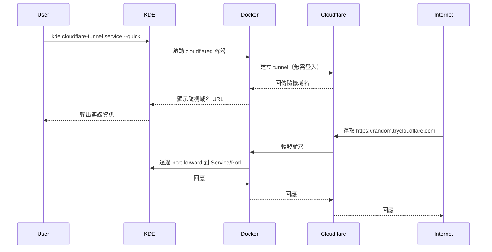
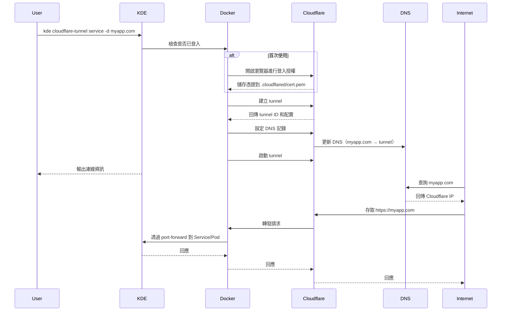

# Cloudflare Tunnel

**透過 Cloudflare Tunnel 建立安全的外部連線，無需開放防火牆端口**

## 核心概念

### 什麼是 Cloudflare Tunnel？

Cloudflare Tunnel（前身為 Argo Tunnel）是一種安全的連線方式，可以讓您的本地服務或 Kubernetes 應用程式透過 Cloudflare 網路對外提供服務，無需開放防火牆端口或設定複雜的網路配置。

### 主要特點

- **安全性**：不需要開放任何入站端口，所有流量透過 Cloudflare 加密傳輸
- **SSL/TLS**：自動提供 SSL 憑證，支援 HTTPS 連線
- **自訂域名**：支援使用自己的域名（需託管在 Cloudflare）
- **快速模式**：支援不需要登入的快速測試模式（隨機域名）
- **零配置**：自動處理 DNS 設定和憑證管理

### 兩種使用模式

| 模式 | 說明 | 優點 | 缺點 | 適用場景 |
|------|------|------|------|----------|
| **快速模式** | 使用 `--quick` 參數，產生隨機域名 | 無需 Cloudflare 帳號、快速啟動 | 隨機域名、連線不持久 | 快速測試、Demo |
| **自訂域名模式** | 使用 `-d` 指定域名 | 自訂域名、連線穩定 | 需要 Cloudflare 帳號和域名 | 正式開發、對外服務 |

## 使用說明

### 基本指令語法

```bash
kde cloudflare-tunnel <target> [options]
```

### Target 類型

#### 1. Service 連線

連接到 Kubernetes 環境中的 Service：

```bash
# 基本用法（互動式選擇）
kde cloudflare-tunnel service

# 使用快速模式（隨機域名）
kde cloudflare-tunnel service --quick

# 使用自訂域名
kde cloudflare-tunnel service -d myapp.example.com

# 完整參數指定
kde cloudflare-tunnel service \
    -d myapp.example.com \
    -n my-namespace \
    -s my-service \
    -p 8080
```

**執行流程**：
1. 系統會提示選擇 namespace（若未指定）
2. 系統會提示選擇 service（若未指定）
3. 系統會提示選擇 port（若未指定）
4. 建立 tunnel 並啟動連線

#### 2. Pod 連線

連接到 Kubernetes 環境中的特定 Pod：

```bash
# 基本用法（互動式選擇）
kde cloudflare-tunnel pod

# 使用快速模式（隨機域名）
kde cloudflare-tunnel pod --quick

# 使用自訂域名
kde cloudflare-tunnel pod -d myapp.example.com

# 完整參數指定
kde cloudflare-tunnel pod \
    -d myapp.example.com \
    -n my-namespace \
    --pod my-pod-xxx \
    -p 8080
```

#### 3. URL 連線

連接到任意 URL（可以是本地服務或其他網路位置）：

```bash
# 連接到本地服務
kde cloudflare-tunnel url -u http://localhost:8080

# 使用快速模式
kde cloudflare-tunnel url --quick -u http://localhost:8080

# 使用自訂域名
kde cloudflare-tunnel url \
    -d myapp.example.com \
    -u http://localhost:8080

# 連接到內網服務
kde cloudflare-tunnel url \
    -d myapp.example.com \
    -u http://192.168.1.100:3000
```

### 選項說明

| 選項 | 簡寫 | 說明 | 必填 |
|------|------|------|------|
| `--help` | `-h` | 顯示說明 | - |
| `--quick` | `-q` | 使用隨機網址（不需登入） | - |
| `--domain` | `-d` | 自訂域名（需要 Cloudflare 帳號） | 自訂域名模式需要 |
| `--url` | `-u` | 目標 URL 位址 | url target 需要 |
| `--namespace` | `-n` | Namespace 名稱 | - |
| `--service` | `-s` | Service 名稱 | - |
| `--pod` | | Pod 名稱 | - |
| `--port` | `-p` | Port 號碼 | - |
| `--network` | | Docker 網路（預設：當前環境的 Docker 網路） | - |

### 網路模式

使用 `--network` 選項可以指定 Docker 網路：

```bash
# 使用預設網路（當前 K8s 環境的 Docker 網路）
kde cloudflare-tunnel service -d myapp.example.com

# 使用主機網路
kde cloudflare-tunnel url -u http://localhost:8080 --network host

# 使用自訂 Docker 網路
kde cloudflare-tunnel url -u http://app:8080 --network my-docker-network
```

## 使用範例

### 範例 1：快速測試本地服務

```bash
# 1. 啟動本地服務
npm run dev  # 假設在 http://localhost:3000

# 2. 使用快速模式建立 tunnel（不需要 Cloudflare 帳號）
kde cloudflare-tunnel url --quick -u http://localhost:3000

# 輸出範例：
# Starting tunnel forwarding for http://localhost:3000 on docker network host
# 2024-02-05T10:30:45Z INF +--------------------------------------------------------------------------------------------+
# 2024-02-05T10:30:45Z INF |  Your quick Tunnel has been created! Visit it at:                                          |
# 2024-02-05T10:30:45Z INF |  https://random-name-abc123.trycloudflare.com                                             |
# 2024-02-05T10:30:45Z INF +--------------------------------------------------------------------------------------------+

# 3. 在瀏覽器中存取產生的 URL
# https://random-name-abc123.trycloudflare.com
```

### 範例 2：使用自訂域名（需要 Cloudflare 帳號）

```bash
# 1. 首次使用需要登入 Cloudflare
#    執行任何非快速模式指令時，系統會自動提示登入
kde cloudflare-tunnel url -d dev.myapp.com -u http://localhost:3000

# 2. 系統會自動：
#    - 開啟瀏覽器進行 Cloudflare 登入授權
#    - 建立 tunnel
#    - 設定 DNS 記錄
#    - 啟動連線

# 3. 在瀏覽器中存取自訂域名
# https://dev.myapp.com

# 注意：域名必須託管在 Cloudflare 上
```

### 範例 3：連接到 Kubernetes Service

```bash
# 1. 建立 Kubernetes 環境和應用
kde start dev-env kind
kde proj create myapp
kde proj pipeline myapp

# 2. 使用快速模式測試（不需要域名）
kde cloudflare-tunnel service --quick
# 選擇 namespace: myapp
# 選擇 service: myapp
# 選擇 port: 3000
# 產生的 URL: https://random-name-xyz789.trycloudflare.com

# 3. 或使用自訂域名（需要 Cloudflare 帳號）
kde cloudflare-tunnel service -d myapp.example.com
# 選擇 namespace: myapp
# 選擇 service: myapp
# 選擇 port: 3000
# 存取 URL: https://myapp.example.com
```

### 範例 4：連接到特定 Pod

```bash
# 連接到指定的 Pod
kde cloudflare-tunnel pod --quick
# 選擇 namespace: myapp
# 選擇 pod: myapp-deployment-abc123-xyz
# 選擇 port: 8080

# 或使用完整參數
kde cloudflare-tunnel pod \
    --quick \
    -n myapp \
    --pod myapp-deployment-abc123-xyz \
    -p 8080
```

### 範例 5：開發環境完整工作流程

```bash
# 1. 建立開發環境
kde start dev-env kind

# 2. 建立並部署專案
kde proj create nodejs-app
# ... 編輯 build.sh 和 deploy.sh ...
kde proj pipeline nodejs-app

# 3. 使用快速模式建立外部存取（測試用）
kde cloudflare-tunnel service --quick
# 選擇: nodejs-app namespace → nodejs-app service → 3000 port
# 產生 URL: https://random-name.trycloudflare.com
# 分享給團隊成員測試

# 4. 正式開發使用自訂域名
kde cloudflare-tunnel service -d dev.myapp.com
# 選擇: nodejs-app namespace → nodejs-app service → 3000 port
# 穩定 URL: https://dev.myapp.com
```

### 範例 6：連接內網服務

```bash
# 連接到內網的資料庫管理介面
kde cloudflare-tunnel url \
    -d db-admin.myapp.com \
    -u http://192.168.1.100:8080

# 連接到內網的 API 服務
kde cloudflare-tunnel url --quick -u http://10.0.0.50:3000
```

### 範例 7：多域名管理

```bash
# 終端機 1：前端服務
kde cloudflare-tunnel service -d frontend.myapp.com
# 選擇: frontend namespace → frontend-service → 80 port

# 終端機 2：後端 API 服務
kde cloudflare-tunnel service -d api.myapp.com
# 選擇: backend namespace → backend-service → 8080 port

# 終端機 3：管理介面
kde cloudflare-tunnel service -d admin.myapp.com
# 選擇: admin namespace → admin-service → 3000 port
```

## 運作原理

### 快速模式流程



### 自訂域名模式流程



### Service 連線原理

當連接到 Kubernetes Service 時：

```
┌─────────────────────────────────────────────────────────────┐
│                        Internet                              │
│                           │                                  │
│                           ▼                                  │
│                    Cloudflare Network                        │
│                           │                                  │
└───────────────────────────┼──────────────────────────────────┘
                            │
┌───────────────────────────┼──────────────────────────────────┐
│                     本地開發機器                              │
│                           │                                  │
│  ┌────────────────────────┼──────────────────────────────┐  │
│  │  cloudflared container │                              │  │
│  │         ┌──────────────▼──────────────┐              │  │
│  │         │  cloudflared tunnel daemon  │              │  │
│  │         └──────────────┬──────────────┘              │  │
│  │                        │                              │  │
│  │         ┌──────────────▼──────────────┐              │  │
│  │         │  kubectl port-forward       │              │  │
│  │         │  svc/myapp 80:8080          │              │  │
│  │         └──────────────┬──────────────┘              │  │
│  └────────────────────────┼──────────────────────────────┘  │
│                           │                                  │
│  ┌────────────────────────┼──────────────────────────────┐  │
│  │     Kind/K3D 環境      │                              │  │
│  │         ┌──────────────▼──────────────┐              │  │
│  │         │  Service: myapp              │              │  │
│  │         │  Port: 8080                  │              │  │
│  │         └──────────────┬──────────────┘              │  │
│  │                        │                              │  │
│  │         ┌──────────────▼──────────────┐              │  │
│  │         │  Pod: myapp-xxx              │              │  │
│  │         │  Container Port: 8080        │              │  │
│  │         └──────────────────────────────┘              │  │
│  └─────────────────────────────────────────────────────────┘│
└─────────────────────────────────────────────────────────────┘
```

## 配置與管理

### Cloudflare 憑證位置

登入 Cloudflare 後，憑證會儲存在：

```
${KDE_PATH}/.cloudflared/
├── cert.pem              # Cloudflare 登入憑證
├── <domain>.json         # Tunnel 配置檔案（包含 TunnelID）
└── <domain>.yml          # Tunnel 設定檔（ingress 規則）
```

### 查看已建立的 Tunnel

```bash
# 進入部署容器查看 tunnel 列表
kde proj exec deploy

# 列出所有 tunnel
docker run -it --rm \
    -v ${KDE_PATH}/.cloudflared:/etc/cloudflared \
    ${CLOUDFLARE_TUNNEL_PROXY_IMAGE} \
    "cloudflared --no-autoupdate tunnel list"
```

### 刪除 Tunnel

Tunnel 會在容器停止時自動清理。如需手動清理：

```bash
# 停止正在運行的 tunnel
docker stop cloudflared-tunnel-<domain>

# 清理 tunnel 配置檔案
rm -rf ${KDE_PATH}/.cloudflared/<domain>.*
```

### 重新登入 Cloudflare

```bash
# 刪除現有憑證
rm -rf ${KDE_PATH}/.cloudflared

# 下次執行時會自動提示重新登入
kde cloudflare-tunnel url -d myapp.example.com -u http://localhost:3000
```

## 與其他工具比較

### Cloudflare Tunnel vs Ngrok

| 特性 | Cloudflare Tunnel | Ngrok |
|------|-------------------|-------|
| **免費方案** | 無限制使用 | 有連線數和速率限制 |
| **自訂域名** | 支援（需託管在 Cloudflare） | 需付費方案 |
| **SSL 憑證** | 自動提供 | 自動提供 |
| **穩定性** | 非常穩定 | 穩定 |
| **設定複雜度** | 中等（需 Cloudflare 帳號） | 簡單 |
| **快速模式** | 支援隨機域名 | 預設隨機域名 |
| **適用場景** | 長期使用、正式開發 | 快速測試、Demo |

### 使用建議

- **快速測試、Demo**：使用 Cloudflare Tunnel 快速模式或 Ngrok
- **正式開發、團隊協作**：使用 Cloudflare Tunnel 自訂域名模式
- **生產環境**：建議使用 Ingress + LoadBalancer 或 Cloudflare Tunnel
- **臨時展示**：Cloudflare Tunnel 快速模式最方便

## 常見使用場景

### 場景 1：快速分享開發進度

```bash
# 使用快速模式，產生臨時 URL 分享給團隊
kde cloudflare-tunnel service --quick
# 分享產生的 URL: https://random-name.trycloudflare.com
```

### 場景 2：前端開發測試後端 API

```bash
# 終端機 1：啟動後端服務
kde proj pipeline backend-api

# 終端機 2：建立 tunnel 給前端團隊使用
kde cloudflare-tunnel service -d api.dev.myapp.com
# 選擇: backend-api → api-service → 8080
# 前端團隊可以透過 https://api.dev.myapp.com 存取 API
```

### 場景 3：外部測試人員測試

```bash
# 建立穩定的測試環境 URL
kde cloudflare-tunnel service -d test.myapp.com
# 選擇: test-app → test-service → 80
# 測試人員可以透過 https://test.myapp.com 進行測試
```

### 場景 4：Webhook 回調測試

```bash
# 建立 tunnel 接收 webhook
kde cloudflare-tunnel url -d webhook.myapp.com -u http://localhost:3000

# 在第三方服務（如 GitHub、Stripe）設定 webhook URL:
# https://webhook.myapp.com/api/webhook
```

### 場景 5：連接多個微服務

```bash
# 使用不同終端機建立多個 tunnel

# 終端機 1：前端
kde cloudflare-tunnel service -d app.myapp.com
# 選擇: frontend → frontend-service → 80

# 終端機 2：API
kde cloudflare-tunnel service -d api.myapp.com
# 選擇: backend → api-service → 8080

# 終端機 3：管理後台
kde cloudflare-tunnel service -d admin.myapp.com
# 選擇: admin → admin-service → 3000

# 終端機 4：WebSocket 服務
kde cloudflare-tunnel service -d ws.myapp.com
# 選擇: websocket → ws-service → 8081
```

## 故障排除

### 常見問題

#### 1. 無法登入 Cloudflare

**症狀**：執行指令後瀏覽器無法開啟或授權失敗

**解決方法**：
```bash
# 清理現有憑證
rm -rf ${KDE_PATH}/.cloudflared

# 重新執行指令，系統會重新提示登入
kde cloudflare-tunnel url -d myapp.example.com -u http://localhost:3000

# 或手動登入
docker run -it --rm \
    -v ${KDE_PATH}/.cloudflared:/home/nonroot/.cloudflared \
    ${CLOUDFLARE_TUNNEL_PROXY_IMAGE} \
    "cloudflared --no-autoupdate login"
```

#### 2. 域名無法解析

**症狀**：建立 tunnel 成功但無法存取域名

**可能原因**：
- 域名未託管在 Cloudflare
- DNS 記錄尚未傳播（通常需要 1-5 分鐘）
- Cloudflare SSL 設定不正確

**解決方法**：
```bash
# 1. 確認域名是否在 Cloudflare 管理
#    登入 Cloudflare Dashboard 檢查

# 2. 等待 DNS 傳播（通常 1-5 分鐘）
nslookup myapp.example.com

# 3. 檢查 Cloudflare SSL 設定
#    在 Cloudflare Dashboard 中，SSL/TLS 設定應為 "Full" 或 "Full (strict)"

# 4. 使用快速模式測試（排除域名問題）
kde cloudflare-tunnel service --quick
```

#### 3. 連線建立後無法存取服務

**症狀**：Tunnel 建立成功，但存取 URL 時出現錯誤

**可能原因**：
- Service/Pod 未正常運行
- Port 設定錯誤
- 網路配置問題

**解決方法**：
```bash
# 1. 檢查 Service/Pod 狀態
kubectl get svc -A
kubectl get pods -A

# 2. 測試本地連線
kubectl port-forward -n <namespace> svc/<service> 8080:<port>
curl http://localhost:8080

# 3. 檢查 tunnel 日誌
docker logs cloudflared-tunnel-<domain>

# 4. 使用正確的 port
kde cloudflare-tunnel service -d myapp.com -n <namespace> -s <service> -p <正確的port>
```

#### 4. 快速模式無法使用

**症狀**：使用 `--quick` 參數時出現錯誤

**解決方法**：
```bash
# 快速模式不需要登入，檢查網路連線
ping cloudflare.com

# 檢查 Docker 是否正常
docker ps

# 重新執行指令
kde cloudflare-tunnel url --quick -u http://localhost:3000
```

#### 5. Tunnel 容器無法啟動

**症狀**：執行指令後容器啟動失敗

**解決方法**：
```bash
# 1. 檢查 Docker 網路
docker network ls

# 2. 檢查容器日誌
docker logs cloudflared-tunnel-<domain>

# 3. 手動清理舊容器
docker stop cloudflared-tunnel-<domain>
docker rm cloudflared-tunnel-<domain>

# 4. 重新執行
kde cloudflare-tunnel service -d myapp.com
```

### 除錯指令

```bash
# 檢查 Cloudflare 憑證
ls -la ${KDE_PATH}/.cloudflared/

# 查看 tunnel 配置
cat ${KDE_PATH}/.cloudflared/<domain>.yml

# 列出所有 tunnel
docker run -it --rm \
    -v ${KDE_PATH}/.cloudflared:/etc/cloudflared \
    ${CLOUDFLARE_TUNNEL_PROXY_IMAGE} \
    "cloudflared --no-autoupdate tunnel list"

# 查看運行中的 cloudflared 容器
docker ps | grep cloudflared

# 查看 tunnel 日誌
docker logs cloudflared-tunnel-<domain>

# 手動測試 port-forward
kubectl port-forward -n <namespace> svc/<service> 8080:<port>
curl http://localhost:8080

# 檢查 DNS 解析
nslookup myapp.example.com
dig myapp.example.com
```

## Best Practice

### 1. 使用場景選擇

- **開發階段**：使用快速模式 (`--quick`)，無需域名設定
- **測試階段**：使用自訂域名，提供穩定的測試 URL
- **展示階段**：使用自訂域名，專業且易記
- **臨時分享**：使用快速模式，快速產生 URL

### 2. 域名管理

- 使用有意義的子域名，例如：`dev.myapp.com`、`api.myapp.com`、`test.myapp.com`
- 為不同的服務使用不同的子域名
- 避免在生產環境域名下建立開發用 tunnel
- 建議使用獨立的開發用域名

### 3. 安全性考量

- 不要在公開場合分享 tunnel URL（特別是快速模式的隨機域名）
- 使用完畢後立即停止 tunnel（Ctrl+C）
- 定期清理不使用的 tunnel 配置
- 在應用程式層面加入驗證和授權機制
- 快速模式的隨機域名會在容器停止後失效

### 4. 效能優化

- 優先使用 Service 連線而非 Pod 連線（Service 有負載均衡）
- 避免同時建立過多 tunnel
- 監控 tunnel 的流量和延遲
- 對於高流量場景，考慮使用 Ingress + LoadBalancer

### 5. 開發工作流程

```bash
# 1. 本地開發使用快速模式
kde cloudflare-tunnel url --quick -u http://localhost:3000

# 2. 團隊協作使用自訂域名
kde cloudflare-tunnel service -d dev.myapp.com

# 3. 外部測試使用穩定域名
kde cloudflare-tunnel service -d test.myapp.com

# 4. 使用完畢立即停止（Ctrl+C）
```

### 6. 多環境管理

```bash
# 開發環境
kde use dev-env
kde cloudflare-tunnel service -d dev.myapp.com

# 測試環境
kde use test-env
kde cloudflare-tunnel service -d test.myapp.com

# Staging 環境
kde use staging-env
kde cloudflare-tunnel service -d staging.myapp.com
```

## 進階使用

### 自訂網路配置

```bash
# 使用主機網路（適用於連接本地服務）
kde cloudflare-tunnel url \
    -d myapp.com \
    -u http://localhost:8080 \
    --network host

# 使用自訂 Docker 網路（適用於連接其他容器）
kde cloudflare-tunnel url \
    -d myapp.com \
    -u http://my-container:8080 \
    --network my-docker-network
```

### 批次建立多個 Tunnel

```bash
# 建立 script 批次啟動多個 tunnel
cat > start-tunnels.sh <<'EOF'
#!/bin/bash

# 前端
kde cloudflare-tunnel service -d app.myapp.com -n frontend -s frontend-service -p 80 &

# API
kde cloudflare-tunnel service -d api.myapp.com -n backend -s api-service -p 8080 &

# WebSocket
kde cloudflare-tunnel service -d ws.myapp.com -n backend -s ws-service -p 8081 &

# 等待所有背景程序
wait
EOF

chmod +x start-tunnels.sh
./start-tunnels.sh
```

## 與 KDE 其他功能整合

### 與專案管理整合

```bash
# 1. 建立並部署專案
kde proj create myapp
kde proj pipeline myapp

# 2. 建立 tunnel
kde cloudflare-tunnel service -d myapp.example.com
# 選擇: myapp → myapp-service → 3000

# 3. 監控日誌
kde proj tail myapp
```

### 與開發容器整合

```bash
# 1. 進入開發容器
kde proj exec myapp develop 3000

# 2. 在容器內啟動服務
npm run dev

# 3. 在另一個終端機建立 tunnel
kde cloudflare-tunnel url --quick -u http://localhost:3000
```

### 與 Telepresence 整合

```bash
# 1. 使用 Telepresence 攔截流量
kde telepresence intercept myapp myapp-deployment

# 2. 建立 tunnel 對外提供服務
kde cloudflare-tunnel service -d myapp.example.com
# 選擇: myapp → myapp-service → 3000

# 3. 外部請求 → Cloudflare → Service → Telepresence → 本地容器
```

---

**相關文檔**：
- **[Ngrok 工具文檔](./ngrok.md)** - 另一種快速外部存取方案
- **[Telepresence 工具文檔](./telepresence.md)** - 本地開發與 K8s 整合
- **[Port Forward 工具文檔](./port-forward.md)** - 本地端口轉發
- **[專案管理文檔](../project.md)** - 專案部署和管理
