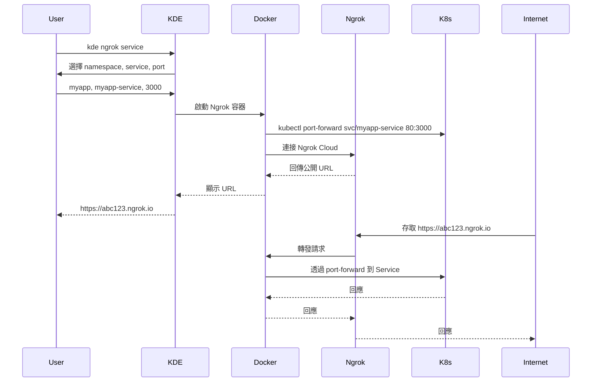

# Ngrok

**透過 Ngrok 快速建立安全的外部連線，無需複雜設定**

## 核心概念

### 什麼是 Ngrok？

Ngrok 是一個流行的內網穿透工具，可以將本地服務快速暴露到公網，提供臨時的公開 URL。在 KDE 中整合 Ngrok，讓您可以輕鬆地將 Kubernetes 環境中的服務分享給外部使用者或進行測試。

**官方資源**：
- [Ngrok 官方網站](https://ngrok.com/)
- [Ngrok 文檔](https://ngrok.com/docs)
- [註冊 Ngrok 帳號](https://dashboard.ngrok.com/signup)（免費方案）

### 主要特點

- **快速啟動**：一行指令即可建立外部連線
- **自動 HTTPS**：自動提供 SSL 加密連線
- **即時 URL**：立即產生可分享的公開 URL
- **無需配置**：不需要設定防火牆或路由
- **KDE 整合**：自動整合當前 Kubernetes 環境

### 使用場景

| 場景 | 說明 |
|------|------|
| **快速 Demo** | 快速產生 URL 給客戶或團隊展示 |
| **Webhook 測試** | 接收第三方服務的 Webhook 回調 |
| **臨時分享** | 暫時分享開發中的應用給測試人員 |
| **外部整合測試** | 測試與外部 API 的整合 |
| **行動裝置測試** | 在手機上測試本地開發的應用 |

### 與 Cloudflare Tunnel 比較

| 特性 | Ngrok | Cloudflare Tunnel |
|------|-------|-------------------|
| **設定複雜度** | 簡單 | 中等 |
| **啟動速度** | 極快 | 快 |
| **自訂域名** | 付費 | 免費（需 Cloudflare 帳號） |
| **URL 穩定性** | 隨機 URL | 自訂域名 |
| **免費方案** | 有限制 | 無限制 |
| **適用場景** | 快速測試、臨時分享 | 長期使用、正式開發 |

**使用建議**：
- **快速測試、Demo**：使用 Ngrok（啟動最快）
- **正式開發、穩定環境**：使用 Cloudflare Tunnel（自訂域名）

## 使用說明

### 前置需求

#### 1. 註冊 Ngrok 帳號並取得 Token

```bash
# 1. 前往 Ngrok 官網註冊
# https://dashboard.ngrok.com/signup

# 2. 登入後取得 Authtoken
# https://dashboard.ngrok.com/get-started/your-authtoken

# 3. 複製 Authtoken（格式類似：2abc...xyz）
```

#### 2. 設定 Ngrok Token

首次使用時，KDE 會提示輸入 Token：

```bash
# 執行任何 ngrok 指令
kde ngrok service

# 提示：請輸入 NGROK_TOKEN: 
# 輸入您的 Token

# Token 會自動儲存到 ngrok.env
# 之後不需要再次輸入
```

或手動設定：

```bash
# 編輯 ngrok.env 檔案
echo "NGROK_TOKEN=your_token_here" >> ngrok.env
```

### 基本指令語法

```bash
kde ngrok <target>
```

### Target 類型

| Target | 說明 | 範例 |
|--------|------|------|
| `ingress` | 連接到環境的 Ingress | `kde ngrok ingress` |
| `service` | 連接到指定的 Service | `kde ngrok service` |
| `pod` | 連接到指定的 Pod | `kde ngrok pod` |
| `[url]` | 連接到自訂 URL | `kde ngrok http://localhost:8080` |

## 使用範例

### 範例 1：快速分享本地服務

```bash
# 1. 啟動本地服務
npm run dev  # 假設在 http://localhost:3000

# 2. 使用 Ngrok 建立外部連線
kde ngrok http://localhost:3000

# 3. Ngrok 會顯示公開 URL
# Forwarding    https://abc123.ngrok.io -> http://localhost:3000
# 
# Session Status    online
# Account           your@email.com (Plan: Free)
# Version           3.x.x
# Region            United States (us)
# Web Interface     http://127.0.0.1:4040

# 4. 分享 URL 給其他人
# https://abc123.ngrok.io

# 5. 停止（按 Ctrl+C）
```

### 範例 2：連接到 Kubernetes Service

```bash
# 1. 建立並部署應用
kde start dev-env kind
kde proj create myapp
kde proj pipeline myapp

# 2. 使用 Ngrok 連接到 Service
kde ngrok service

# 3. 系統會互動式提示：
# 選擇 namespace: myapp
# 選擇 service: myapp-service
# 選擇 port: 3000

# 4. Ngrok 會顯示公開 URL
# Forwarding    https://xyz789.ngrok.io -> http://myapp-service:3000

# 5. 在瀏覽器中存取
# https://xyz789.ngrok.io

# 6. 或分享給團隊成員測試
```

### 範例 3：連接到特定 Pod

```bash
# 1. 使用 Ngrok 連接到 Pod
kde ngrok pod

# 2. 系統會互動式提示：
# 選擇 namespace: myapp
# 選擇 pod: myapp-deployment-abc123-xyz
# 選擇 port: 8080

# 3. Ngrok 會建立連線並顯示 URL
# Forwarding    https://def456.ngrok.io -> http://pod:8080
```

### 範例 4：連接到 Ingress

```bash
# 1. 確保環境有設定 Ingress
kde ngrok ingress

# 2. Ngrok 會連接到環境的 Ingress
# 並顯示公開 URL
```

### 範例 5：Webhook 測試

```bash
# 1. 啟動應用（帶有 Webhook endpoint）
kde proj pipeline webhook-app

# 2. 建立 Ngrok 連線
kde ngrok service
# 選擇 webhook-app service 和 port

# 3. 取得 Ngrok URL
# https://webhook123.ngrok.io

# 4. 在第三方服務（如 GitHub、Stripe）設定 Webhook
# Webhook URL: https://webhook123.ngrok.io/api/webhook

# 5. 觸發 Webhook 測試
# 在應用日誌中查看收到的請求
kde proj tail webhook-app
```

### 範例 6：行動裝置測試

```bash
# 1. 啟動應用
kde proj pipeline mobile-app

# 2. 建立 Ngrok 連線
kde ngrok service
# 選擇 service 和 port

# 3. 取得 URL（例如：https://mobile123.ngrok.io）

# 4. 在手機瀏覽器開啟 URL
# 可以直接在手機上測試應用

# 5. 優勢：
# - 真實裝置測試
# - 測試行動版 UI
# - 測試觸控互動
# - 測試行動網路環境
```

### 範例 7：客戶 Demo

```bash
# 1. 準備 Demo 環境
kde start demo-env kind
kde proj pipeline demo-app

# 2. 建立穩定的 Ngrok 連線
kde ngrok service
# 選擇 demo-app service

# 3. 取得 URL（例如：https://demo789.ngrok.io）

# 4. 在會議前測試 URL

# 5. 會議時分享 URL 給客戶
# 客戶可以直接在瀏覽器中查看

# 6. Demo 結束後停止（Ctrl+C）
```

### 範例 8：多服務同時測試

```bash
# 需要開啟多個終端機

# 終端機 1：前端服務
kde ngrok service
# 選擇 frontend-service
# 取得 URL：https://frontend123.ngrok.io

# 終端機 2：後端 API 服務
kde ngrok service
# 選擇 backend-service
# 取得 URL：https://api456.ngrok.io

# 終端機 3：WebSocket 服務
kde ngrok service
# 選擇 websocket-service
# 取得 URL：https://ws789.ngrok.io

# 可以同時測試多個服務的外部存取
```

### 範例 9：與專案管理整合

```bash
# 完整的開發測試流程

# 1. 開發應用
kde proj exec myapp develop
# 在開發容器中修改程式碼

# 2. 部署到 K8s
kde proj pipeline myapp

# 3. 建立 Ngrok 連線
kde ngrok service
# 選擇 myapp service

# 4. 分享 URL 給測試人員
# https://test123.ngrok.io

# 5. 收到回饋後修改程式碼

# 6. 重新部署
kde proj redeploy myapp

# 7. 測試人員重新測試（URL 保持不變）
# 注意：免費版 URL 會變，付費版可以固定
```

## 運作原理

### 架構圖

```
┌─────────────────────────────────────────────────────────────┐
│                      Internet                                │
│                 https://abc123.ngrok.io                      │
└────────────────────────┬────────────────────────────────────┘
                         │
                         │ Ngrok Cloud
                         │
┌────────────────────────┼────────────────────────────────────┐
│                  本地開發機器                                 │
│                         │                                    │
│  ┌──────────────────────▼──────────────────────────────┐   │
│  │          Ngrok Container                            │   │
│  │  ┌─────────────────────────────────────────────┐   │   │
│  │  │  Ngrok Client                               │   │   │
│  │  │  - 建立加密通道到 Ngrok Cloud                │   │   │
│  │  │  - 轉發外部請求到本地                         │   │   │
│  │  └─────────────────┬───────────────────────────┘   │   │
│  │                    │                                │   │
│  │         kubectl port-forward                        │   │
│  │                    │                                │   │
│  └────────────────────┼────────────────────────────────┘   │
│                       │                                     │
│  ┌────────────────────▼────────────────────────────────┐   │
│  │         Kind/K3D/外部 K8s 環境                       │   │
│  │  ┌─────────────────────────────────────────────┐   │   │
│  │  │  Service/Pod                                │   │   │
│  │  │  Port: 8080                                 │   │   │
│  │  └─────────────────────────────────────────────┘   │   │
│  └─────────────────────────────────────────────────────┘   │
└─────────────────────────────────────────────────────────────┘
```

### Service 連線流程



## Ngrok Web Interface

Ngrok 提供一個本地 Web 介面來監控請求：

```bash
# 啟動 Ngrok 後，預設會在 http://localhost:4040 開啟 Web 介面

# Web 介面功能：
# 1. 查看所有請求和回應
# 2. 查看請求詳細資訊（Headers、Body）
# 3. 重放請求（Replay）
# 4. 查看連線狀態和統計資訊
```

**使用方式**：

```bash
# 1. 啟動 Ngrok
kde ngrok service

# 2. 在瀏覽器開啟 http://localhost:4040
# （如果 Ngrok 在容器中運行，可能需要 port mapping）

# 3. 查看即時的請求流量
# - 每個請求都會顯示在列表中
# - 點選請求查看詳細資訊
# - 可以重放請求進行測試
```

## 配置管理

### Token 儲存位置

```bash
# Token 儲存在 KDE 根目錄
${KDE_PATH}/ngrok.env

# 內容範例：
NGROK_TOKEN=2abc...xyz
```

### 查看已設定的 Token

```bash
# 查看 ngrok.env 檔案
cat ngrok.env

# 或
grep NGROK_TOKEN ngrok.env
```

### 更新 Token

```bash
# 方式 1：編輯 ngrok.env
vi ngrok.env
# 修改 NGROK_TOKEN=new_token

# 方式 2：刪除 ngrok.env 重新設定
rm ngrok.env
kde ngrok service
# 系統會提示重新輸入 Token
```

## 故障排除

### 常見問題

#### 1. 提示需要 Ngrok Token

**症狀**：執行指令後提示輸入 NGROK_TOKEN

**解決方法**：
```bash
# 1. 前往 Ngrok Dashboard 取得 Token
# https://dashboard.ngrok.com/get-started/your-authtoken

# 2. 輸入 Token 或編輯 ngrok.env
echo "NGROK_TOKEN=your_token_here" >> ngrok.env

# 3. 重新執行指令
kde ngrok service
```

#### 2. 連線失敗或無法存取

**症狀**：Ngrok 啟動但無法存取 URL

**可能原因**：
- Service/Pod 未正常運行
- Port 設定錯誤
- Kubernetes 環境問題

**解決方法**：
```bash
# 1. 檢查 Service/Pod 狀態
kubectl get svc -A
kubectl get pods -A

# 2. 測試本地連線
kubectl port-forward -n <namespace> svc/<service> 8080:<port>
curl http://localhost:8080

# 3. 檢查 Ngrok 日誌
# 查看終端機輸出的錯誤訊息

# 4. 使用正確的 port
kde ngrok service
# 確認選擇正確的 port
```

#### 3. Ngrok Token 無效

**症狀**：提示 Token 無效或過期

**解決方法**：
```bash
# 1. 確認 Token 是否正確
cat ngrok.env

# 2. 重新取得 Token
# 登入 https://dashboard.ngrok.com/

# 3. 更新 Token
rm ngrok.env
echo "NGROK_TOKEN=new_token" >> ngrok.env
```

#### 4. 免費方案限制

**症狀**：達到 Ngrok 免費方案限制

**Ngrok 免費方案限制**：
- 每分鐘 40 個連線
- 僅能使用隨機 URL
- 同時只能有 1 個線上 Tunnel

**解決方法**：
```bash
# 1. 等待限制重置（通常 1 分鐘）

# 2. 升級到付費方案
# https://ngrok.com/pricing

# 3. 或使用 Cloudflare Tunnel（無限制）
kde cloudflare-tunnel service
```

#### 5. URL 每次都變動

**症狀**：每次啟動 Ngrok，URL 都不同

**原因**：免費方案使用隨機 URL

**解決方法**：
```bash
# 1. 升級到 Ngrok 付費方案以使用固定域名
# https://ngrok.com/pricing

# 2. 或使用 Cloudflare Tunnel（支援自訂域名）
kde cloudflare-tunnel service -d myapp.example.com
```

### 除錯指令

```bash
# 檢查 Ngrok Token 是否設定
cat ngrok.env | grep NGROK_TOKEN

# 測試 Service 連線
kubectl get svc -A
kubectl get pods -A

# 手動測試 port-forward
kubectl port-forward -n <namespace> svc/<service> 8080:<port>
curl http://localhost:8080

# 查看 Ngrok 容器日誌
docker ps | grep ngrok
docker logs <ngrok_container_id>

# 測試 Ngrok Token 是否有效
docker run --rm -e NGROK_AUTHTOKEN=${NGROK_TOKEN} ngrok/ngrok:latest version
```

## Best Practice

### 1. 使用場景選擇

- **快速測試、Demo**：使用 Ngrok（最快速）
- **Webhook 測試**：使用 Ngrok（即時 URL）
- **長期開發**：使用 Cloudflare Tunnel（自訂域名、無限制）
- **團隊協作**：使用 Cloudflare Tunnel（穩定 URL）

### 2. 安全性考量

```bash
# 1. 不要在公開場合分享 Ngrok URL
# 特別是包含敏感資料的應用

# 2. 使用完畢立即停止 Ngrok（Ctrl+C）

# 3. 在應用層面加入驗證機制
# 例如：Basic Auth、JWT Token

# 4. 監控 Ngrok Web Interface
# http://localhost:4040
# 查看誰在存取您的服務

# 5. 定期更新 Ngrok Token
```

### 3. 效能優化

```bash
# 1. 選擇最近的 Ngrok 區域（付費功能）
# 免費版自動選擇

# 2. 優先連接 Service 而非 Pod
# Service 有負載均衡

# 3. 避免長時間運行 Ngrok
# 只在需要時啟動

# 4. 監控流量和限制
# 注意免費方案的每分鐘 40 連線限制
```

### 4. 開發工作流程

```bash
# 推薦的使用流程

# 1. 本地開發和測試
kde proj exec myapp develop

# 2. 部署到 K8s
kde proj pipeline myapp

# 3. 只在需要外部存取時啟動 Ngrok
kde ngrok service

# 4. 測試完成後立即停止（Ctrl+C）

# 5. 長期開發使用 Cloudflare Tunnel
kde cloudflare-tunnel service -d dev.myapp.com
```

### 5. Token 管理

```bash
# 1. Token 不要加入版控
echo "ngrok.env" >> .gitignore

# 2. 團隊共用 Token（如果需要）
# 可以使用團隊帳號的 Token

# 3. 定期檢查 Token 使用情況
# 登入 https://dashboard.ngrok.com/

# 4. 為不同專案使用不同的 Token（進階用法）
```

## 與 KDE 功能整合

### 與專案管理整合

```bash
# 1. 部署專案
kde proj create myapp
kde proj pipeline myapp

# 2. 建立 Ngrok 連線
kde ngrok service
# 選擇 myapp service

# 3. 分享 URL 進行測試

# 4. 監控日誌
kde proj tail myapp

# 5. 修復問題並重新部署
kde proj redeploy myapp
```

### 與監控工具整合

```bash
# 終端機 1：Ngrok 外部存取
kde ngrok service

# 終端機 2：K9s 監控
kde k9s

# 終端機 3：查看日誌
kde proj tail myapp

# 優勢：
# - 即時監控外部請求
# - 快速發現問題
# - 多視角觀察應用行為
```

### 與環境管理整合

```bash
# Ngrok 自動連接到當前環境

# 開發環境
kde use dev-env
kde ngrok service

# 測試環境
kde use test-env
kde ngrok service

# 每個環境獨立的 Ngrok 連線
```

## 進階使用

### 自訂 Docker 網路

```bash
# 預設 Ngrok 使用 host 網路

# 如果需要使用特定 Docker 網路
# 可以修改 ngrok.sh 中的 DOCKER_NETWORK 參數

# 或在執行時指定
# 參考源碼：ngrok_http_url 函數接受 DOCKER_NETWORK 參數
```

### 多個 Ngrok 實例

```bash
# 可以在不同終端機啟動多個 Ngrok

# 終端機 1：前端
kde ngrok service
# 選擇 frontend service

# 終端機 2：後端
kde ngrok service
# 選擇 backend service

# 終端機 3：WebSocket
kde ngrok service
# 選擇 websocket service

# 注意：免費版每個帳號只能同時運行 1 個 Tunnel
# 需要付費方案才能同時運行多個
```

## Ngrok vs Cloudflare Tunnel 選擇指南

### 使用 Ngrok 的情況

✅ 快速測試和 Demo  
✅ Webhook 開發和測試  
✅ 臨時外部存取需求  
✅ 不需要自訂域名  
✅ 短時間使用（幾分鐘到幾小時）

### 使用 Cloudflare Tunnel 的情況

✅ 長期開發環境  
✅ 需要自訂域名  
✅ 團隊協作共享環境  
✅ 生產環境或 Staging 環境  
✅ 需要穩定的 URL  
✅ 高流量應用（無流量限制）

### 範例場景

```bash
# 場景 1：快速 Demo（使用 Ngrok）
kde ngrok service  # 快速產生 URL

# 場景 2：團隊開發（使用 Cloudflare Tunnel）
kde cloudflare-tunnel service -d dev.team.com  # 穩定的團隊 URL

# 場景 3：Webhook 測試（使用 Ngrok）
kde ngrok service  # 快速取得 Webhook URL

# 場景 4：外部測試環境（使用 Cloudflare Tunnel）
kde cloudflare-tunnel service -d test.myapp.com  # 固定的測試 URL
```

---

**相關文檔**：
- **[Cloudflare Tunnel 文檔](./cloudflare-tunnel.md)** - 安全且穩定的外部存取方案
- **[Port Forward 文檔](./port-forward.md)** - 本地端口轉發
- **[專案管理文檔](../project.md)** - 專案部署和管理
- **[環境管理文檔](../environment/environment-overview.md)** - Kubernetes 環境管理

**外部資源**：
- [Ngrok 官方網站](https://ngrok.com/)
- [Ngrok 文檔](https://ngrok.com/docs)
- [Ngrok Dashboard](https://dashboard.ngrok.com/)
- [Ngrok 定價](https://ngrok.com/pricing)
