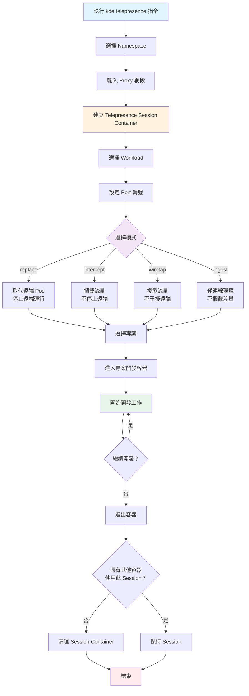

# Telepresence

**透過 Telepresence 將本地開發環境整合到遠端 Kubernetes 集群，實現即時開發與除錯。**

## 核心概念

### 什麼是 Telepresence？

Telepresence 是一個 CNCF 開源專案，允許開發者在本地環境中開發和除錯 Kubernetes 服務，同時與遠端集群中的其他服務互動。

**官方資源**：
- 官方網站：https://www.telepresence.io/
- GitHub：https://github.com/telepresenceio/telepresence
- 文檔：https://www.telepresence.io/docs/latest/

### KDE 中的 Telepresence

KDE-cli 整合了 Telepresence，提供簡化的指令介面，讓開發者可以：

1. **連接遠端 K8s 環境** - 透過容器化的 Telepresence 建立連線
2. **攔截 Pod 流量** - 將遠端 Pod 的流量導向本地開發容器
3. **同步環境變數** - 自動將遠端 Pod 的環境變數同步到本地
4. **整合開發容器** - 與專案的開發容器無縫整合

### 運作原理

```
┌──────────────────────────────────────────────────────────────┐
│                      本地開發機器                              │
│                                                                │
│  ┌─────────────────────────────────────────────────────┐     │
│  │  kde telepresence intercept <namespace> <workload>  │     │
│  └─────────────────────────────────────────────────────┘     │
│                             │                                 │
│                             ▼                                 │
│  ┌──────────────────────────────────────────────────────┐    │
│  │ 1. 建立 Telepresence Session Container               │    │
│  │    - 連接到遠端 K8s                                   │    │
│  │    - 建立網路通道                                     │    │
│  └──────────────────────────────────────────────────────┘    │
│                             │                                 │
│                             ▼                                 │
│  ┌──────────────────────────────────────────────────────┐    │
│  │ 2. 攔截 Pod 流量                                      │    │
│  │    - 在遠端 K8s 注入 Traffic Agent                    │    │
│  │    - 將流量導向本地                                   │    │
│  └──────────────────────────────────────────────────────┘    │
│                             │                                 │
│                             ▼                                 │
│  ┌──────────────────────────────────────────────────────┐    │
│  │ 3. 啟動專案開發容器                                   │    │
│  │    - 使用 Telepresence 網路                           │    │
│  │    - 載入遠端 Pod 的環境變數                          │    │
│  │    - 掛載專案程式碼                                   │    │
│  └──────────────────────────────────────────────────────┘    │
│                             │                                 │
│                             ▼                                 │
│  ┌──────────────────────────────────────────────────────┐    │
│  │ 4. 即時開發                                           │    │
│  │    - 本地修改程式碼                                   │    │
│  │    - 即時測試與除錯                                   │    │
│  │    - 存取遠端 K8s 服務                                │    │
│  └──────────────────────────────────────────────────────┘    │
│                                                                │
└────────────────────────────┬───────────────────────────────────┘
                             │
                             │ 網路通道 + 流量攔截
                             │
┌────────────────────────────▼───────────────────────────────────┐
│                      遠端 Kubernetes 環境                        │
│                                                                  │
│  ┌────────────────────┐  ┌────────────────────┐                │
│  │ Traffic Manager    │  │ 其他服務 Pod        │                │
│  │ (自動部署)         │  │                    │                │
│  └────────────────────┘  └────────────────────┘                │
│                                                                  │
│  ┌────────────────────────────────────────────────────────┐    │
│  │ 攔截的 Pod（注入 Traffic Agent）                        │    │
│  │                                                          │    │
│  │  ┌──────────────┐      ┌──────────────────────┐        │    │
│  │  │ Traffic Agent│ ───► │ 原始 Container        │        │    │
│  │  │              │      │ (依模式決定是否運行)   │        │    │
│  │  └──────────────┘      └──────────────────────┘        │    │
│  │         │                                                │    │
│  │         │ 流量導向本地開發容器                          │    │
│  │         └────────────────────────────────────────►      │    │
│  └────────────────────────────────────────────────────────┘    │
│                                                                  │
└──────────────────────────────────────────────────────────────────┘
```

### 工作模式

KDE-cli 支援四種 Telepresence 工作模式：

| 模式 | 攔截流量 | 停止遠端 Pod | 複製流量 | 適用場景 |
|------|----------|--------------|----------|----------|
| **replace** | ✅ | ✅ | ❌ | 完全取代測試、避免衝突 |
| **intercept** | ✅ | ❌ | ❌ | 部分流量測試、金絲雀部署 |
| **wiretap** | ❌ | ❌ | ✅ | 流量監控、除錯分析 |
| **ingest** | ❌ | ❌ | ❌ | 僅連線環境、存取服務 |

### 與其他開發模式的比較

| 模式 | 環境 | Hot Reload | K8s 功能 | 遠端服務存取 | 適用場景 |
|------|------|------------|----------|--------------|----------|
| **開發容器** | 本地容器 | ✅ | ❌ | ❌ | 快速開發、單元測試 |
| **K8s + PVC 掛載** | Kind/K3D | ✅ | ✅ | ❌ | 整合測試、接近生產環境 |
| **Telepresence** | 遠端 K8s | ✅ | ✅ | ✅ | 遠端整合、生產除錯 |

## 使用說明

### 基本指令語法

```bash
kde telepresence <command> [namespace] [workload]
```

### 連線狀態管理

#### 列出連線狀態

```bash
# 列出指定 namespace 的 Telepresence 連線狀態
kde telepresence list [namespace]

# 互動式選擇 namespace
kde telepresence list
```

**顯示資訊**：
- 可用的 workload 列表
- 當前攔截狀態
- Traffic Agent 狀態

#### 停止所有連線

```bash
# 停止所有 Telepresence Session Container
kde telepresence clear
```

### 工作模式指令

#### Replace 模式（取代遠端 Pod）

```bash
# 取代遠端 Pod，停止遠端 Pod 運行
kde telepresence replace [namespace] [workload]

# 互動式選擇
kde telepresence replace
```

**流程**：
1. 選擇 namespace（如未指定）
2. 輸入要 proxy 的內網網段（CIDR 格式，可選）
3. 建立 Telepresence Session Container
4. 選擇要攔截的 workload
5. 設定 port 轉發（遠端 port → 本地 port）
6. 選擇專案
7. 自動進入專案開發容器

**特點**：
- 遠端 Pod 會停止運行
- 所有流量導向本地
- 適合完全取代測試

#### Intercept 模式（攔截流量）

```bash
# 攔截流量但不停止遠端 Pod
kde telepresence intercept [namespace] [workload]

# 互動式選擇
kde telepresence intercept
```

**特點**：
- 遠端 Pod 繼續運行
- 可選擇性攔截部分流量
- 適合金絲雀部署測試

#### Wiretap 模式（監聽流量）

```bash
# 複製流量但不干擾遠端 Pod
kde telepresence wiretap [namespace] [workload]

# 互動式選擇
kde telepresence wiretap
```

**特點**：
- 不影響遠端 Pod 運行
- 僅複製流量到本地
- 適合流量分析和除錯

#### Ingest 模式（僅連線環境）

```bash
# 僅連線到 K8s 環境，不攔截流量
kde telepresence ingest [namespace] [workload]

# 互動式選擇
kde telepresence ingest
```

**特點**：
- 不攔截流量
- 可存取 K8s 內部服務
- 適合測試服務連線

### 代理管理

#### 卸載 Telepresence 代理

```bash
# 卸載指定 namespace 的所有 Traffic Agent
kde telepresence uninstall [namespace]

# 互動式選擇
kde telepresence uninstall
```

**功能**：
- 移除 Traffic Manager
- 移除所有 Traffic Agent
- 清理注入的資源

### 環境變數配置

#### 設定 Proxy 網段

在執行 Telepresence 指令時，系統會詢問要 proxy 的內網網段：

```bash
請輸入要 Proxy 的內網網段(CIDR)，如果沒有請直接按 Enter:
```

**範例**：
- `10.0.0.0/8` - 私有網段 A
- `172.16.0.0/12` - 私有網段 B
- `192.168.0.0/16` - 私有網段 C
- `10.10.0.0/16` - 特定子網段

**說明**：
- 如果不需要 proxy 額外網段，直接按 Enter
- 設定後會儲存在 `TELEPRESENCE_ALSO_PROXY_CIDR` 環境變數中
- 下次執行會自動使用上次的設定

#### 設定 Traffic Manager Namespace

預設情況下，Telepresence Traffic Manager 會部署在 `ambassador` namespace。如需自訂：

```bash
# 在環境配置中設定
echo "TELEPRESENCE_MANAGER_NAMESPACE=telepresence" >> environments/<env_name>/.env
```

## 使用範例

### 範例 1：連接遠端環境開發

```bash
# 1. 連接到遠端 K8s 環境
kde use prod-env

# 2. 使用 intercept 模式攔截 myapp 服務
kde telepresence intercept myapp myapp-deployment

# 互動流程：
# - 選擇 namespace: myapp
# - 輸入 proxy 網段: 10.0.0.0/8
# - 系統建立 Telepresence Session Container
# - 選擇 workload: myapp-deployment
# - 輸入遠端 Port: 8080
# - 輸入本地 Port: 8080
# - 選擇專案: myapp
# - 自動進入開發容器

# 3. 在開發容器中啟動應用
npm run dev -- --port 8080

# 4. 本地開發
# - 修改程式碼
# - 即時測試
# - 存取遠端 K8s 服務（資料庫、快取等）

# 5. 退出開發容器後，Telepresence Session 自動清理
```

### 範例 2：除錯生產環境問題

```bash
# 使用 wiretap 模式監聽生產流量
kde telepresence wiretap production backend-api

# 在開發容器中：
# - 查看即時請求
# - 分析流量模式
# - 複現問題
# - 不影響生產環境運行
```

### 範例 3：完全取代測試

```bash
# 使用 replace 模式完全取代測試環境的服務
kde telepresence replace test-env api-service

# 適用場景：
# - 測試重大變更
# - 避免新舊版本衝突
# - 完整功能驗證
```

### 範例 4：存取遠端服務

```bash
# 使用 ingest 模式僅連線環境
kde telepresence ingest staging backend

# 在開發容器中可以：
# - 存取遠端資料庫
# - 呼叫內部 API
# - 測試服務連線
# - 不攔截任何流量
```

### 範例 5：查看連線狀態

```bash
# 列出當前連線狀態
kde telepresence list myapp

# 輸出範例：
# Workload          | Status | Intercept
# myapp-deployment  | ready  | intercepted
# myapp-worker      | ready  | -
```

### 範例 6：清理 Telepresence 資源

```bash
# 停止所有 Telepresence 連線
kde telepresence clear

# 卸載 namespace 的 Telepresence 代理
kde telepresence uninstall myapp
```

## 資料持久化

### Telepresence 資料目錄

Telepresence 相關資料會儲存在環境目錄下：

```
environments/<env_name>/.telepresence/
├── logs/                           # Telepresence 日誌
├── env-files/                      # 同步的環境變數
│   └── <namespace>/
│       └── <workload>.env
└── mounts/
    ├── local/<namespace>/          # 本地掛載點
    └── remote/<namespace>/         # 遠端掛載（未使用）
        └── <workload>/
```

### 環境變數同步

攔截 Pod 的環境變數會自動同步到：
```
environments/<env_name>/.telepresence/env-files/<namespace>/<workload>.env
```

這些環境變數會自動載入到開發容器中。

### 查看日誌

```bash
# Telepresence 日誌位置
ls environments/<env_name>/.telepresence/logs/

# 查看日誌
tail -f environments/<env_name>/.telepresence/logs/*.log
```

## 工作流程

### 完整工作流程



### 多專案開發流程

當同一個 namespace 有多個專案需要同時開發時：

```bash
# 1. 建立第一個 Telepresence 連線
kde telepresence intercept myapp api-service
# 進入 api-service 專案的開發容器

# 2. 在另一個終端機，建立第二個連線
kde telepresence intercept myapp worker-service
# 系統檢測到已有 Session Container，直接複用
# 進入 worker-service 專案的開發容器

# 3. 兩個開發容器共用同一個 Telepresence Session
# 4. 當兩個容器都退出後，Session 才會自動清理
```

## 故障排除

### 常見問題

#### 1. Telepresence 連線失敗

**症狀**：
```
telepresence 連線失敗
```

**解決方法**：
```bash
# 1. 檢查 K8s 連線
kubectl get nodes

# 2. 檢查 kubeconfig
echo $KUBECONFIG
cat $KUBECONFIG

# 3. 查看詳細日誌
cat environments/<env_name>/.telepresence/logs/*.log

# 4. 檢查 Traffic Manager 是否正常
kubectl get pods -n ambassador
# 或
kubectl get pods -n ${TELEPRESENCE_MANAGER_NAMESPACE}

# 5. 重新建立連線
kde telepresence clear
kde telepresence intercept
```

#### 2. 無法攔截 Workload

**症狀**：
```
workload 不在 ready 狀態
```

**解決方法**：
```bash
# 1. 檢查 Pod 狀態
kubectl get pods -n <namespace>

# 2. 檢查 Deployment 狀態
kubectl get deployment -n <namespace>

# 3. 確認 workload 名稱正確
kde telepresence list <namespace>

# 4. 檢查是否有權限
kubectl auth can-i get deployments -n <namespace>
```

#### 3. Port 已被佔用

**症狀**：
```
bind: address already in use
```

**解決方法**：
```bash
# 1. 檢查 port 使用情況
lsof -i :<port>

# 2. 使用不同的本地 port
kde telepresence intercept
# 輸入不同的本地 port

# 3. 停止佔用 port 的程序
kill -9 <pid>
```

#### 4. 環境變數未同步

**症狀**：
開發容器中缺少遠端 Pod 的環境變數

**解決方法**：
```bash
# 1. 檢查環境變數檔案
cat environments/<env_name>/.telepresence/env-files/<namespace>/<workload>.env

# 2. 檢查檔案是否被正確掛載
docker exec <container_name> env | grep <VAR_NAME>

# 3. 重新建立連線
kde telepresence clear
kde telepresence intercept <namespace> <workload>
```

#### 5. Session Container 無法啟動

**症狀**：
```
telepresence session container 建立失敗
```

**解決方法**：
```bash
# 1. 檢查 Docker 狀態
docker ps -a | grep telepresence

# 2. 查看容器日誌
docker logs kde-telepresence-session-<env>-<namespace>

# 3. 檢查權限
# Telepresence 需要特權容器權限
# - CAP_NET_ADMIN
# - CAP_SYS_ADMIN
# - /dev/net/tun
# - /dev/fuse

# 4. 清理並重試
docker rm -f $(docker ps -aq -f name=telepresence)
kde telepresence intercept
```

### 除錯指令

```bash
# 查看所有 Telepresence Session Container
docker ps -f name=kde-telepresence-session

# 查看 Session Container 日誌
docker logs kde-telepresence-session-<env>-<namespace>

# 進入 Session Container
docker exec -it kde-telepresence-session-<env>-<namespace> bash

# 在 Session Container 內執行 telepresence 指令
docker exec -it kde-telepresence-session-<env>-<namespace> telepresence list
docker exec -it kde-telepresence-session-<env>-<namespace> telepresence status

# 檢查 Telepresence 相關資源
kubectl get all -n ambassador
kubectl get mutatingwebhookconfigurations | grep telepresence

# 清理 Telepresence 資源
kde telepresence clear
kde telepresence uninstall <namespace>
```

## Best Practice

### 使用建議

1. **選擇適合的模式**
   - **開發階段**：使用 `intercept` 模式，不影響團隊其他成員
   - **測試階段**：使用 `replace` 模式，避免版本衝突
   - **除錯階段**：使用 `wiretap` 模式，監聽問題流量
   - **連線測試**：使用 `ingest` 模式，測試服務可用性

2. **網段設定**
   - 如果需要存取企業內網服務，設定內網 CIDR
   - 避免設定過大的網段，影響效能
   - 使用環境變數 `TELEPRESENCE_ALSO_PROXY_CIDR` 保存設定

3. **資源清理**
   - 開發完成後記得執行 `kde telepresence clear`
   - 定期卸載不需要的 Traffic Agent
   - 監控 Traffic Manager 的資源使用

4. **權限管理**
   - 確保有足夠的 K8s RBAC 權限
   - Traffic Manager 需要 cluster-admin 權限（由管理員安裝）
   - 一般使用者需要 namespace 的 admin 權限

5. **多人協作**
   - 使用 `intercept` 模式避免影響他人
   - 協調 Traffic Manager 的部署
   - 共用 `TELEPRESENCE_MANAGER_NAMESPACE` 設定

### 安全性考量

1. **生產環境使用**
   - 謹慎在生產環境使用 `replace` 模式
   - 優先使用 `wiretap` 或 `ingest` 模式
   - 建立專用的除錯環境

2. **敏感資料**
   - 環境變數會同步到本地，注意保護敏感資訊
   - `.telepresence/` 目錄建議加入 `.gitignore`
   - 定期清理同步的環境變數檔案

3. **網路隔離**
   - 了解 proxy 網段的影響範圍
   - 避免將生產網段暴露到不安全的本地網路
   - 使用 VPN 或專線連接遠端 K8s

### 效能優化

1. **Session 複用**
   - 多個專案可共用同一個 Telepresence Session
   - 系統自動管理 Session 生命週期
   - 避免重複建立 Session

2. **網路優化**
   - 僅 proxy 必要的網段
   - 使用就近的 K8s 集群
   - 監控網路延遲

3. **資源使用**
   - Telepresence Session Container 會佔用資源
   - Traffic Manager 和 Agent 會消耗 K8s 資源
   - 定期清理不需要的連線

## 相關文件

- [KDE-cli 概述](../overview.md) - 了解 KDE-cli 的核心價值與開發模式比較
- [環境管理](../environment/environment-overview.md) - 了解三種開發模式的差異與使用時機
- [專案管理](../project.md) - 了解如何建立和管理專案
- [開發容器](../environment/dev-container.md) - 了解開發容器的使用方式
- [Telepresence 官方文檔](https://www.telepresence.io/docs/latest/) - Telepresence 工具本身的詳細說明
