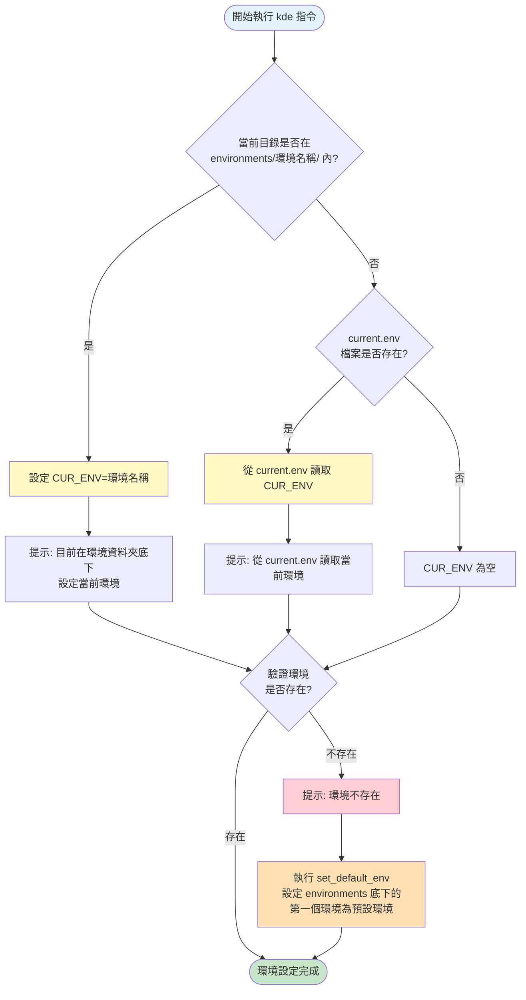

# 環境 (Container、Kubernetes)

環境指的是 Container 及 K8S 環境，KDE-cli 支援多種環境類型，滿足從本地開發到生產部署的完整需求。

## 環境類型

| 類型 | 說明 | 適用場景 |
|------|------|----------|
| **本地 K8S - Kind** | Kubernetes in Docker | 本地開發、完整功能測試 |
| **本地 K8S - K3D** | K3s in Docker | 快速開發、CI/CD、資源受限環境 |
| **雲端 K8S** | EKS、GKE、LKE、AKS | 生產環境、團隊協作 |
| **地端自建 K8S** | On-premises | 企業內部部署 |
| **本地開發容器** | DEVELOP_IMAGE container | 快速開發、單元測試 |

## 環境連接與權限

- 透過 kubeconfig 連結 K8S 環境（存放於 `environments/[環境名稱]/kubeconfig/config`）
- K8S 環境權限基於 K8S RBAC (kubeconfig)

## 環境狀態

環境狀態有三個階段：

```
存在 (Exist) → 初始化 (Init) → 運行 (Running)
```

| 狀態 | 說明 |
|------|------|
| **存在 (Exist)** | 環境目錄已建立，k8s.env 檔案存在 |
| **初始化 (Init)** | kubeconfig 已產生，環境可被使用 |
| **運行 (Running)** | 全部 K8S 節點處於 Ready 狀態，可正常使用 |

## 環境配置

- `environment/[環境名稱]/k8s.env` - 環境共用設定（可進入 git 版控）
- `environment/[環境名稱]/.env` - 環境本地設定（不可進入 git 版控）

## 當前環境判斷

KDE-cli 使用智能化的當前環境判斷機制，自動識別和切換環境：

### 判斷優先順序

1. **目錄位置判斷（最高優先級）**
   - 當你在任何環境的資料夾底下工作時，系統會自動識別並設定為當前環境
   - 例如：在 `environments/dev-env/` 目錄或其子目錄下，自動設定 `CUR_ENV=dev-env`

2. **配置檔案讀取（次優先級）**
   - 如果不在環境目錄下，系統會從 `current.env` 檔案讀取上次使用的環境
   - 保持環境狀態的持久性

3. **環境有效性驗證**
   - 判斷識別出的環境是否`存在`
   - 如果環境不存在，自動進入預設環境設定流程

### 運作流程



### 使用範例

```bash
# 範例 1：透過目錄自動切換環境
cd ~/workspace/environments/dev-env
kde cur  # 自動使用 dev-env 環境
# 輸出：目前在 dev-env 環境資料夾底下，設定當前環境為 dev-env

# 範例 2：在專案目錄下工作
cd ~/kde/environments/prod-env/namespaces/myapp
kde proj ls  # 自動使用 prod-env 環境

# 範例 3：在環境外使用上次的環境
cd ~/workspace
kde cur  # 使用 current.env 記錄的環境
# 輸出：從 current.env 檔案中讀取當前環境為 dev-env
```
---

## 開發模式

KDE-cli 支援三種開發模式，適應不同的開發場景：

### 模式比較

| 模式 | 環境 | Hot Reload | K8s 功能 | 適用場景 |
|------|------|------------|----------|----------|
| **開發容器模式** | 本地容器 | ✅ | ❌ | 快速開發、單元測試 |
| **K8s + PVC 掛載模式** | Kind/K3D | ✅ | ✅ | 整合測試、接近生產環境 |
| **Telepresence 模式** | 遠端 K8s | ✅ | ✅ | 連接遠端服務、生產環境除錯 |

### 模式 1：開發容器模式

透過 `DEVELOP_IMAGE` 啟動容器，自動掛載專案資料夾。

```bash
kde proj exec <project-name> develop [port]
```

**特點**：
- 自動把 project 資料夾掛載進入 container
- 載入 project.env 和 .env 的環境變數
- 快速啟動，不需要 K8s 環境

**適用場景**：快速開發、單元測試、不需要 K8s 功能

### 模式 2：K8s + PVC 掛載模式（Hot Reload）

透過 K8s YAML 或 Helm 部署應用到 K8s，使用 `local-path-provisioner` 將 source code 掛載到 Pod 內，實現即時開發。

**架構圖**：

```
┌─────────────────────────────────────────────────────────┐
│                  本地開發機器                            │
│  ┌─────────────────────────────────────────────────┐   │
│  │  environments/<env>/namespaces/<project>/       │   │
│  │  └── source-code/  ← 開發者編輯的程式碼           │   │
│  └─────────────────────────────────────────────────┘   │
│                         │                               │
│                         │ local-path-provisioner        │
│                         │ (PVC 自動掛載)                │
│                         ▼                               │
│  ┌─────────────────────────────────────────────────┐   │
│  │              Kind/K3D 環境                       │   │
│  │  ┌─────────────────────────────────────────┐   │   │
│  │  │              Pod                         │   │   │
│  │  │  /app/source-code ← 即時同步             │   │   │
│  │  │                                          │   │   │
│  │  │  檔案變更 → Hot Reload 自動重載          │   │   │
│  │  └─────────────────────────────────────────┘   │   │
│  └─────────────────────────────────────────────────┘   │
└─────────────────────────────────────────────────────────┘
```

**運作原理**：
1. 透過 rancher 的 `local-path-provisioner`，將 `environment/[環境名稱]/namespaces` 資料夾掛載到 local-path-provisioner 的 hostPath (`/opt/local-path-provisioner`)
2. 在 K8s YAML 或 Helm 中建立 PVC，PVC 名稱對應到專案資料夾下的同名資料夾/檔案
3. 本地修改 source code → Pod 內即時同步
4. 應用自動 Hot Reload（需要應用本身支援，如 nodemon、air 等）

**使用流程**：
```bash
# 1. 啟動 Kind/K3D 環境
kde start dev-env kind

# 2. 部署應用（K8s YAML 或 Helm）
kubectl apply -f deployment.yaml
# 或
helm install myapp ./chart

# 3. 修改本地程式碼，Pod 內即時同步
```

**特點**：
- 開發環境與生產環境一致（都在 K8s 內運行）
- 無需重新 build image，即時看到程式碼變更
- 支援真實的 K8s 網路、Service Discovery、ConfigMap 等功能
- local k8s(kind、k3d) 內每個 PVC 名稱都會對應到 project 資料夾底下的一個與 PVC 同名的資料夾或檔案

**適用場景**：整合測試、需要 K8s 功能、接近生產環境的開發

### 模式 3：Telepresence 模式

攔截遠端 K8s Pod 的流量到本地開發容器。

```bash
kde telepresence intercept <namespace> <workload>
```

**特點**：
- 連接到遠端 K8s 環境
- 攔截 Pod 流量到本地
- 環境變數同步

**適用場景**：連接遠端 K8s 開發、需要存取遠端服務、生產環境除錯

---

## 本地 K8S (Kind、K3D)

### 建立

- 透過 Docker 啟動 kind(Kubernetes in Docker)，快速啟動 Kubernetes 環境
- 透過 Docker 啟動 k3d(K3S in Docker)，快速啟動 K3S 環境

### 環境初始化腳本 (init.sh)

Kind 和 K3D 環境支援自動執行初始化腳本，用於在環境啟動後自動安裝額外的 K8s 組件或進行環境配置。

**位置**：`environments/<env_name>/init.sh`

**執行時機**：
- 環境啟動完成後自動執行
- 在 `DEPLOY_IMAGE` 容器環境中執行（預設包含 kubectl、helm、docker 等工具）
- 自動載入環境變數（`kde.env`、`k8s.env`、`.env`）

**使用範例**：
```bash
# 建立環境
kde start dev-env kind

# 建立 init.sh
cat > environments/dev-env/init.sh <<'EOF'
#!/bin/bash
set -e

echo "開始環境初始化..."

# 安裝 Prometheus
helm repo add prometheus-community https://prometheus-community.github.io/helm-charts
helm repo update
helm install prometheus prometheus-community/kube-prometheus-stack \
    --namespace monitoring --create-namespace --wait

# 安裝 Grafana
helm install grafana grafana/grafana \
    --namespace monitoring --create-namespace

# 建立自訂 Namespace
kubectl create namespace production
kubectl create namespace staging

echo "環境初始化完成！"
EOF

# 設定執行權限
chmod +x environments/dev-env/init.sh

# 重新啟動環境（會自動執行 init.sh）
kde restart dev-env
```

**常見使用場景**：
- 安裝監控工具（Prometheus、Grafana）
- 安裝服務網格（Istio、Linkerd）
- 安裝 CI/CD 工具（ArgoCD、Tekton）
- 建立自訂 Namespace 和 RBAC
- 預先部署基礎服務
- 設定資源配額和限制

**除錯**：
```bash
# 手動執行 init.sh
kde proj exec deploy
cd ${ENV_PATH}
bash -x init.sh  # -x 顯示執行過程
```

詳細範例請參考：
- [Kind 環境 - init.sh 範例](./kubernetes/kind.md#範例-7使用-initsh-自動安裝額外組件)
- [K3D 環境 - init.sh 範例](./kubernetes/k3d.md#範例-6使用-initsh-自動安裝額外組件)

### 自訂配置模板

可指定自訂的 kind-config.yaml/k3d-config.yaml 作為 template yaml：

**kind-config.template.yaml 機制**：
- 將自訂 kind 配置檔案放置於 `environments/<env_name>/kind-config.template.yaml`
- 或執行 `kde start <env_name> kind <config_path>` 自動複製為模板
- 系統會使用模板生成最終的 `kind-config.yaml`，支援環境變數替換
- 自訂模板可加入版控，生成的配置檔案建議加入 .gitignore

**k3d-config.template.yaml 機制**：
- 將自訂 k3d 配置檔案放置於 `environments/<env_name>/k3d-config.template.yaml`
- 或執行 `kde start <env_name> k3d <config_path>` 自動複製為模板
- 系統會使用模板生成最終的 `k3d-config.yaml`，支援環境變數替換
- 自訂模板可加入版控，生成的配置檔案建議加入 .gitignore

---

## 遠端 K8S

### 建立

- 透過 Terraform 或 Ansible 建立 Kubernetes
- 透過 kubeconfig 連結 Kubernetes

### 開發

- 使用者可以透過 Telepresence 攔截 Pod 流量，並且連接到本地的容器開發環境
- 讓使用者可以透過本地的容器開發環境即時開發

---

## 本地開發容器 (DEVELOP_IMAGE)

### 建立

- 透過 project.env 設定的 `DEVELOP_IMAGE` 啟動 container

### 開發

- 自動把 project 資料夾掛載進入 container
- 讓使用者可以快速啟動開發環境
- 載入 project.env 和 `[專案資料夾]/.env` 的環境變數

---

## 除錯環境問題

當環境啟動或運作出現問題時，可以啟用除錯模式：

```bash
# 啟用除錯模式查看環境管理指令的執行流程
KDE_DEBUG=true kde start dev-env kind
KDE_DEBUG=true kde stop dev-env
KDE_DEBUG=true kde restart dev-env
```

詳細的除錯說明請參考：
- [概述文檔中的除錯章節](../overview.md#除錯與故障排除)
- [專案管理文檔中的故障排除章節](../project.md#故障排除)

---

## 相關文件

- [KDE-cli 概述](../overview.md) - 核心價值與開發生命週期
- [Kubernetes 環境詳細說明](./kubernetes.md) - Kind、K3D、外部 K8s 詳細說明
- [開發容器詳細說明](./dev-container.md) - 開發容器詳細說明


