# KDE-cli 概述

**KDE-cli 是一個 Kubernetes 開發工作區的統一管理工具，整合完整的開發工具鏈，實現從環境建立到部署的全生命週期管理。**

---

## 整合的工具生態系統

| 分類 | 工具 | 功能 |
|------|------|------|
| **本地 K8s** | Kind, K3D | 快速啟動本地 Kubernetes 環境 |
| **K8s 管理** | K9s | TUI 終端機圖形化操作介面 |
| | Headlamp | Web UI 圖形化管理介面 |
| **開發整合** | 開發容器 | DEVELOP_IMAGE 容器環境 |
| | Kind/K3D + PVC 掛載 | 透過 local-path-provisioner 實現程式碼即時同步 |
| | Telepresence | 遠端 Pod 流量轉接與環境模擬 |
| | code-server | Web UI 的 VSCode 開發環境 |
| | Port Forward | Service/Pod 端口轉發到本地 |
| **對外連線** | Cloudflare Tunnel | 安全的外部連線（自訂域名） |
| | Ngrok | 快速的臨時外部連線 |

---

## 開發生命週期

KDE-cli 支援完整的 Kubernetes 應用開發生命週期：

```
環境建立 ──► 開發 ──► CI/CD Pipeline ──► 監控 ──► 對外存取
```

### 生命週期流程圖

```mermaid
flowchart LR
    subgraph Stage1[環境建立]
        Kind[Kind]
        K3D[K3D]
        ExtK8s[外部 K8s]
    end

    subgraph Stage2[開發]
        DevContainer[開發容器]
        K8sPVC[K8s + PVC 掛載]
        Telepresence[Telepresence]
        CodeServer[code-server]
    end

    subgraph Stage3[CI/CD Pipeline]
        Build[build]
        Test[test]
        Deploy[deploy]
    end

    subgraph Stage4[監控]
        K9s[K9s]
        Headlamp[Headlamp]
    end

    subgraph Stage5[對外存取]
        Ngrok[Ngrok]
        CFTunnel[Cloudflare Tunnel]
        PortFwd[Port Forward]
    end

    Stage1 --> Stage2
    Stage2 --> Stage3
    Stage3 --> Stage4
    Stage4 --> Stage5
```



### 各階段說明

| 階段 | 工具 | 說明 |
|------|------|------|
| **1. 環境建立** | Kind, K3D, 外部 K8s | 建立 Kubernetes 運行環境 |
| **2. 開發** | 開發容器, K8s + PVC 掛載, code-server, Telepresence | 撰寫程式碼、本地測試、Hot Reload |
| **3. CI/CD Pipeline** | build → test → deploy | 建置、測試、部署到 K8s |
| **4. 監控** | K9s, Headlamp | 監控部署後的應用狀態 |
| **5. 對外存取** | Ngrok, Cloudflare Tunnel, Port Forward | 讓外部可以存取服務 |

---

## 開發模式

開發階段支援多種模式，適應不同的開發場景：

### 模式 1：開發容器模式

進入 `DEVELOP_IMAGE` 容器，掛載專案資料夾進行開發。

```bash
kde proj exec <project-name> develop
```

**適用場景**：快速開發、單元測試、不需要 K8s 功能

### 模式 2：K8s + PVC 掛載模式（Hot Reload）

透過 K8s YAML 或 Helm 部署應用到 K8s，使用 `local-path-provisioner` 將 source code 掛載到 Pod 內。

```
┌─────────────────────────────────────────────────────────┐
│                  本地開發機器                             │
│  ┌─────────────────────────────────────────────────┐    │
│  │  environments/<env>/namespaces/<project>/       │    │
│  │  └── source-code/  ← 開發者編輯的程式碼            │    │
│  └─────────────────────────────────────────────────┘    │
│                         │                               │
│                         │ local-path-provisioner        │
│                         │ (PVC 自動掛載)                 │
│                         ▼                               │
│  ┌─────────────────────────────────────────────────┐    │
│  │              Kind/K3D 環境                       │    │
│  │  ┌─────────────────────────────────────────┐    │    │
│  │  │              Pod                        │    │    │
│  │  │  /app/source-code ← 即時同步             │    │    │
│  │  │                                         │    │    │
│  │  │  檔案變更 → Hot Reload 自動重載            │    │    │
│  │  └─────────────────────────────────────────┘    │    │
│  └─────────────────────────────────────────────────┘    │
└─────────────────────────────────────────────────────────┘
```

**流程**：
1. 透過 K8s YAML 或 Helm 部署應用到 K8s
2. PVC 名稱對應到專案資料夾下的同名資料夾/檔案
3. 本地修改 source code → Pod 內即時同步
4. 應用自動 Hot Reload

**適用場景**：接近生產環境的開發、希望開發環境對齊正式環境、需要 K8s 網路/Service Discovery/ConfigMap 等功能

### 模式 3：Telepresence 模式

攔截遠端 K8s Pod 的流量到本地開發容器，並且將專案資料夾掛載進入本地開發容器。

```bash
kde telepresence replace <namespace> <workload>
```

**適用場景**：連接遠端 K8s 開發、需要存取遠端服務

### 模式比較

| 模式 | 環境 | 程式碼即時同步 | K8s 功能 | 適用場景 |
|------|------|------------|----------|----------|
| 開發容器 | 本地容器 | ✅ | ❌ | 快速開發、單元測試 |
| K8s + PVC 掛載 | Kind/K3D | ✅ | ✅ | 整合測試、接近生產環境 |
| Telepresence | 遠端 K8s | ✅ | ✅ | 連接遠端服務、生產環境除錯 |

---

## 核心定位

> **KDE-cli 是一個以 Kubernetes 為目標平台的開發環境與交付流程管理工具**

它的價值不只是單一工具，而是：

1. **工具整合平台** - 將 9+ 種工具統一在一個 CLI
2. **環境抽象層** - 屏蔽本地/雲端 K8s 的差異
3. **配置自動化** - 工具間的連接自動處理
4. **工作流程標準化** - 統一的專案結構和 CI/CD 流程

**一句話總結**：KDE-cli 讓開發者用**一套工具、一個指令介面**完成從環境建立、開發、測試到部署的完整 Kubernetes 開發流程。

---

## 除錯與故障排除

### 啟用除錯模式

當遇到問題時，可以啟用除錯模式來追蹤 KDE CLI 的執行流程：

```bash
# 方式 1：在指令前加上環境變數
KDE_DEBUG=true kde start dev-env kind
KDE_DEBUG=true kde proj pipeline myapp

# 方式 2：在 kde.env 中永久啟用（用於持續除錯）
echo "KDE_DEBUG=true" >> kde.env
kde proj pipeline myapp
```

**除錯模式會顯示**：
- KDE CLI 內部執行的每個 shell 命令
- 變數值和函數調用
- 幫助追蹤問題發生在哪個步驟

**注意**：除錯模式會產生大量輸出，建議只在需要時使用。

---

## 相關文件

- [環境管理](./environment.md) - 環境建立與管理詳細說明
- [專案管理](./project.md) - 專案配置與管理詳細說明
- [CI/CD Pipeline](./cicd-pipeline.md) - CI/CD 流程詳細說明
- [開發容器](./environment/dev-container.md) - 開發容器詳細說明
- [Kubernetes 環境](./environment/kubernetes.md) - Kubernetes 環境詳細說明
