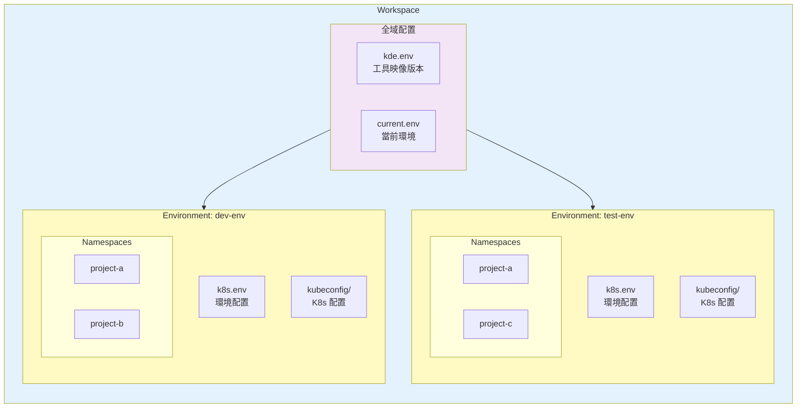
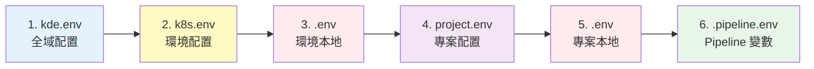

# Workspace（工作空間）

**Workspace（工作空間）是 KDE-cli 的核心組織單位，用來統一管理專案程式碼、CI/CD Pipeline 和 Kubernetes 環境三者之間的關係**

> **💡 名詞說明**  
> **KDE** = **Kubernetes Development Environment** = **Workspace**  
> 
> 這三個名詞指的是同一個概念：
> - **KDE** 是縮寫，代表整個開發環境
> - **Kubernetes Development Environment** 是完整名稱
> - **Workspace（工作空間）** 是實際的組織單位和目錄結構
>
> 在使用上，你可以將它們視為等價的概念。

## 核心概念

### 什麼是 Workspace？

Workspace 是一個目錄結構，用來組織和管理：

1. **環境定義（Environments）**
   - 一個或多個 Kubernetes 集群（本地或遠端）
   - 每個環境有獨立的配置和專案集合
   - 環境之間完全隔離

2. **專案定義（Projects）**
   - 每個專案對應一個 Kubernetes Namespace
   - 專案包含應用程式碼和 CI/CD 腳本
   - 同一專案可以存在於多個環境

3. **CI/CD 流程定義（Pipeline）**
   - 每個專案可定義獨立的 Pipeline 流程
   - 支援自訂階段和執行環境
   - 可版控、可重現、可共享

### Workspace 與環境、專案的關係



### Workspace 的價值

1. **可版控性（Version Control）**
   - 環境配置、專案配置、CICD 流程納入 Git 版本控制
   - 團隊成員共享相同的配置
   - 可追蹤配置變更歷史

2. **可重現性（Reproducibility）**
   - 一行指令啟動完整環境
   - 新成員快速 onboarding
   - 確保團隊環境一致性

3. **可攜性（Portability）**
   - Workspace 可以在不同機器間複製
   - 專案可以在不同環境間複製
   - 支援多人協作開發
   - 環境配置與 CICD 流程一起管理

4. **隔離性（Isolation）**
   - 不同環境完全隔離
   - 專案之間資源隔離 (namespace)
   - 避免環境污染

## Workspace 結構

### 目錄結構

```
workspace/
├── kde.env                      # 全域配置：工具映像版本
├── current.env                  # 當前使用的環境名稱
├── k9s/                         # 全域 K9s 設定目錄
├── environments/                # 所有環境的根目錄
│   ├── dev-env/                 # 開發環境
│   │   ├── k8s.env              # 環境基本配置（版控）
│   │   ├── .env                 # 環境本地配置（不版控）
│   │   ├── kubeconfig/          # K8s 配置目錄
│   │   │   └── config           # K8s 配置檔案
│   │   ├── pki/                 # Kind 集群憑證（不版控）
│   │   ├── kind-config.template.yaml  # Kind 配置模板（版控）
│   │   ├── kind-config.yaml     # Kind 配置檔案（不版控）
│   │   ├── k3d-config.template.yaml   # K3D 配置模板（版控）
│   │   ├── k3d-config.yaml      # K3D 配置檔案（不版控）
│   │   ├── k9s/                 # 此環境的 K9s 設定
│   │   ├── init.sh              # 環境初始化腳本
│   │   └── namespaces/          # 專案目錄
│   │       ├── project-a/       # 專案 A
│   │       │   ├── project.env  # 專案配置（版控）
│   │       │   ├── .env         # 專案本地配置（不版控）
│   │       │   ├── .pipeline.env  # Pipeline 階段間環境變數（自動生成，不版控）
│   │       │   ├── build.sh     # CI 建置腳本
│   │       │   ├── deploy.sh    # CD 部署腳本
│   │       │   ├── undeploy.sh  # 卸載腳本
│   │       │   └── repo/        # Git 倉庫內容
│   │       └── project-b/       # 專案 B
│   │           └── ...
│   ├── test-env/                # 測試環境
│   │   └── ...
│   └── prod-env/                # 生產環境
│       └── ...
```

### 版本控制建議

建議將以下檔案加入 `.gitignore`：

```gitignore
# 環境本地配置
current.env
environments/*/kubeconfig/
environments/*/pki/
environments/*/.env
environments/*/kind-config.yaml
environments/*/k3d-config.yaml

# 專案本地配置
environments/*/namespaces/*/.env
environments/*/namespaces/*/.pipeline.env

# Git 倉庫內容
environments/*/namespaces/*/*/

# PVC 掛載目錄（根據實際情況）
environments/*/namespaces/*/pvc-*/
```

建議納入版本控制的檔案：

```
kde.env                          # 工具映像版本
environments/*/k8s.env           # 環境基本配置
environments/*/kind-config.template.yaml
environments/*/k3d-config.template.yaml
environments/*/init.sh
environments/*/namespaces/*/project.env  # 專案配置
environments/*/namespaces/*/*.sh         # CI/CD 腳本
```

## 配置檔案說明

### 1. kde.env（全域配置）

KDE-cli 的全域配置檔案，定義所有工具使用的 Docker 映像版本。

**位置**：`kde.env`

**用途**：
- 統一管理工具版本
- 確保團隊使用相同的工具
- 方便版本升級和回退

**範例**：
```bash
# Kubernetes 環境映像
KIND_IMAGE=kindest/node:v1.27.3
K3D_IMAGE=rancher/k3s:v1.27.4-k3s1

# 部署環境映像
KDE_DEPLOY_ENV_IMAGE=r82wei/deploy-env:1.0.0

# 監控與管理工具
K9S_IMAGE=derailed/k9s:v0.32.7
K8S_UI_DASHBOARD_IMAGE=kubernetesui/dashboard:v2.7.0
HEADLAMP_IMAGE=ghcr.io/headlamp-k8s/headlamp:v0.24.0

# 開發工具
CODE_SERVER_IMAGE=codercom/code-server:4.23.0
TELEPRESENCE_IMAGE=datawire/telepresence:2.19.0

# 代理工具
NGROK_PROXY_IMAGE=ngrok/ngrok:latest
CLOUDFLARE_TUNNEL_PROXY_IMAGE=cloudflare/cloudflared:latest

# Debug 模式（可選）
# KDE_DEBUG=true  # 啟用後會顯示所有執行的 shell 指令
```

**版本控制**：✅ 建議納入版本控制

### 2. current.env（當前環境）

記錄當前使用的 Kubernetes 環境名稱。

**位置**：`current.env`

**用途**：
- 記錄當前工作環境
- 快速切換環境
- 由 `kde use` 指令自動維護

**範例**：
```bash
CUR_ENV=dev-env
```

**版本控制**：❌ 不建議納入版本控制（每個開發者可能使用不同環境）

### 3. k8s.env（環境配置）

特定 Kubernetes 環境的共用配置檔案。

**位置**：`environments/<env_name>/k8s.env`

**用途**：
- 定義環境基本資訊
- 團隊共享的環境設定
- 環境級別的配置

**範例**：
```bash
# 環境基本資訊
ENV_NAME=dev-env
ENV_TYPE=kind          # kind, k3d, k8s

# Kind/K3D 環境配置
K8S_CONTAINER_NAME=dev-env-control-plane
DOCKER_NETWORK=kde-dev-env

# 儲存類別
STORAGE_CLASS=local-path

# Kubernetes 版本（可選）
K8S_VERSION=v1.27.3
```

**版本控制**：✅ 建議納入版本控制

### 4. .env（環境本地配置）

特定 Kubernetes 環境的本地配置檔案。

**位置**：`environments/<env_name>/.env`

**用途**：
- 個人化的環境設定
- 不應共享的本地配置
- 端口、路徑等本地資訊

**範例**：
```bash
# 本地端口配置
KUBE_API_PORT=6443
INGRESS_HTTP_PORT=80
INGRESS_HTTPS_PORT=443

# 本地 IP
LOCAL_IP=192.168.1.100

# 自訂 DNS
CUSTOM_DNS=8.8.8.8

# PV 掛載路徑（Kind/K3D）
PV_HOST_PATH=/path/to/local/storage
```

**版本控制**：❌ 不建議納入版本控制

### 5. kind-config.template.yaml（Kind 配置模板）

Kind 集群的配置模板檔案，支援環境變數替換。

**位置**：`environments/<env_name>/kind-config.template.yaml`

**用途**：
- 自訂 Kind 集群配置
- 使用環境變數動態生成配置
- 團隊共享的集群配置

**範例**：
```yaml
kind: Cluster
apiVersion: kind.x-k8s.io/v1alpha4
name: ${ENV_NAME}
networking:
  apiServerAddress: "0.0.0.0"
  apiServerPort: ${KUBE_API_PORT:-6443}
nodes:
  - role: control-plane
    kubeadmConfigPatches:
      - |
        kind: InitConfiguration
        nodeRegistration:
          kubeletExtraArgs:
            node-labels: "ingress-ready=true"
    extraPortMappings:
      - containerPort: 80
        hostPort: ${INGRESS_HTTP_PORT:-80}
        protocol: TCP
      - containerPort: 443
        hostPort: ${INGRESS_HTTPS_PORT:-443}
        protocol: TCP
```

**版本控制**：✅ 建議納入版本控制

### 6. kind-config.yaml（Kind 配置檔案）

由模板生成的實際 Kind 配置檔案。

**位置**：`environments/<env_name>/kind-config.yaml`

**用途**：
- Kind 集群實際使用的配置
- 由 `envsubst` 從模板生成
- 每次環境初始化時重新生成

**版本控制**：❌ 不建議納入版本控制

### 7. k3d-config.template.yaml 和 k3d-config.yaml

與 Kind 配置檔案類似，用於 K3D 集群。

**版本控制**：
- `k3d-config.template.yaml`：✅ 建議納入版本控制
- `k3d-config.yaml`：❌ 不建議納入版本控制

### 8. project.env（專案配置）

專案的配置檔案，定義 Git 倉庫、映像、Pipeline 等資訊。

**位置**：`environments/<env_name>/namespaces/<project_name>/project.env`

**用途**：
- Git 倉庫資訊
- 開發/部署環境映像
- Pipeline 配置
- 應用程式配置（非敏感）

**範例**：
```bash
# Git Repository 設定
GIT_REPO_URL=https://github.com/user/myapp.git
GIT_REPO_BRANCH=main

# 容器映像設定
DEVELOP_IMAGE=node:20
DEPLOY_IMAGE=r82wei/deploy-env:1.0.0

# Pipeline 配置
KDE_PIPELINE_STAGES="build,deploy"
KDE_PIPELINE_STAGE_build_SCRIPT=build.sh
KDE_PIPELINE_STAGE_build_IMAGE=${DEVELOP_IMAGE}
KDE_PIPELINE_STAGE_deploy_SCRIPT=deploy.sh
KDE_PIPELINE_STAGE_deploy_IMAGE=${DEPLOY_IMAGE}

# 應用程式配置
APP_PORT=3000
APP_NAME=myapp

# 掛載配置
KDE_MOUNT_SSH=${HOME}/.ssh:${HOME}/.ssh:ro
```

詳細說明請參考：[專案管理文檔](./project.md)

**版本控制**：✅ 建議納入版本控制

### 9. .env（專案本地配置）

專案的本地配置檔案，包含敏感資訊。

**位置**：`environments/<env_name>/namespaces/<project_name>/.env`

**用途**：
- 敏感資訊（密碼、Token）
- 本地開發覆寫
- CI/CD 腳本的本地驅動參數

**範例**：
```bash
# 資料庫密碼
DATABASE_PASSWORD=secret_password

# API Token
API_TOKEN=xxxxxxxxxxxxx

# JWT Secret Key
JWT_SECRET_KEY=xxxxxxxxxxxxxxx

# 本地覆寫
DEBUG=true
LOG_LEVEL=debug
```

**版本控制**：❌ 不建議納入版本控制

### 10. CI/CD 腳本

每個專案可以包含多個 CI/CD 腳本。

**位置**：`environments/<env_name>/namespaces/<project_name>/*.sh`

**常見腳本**：
- `build.sh` - 建置腳本
- `deploy.sh` - 部署腳本
- `undeploy.sh` - 卸載腳本
- 其他自訂階段腳本

詳細說明請參考：
- [CI/CD Pipeline 文檔](./cicd-pipeline.md)
- [專案管理文檔](./project.md)

**版本控制**：✅ 建議納入版本控制

## 環境變數載入順序

KDE-cli 會依序載入以下配置檔案，後載入的變數會覆蓋先前的同名變數：



1. **`${KDE_PATH}/kde.env`** - KDE 系統主配置檔
2. **`${ENVIROMENTS_PATH}/${CUR_ENV}/k8s.env`** - 環境基本配置
3. **`${ENVIROMENTS_PATH}/${CUR_ENV}/.env`** - 環境本地配置
4. **`${PROJECT_PATH}/project.env`** - 專案配置檔
5. **`${PROJECT_PATH}/.env`** - 專案本地配置
6. **`${PROJECT_PATH}/.pipeline.env`** - Pipeline 階段間傳遞的環境變數（執行時自動載入）

**重要說明**：
- 後載入的變數會覆蓋先前的同名變數
- `.env` 檔案中的敏感資訊會覆蓋 `project.env` 中的同名變數
- `.pipeline.env` 是 Pipeline 執行過程中自動生成的，用於階段間傳遞變數

## Workspace 初始化

### 自動環境搜尋機制

KDE-cli 會自動從當前目錄往上搜尋 `kde.env` 檔案，自動定位 Workspace 根目錄。

**優點**：
- 無需手動設定路徑
- 支援在 Workspace 的任意子目錄執行 kde 指令
- 保持操作一致性

**範例**：
```bash
# 在 Workspace 根目錄執行
~/workspace$ kde proj list

# 在專案目錄執行（自動找到 Workspace 根目錄）
~/workspace/environments/dev-env/namespaces/myapp$ kde proj list

# 在環境目錄執行
~/workspace/environments/dev-env$ kde proj list

# 結果相同，都會正確找到 Workspace 根目錄
```

### 建立 Workspace

#### 方法 1：從頭建立

```bash
# 1. 建立 Workspace 目錄
mkdir my-workspace
cd my-workspace

# 2. 執行初始化（會建立 kde.env 和基本結構）
kde init

# 3. 建立第一個環境
kde start dev-env kind
```

#### 方法 2：從現有 Workspace 複製

```bash
# 1. 複製 Workspace（排除不需要的檔案）
git clone https://github.com/org/workspace.git my-workspace
cd my-workspace

# 2. 建立環境（會自動讀取 kde.env）
kde start dev-env kind

# 3. 驗證
kde status
```

## 使用說明

### 環境切換

```bash
# 查看所有環境
kde list
kde ls

# 切換環境（互動式選擇）
kde use

# 切換到指定環境
kde use dev-env

# 查看當前環境
kde current
kde cur
```

### 環境管理

```bash
# 啟動/建立環境
kde start dev-env kind
kde start test-env k3d
kde start prod-env k8s

# 停止環境
kde stop dev-env

# 重啟環境
kde restart dev-env

# 移除環境
kde remove dev-env
kde rm dev-env

# 重置環境
kde reset dev-env
```

### 專案管理

```bash
# 建立專案
kde proj create myapp

# 列出專案
kde proj list
kde proj ls

# 部署專案
kde proj pipeline myapp

# 移除專案
kde proj rm myapp
```

詳細說明請參考：[專案管理文檔](./project.md)

## 使用範例

### 範例 1：團隊協作開發環境

#### 場景
一個團隊需要統一的開發環境，包含 3 個微服務專案。

#### Workspace 結構
```
team-workspace/
├── kde.env                      # 工具映像版本
├── environments/
│   ├── dev-env/                 # 本地開發環境
│   │   ├── k8s.env
│   │   └── namespaces/
│   │       ├── service-a/
│   │       ├── service-b/
│   │       └── service-c/
│   └── staging-env/             # 測試環境
│       ├── k8s.env
│       └── namespaces/
│           ├── service-a/
│           ├── service-b/
│           └── service-c/
```

#### 操作流程

**團隊管理員**：
```bash
# 1. 建立 Workspace
mkdir team-workspace
cd team-workspace

# 2. 初始化
kde init

# 3. 建立開發環境
kde start dev-env kind

# 4. 建立專案
kde proj create service-a
kde proj create service-b
kde proj create service-c

# 5. 配置專案（編輯 project.env、撰寫 CI/CD 腳本）
# ...

# 6. 提交到 Git
git add .
git commit -m "Add dev environment configuration"
git push
```

**團隊成員**：
```bash
# 1. Clone Workspace
git clone https://github.com/team/team-workspace.git
cd team-workspace

# 2. 啟動環境（一行指令）
kde start dev-env kind

# 3. 部署所有服務
kde proj pipeline service-a
kde proj pipeline service-b
kde proj pipeline service-c

# 4. 使用 K9s 監控所有服務
kde k9s

# 5. 開始開發
```

### 範例 2：多環境部署

#### 場景
同一個應用需要部署到開發、測試、生產三個環境。

#### Workspace 結構
```
myapp-workspace/
├── kde.env
├── environments/
│   ├── dev-env/          # 本地開發（Kind）
│   │   ├── k8s.env
│   │   └── namespaces/
│   │       └── myapp/
│   ├── test-env/         # 測試環境（K3D）
│   │   ├── k8s.env
│   │   └── namespaces/
│   │       └── myapp/
│   └── prod-env/         # 生產環境（外部 K8s）
│       ├── k8s.env
│       └── namespaces/
│           └── myapp/
```

#### 操作流程

```bash
# 開發環境（Kind）
kde use dev-env
kde proj pipeline myapp

# 測試環境（K3D）
kde use test-env
kde proj pipeline myapp

# 生產環境（外部 K8s）
kde use prod-env
kde proj pipeline myapp
```

### 範例 3：單環境多專案

#### 場景
本地開發環境中運行多個專案進行整合測試。

#### 操作流程

```bash
# 1. 建立環境
kde start dev-env kind

# 2. 建立多個專案
kde proj create frontend
kde proj create backend
kde proj create database

# 3. 部署所有專案
kde proj pipeline frontend
kde proj pipeline backend
kde proj pipeline database

# 4. 使用 K9s 監控所有服務
kde k9s

# 5. 專案之間可以透過 K8s Service 互相通訊
# frontend 可以存取 backend.backend.svc.cluster.local
# backend 可以存取 database.database.svc.cluster.local
```

### 範例 4：Workspace 配合 Telepresence

#### 場景
連接到遠端 K8s 環境進行本地開發。

#### 操作流程

```bash
# 1. 連接到遠端環境
kde start remote-env k8s
# 提供 kubeconfig 檔案

# 2. 啟動 Telepresence
kde telepresence replace myapp myapp-deployment

# 3. 選擇專案
# 系統會顯示可用的專案列表

# 4. 進入開發環境
# 自動進入開發容器，流量攔截到本地

# 5. 本地開發
npm run dev

# 遠端 K8s 的流量會導向本地開發環境

# 6. 開發完畢關閉流量攔截
# 卸載 Namespace 下所有 Telepresence 的代理程式
kde telepresence uninstall
# 停止所有 Telepresence 的連線
kde telepresence clear
```

## Debug 模式

### 啟用 Debug 模式

當遇到問題時，可以啟用 Debug 模式來追蹤 KDE-cli 的執行流程。

**方法 1：臨時啟用**
```bash
# 在指令前加上環境變數
KDE_DEBUG=true kde start dev-env kind
KDE_DEBUG=true kde proj pipeline myapp
```

**方法 2：在 kde.env 中永久啟用**
```bash
# 編輯 kde.env
echo "KDE_DEBUG=true" >> kde.env

# 之後的所有指令都會顯示除錯資訊
kde proj pipeline myapp
```

**Debug 模式會顯示**：
- KDE CLI 內部執行的每個 shell 命令
- 變數值和函數調用
- 幫助追蹤問題發生在哪個步驟

**注意**：Debug 模式會產生大量輸出，建議只在需要時使用。

## Best Practice

### 1. Workspace 組織原則

**單 Workspace 多環境**（推薦）：
```
workspace/
├── environments/
│   ├── dev-env/      # 本地開發
│   ├── test-env/     # 測試環境
│   └── prod-env/     # 生產環境
```

**優點**：
- 統一管理所有環境
- 便於環境切換
- 共享工具版本配置

**適用場景**：
- 單一產品或應用
- 需要多環境部署

**多 Workspace**：
```
workspace-a/          # For team A
├── environments/
workspace-b/          # For team B
├── environments/
```

**優點**：
- 不同團隊完全隔離，可用 GitHub/Gitlab 權限隔離
- 可使用不同的工具版本

**適用場景**：
- 多個獨立團隊
- 不同團隊需要不同的工具版本

### 2. 環境命名規範

建議使用有意義的環境名稱：

```bash
# 推薦
dev-env
test-env
staging-env
prod-env
local-dev
remote-staging

# 不推薦
env1
env2
test
```

### 3. Git 版本控制策略

**提交到版本控制**：
```
kde.env
environments/*/k8s.env
environments/*/kind-config.template.yaml
environments/*/k3d-config.template.yaml
environments/*/init.sh
environments/*/namespaces/*/project.env
environments/*/namespaces/*/*.sh
```

**不提交到版本控制**：
```
current.env
environments/*/kubeconfig/
environments/*/pki/
environments/*/.env
environments/*/kind-config.yaml
environments/*/k3d-config.yaml
environments/*/namespaces/*/.env
environments/*/namespaces/*/.pipeline.env
environments/*/namespaces/*/*/  # Git 倉庫內容
```

**.gitignore 範例**：
```gitignore
# 環境本地配置
current.env
environments/*/kubeconfig/
environments/*/pki/
environments/*/.env
environments/*/kind-config.yaml
environments/*/k3d-config.yaml

# 專案本地配置
environments/*/namespaces/*/.env
environments/*/namespaces/*/.pipeline.env

# Git 倉庫內容
environments/*/namespaces/*/*/

# PVC 掛載目錄
environments/*/namespaces/*/pvc-*/
```

### 4. 敏感資訊管理

**不要將敏感資訊提交到版本控制**：
- 資料庫密碼
- API Token
- SSH 私鑰
- SSL 憑證私鑰

**建議做法**：
1. 將敏感資訊放在 `.env` 檔案中（不提交）
2. 在 CI/CD 腳本中提示輸入敏感資訊
3. 使用環境變數或 Secret 管理工具

**範例（在 deploy.sh 中）**：
```bash
# 檢查變數是否為空，為空才提示輸入
if [[ -z $DATABASE_PASSWORD ]]; then
    read -sp "請輸入資料庫密碼: " DB_PASSWORD
    echo ""
    echo "DATABASE_PASSWORD=${DB_PASSWORD}" >> .env
    # 重新載入 .env
    source .env
fi
```

### 5. 工具版本管理

**統一管理工具版本**：
- 在 `kde.env` 中定義所有工具的映像版本
- 團隊使用相同的工具版本
- 便於版本升級和回退

**範例**：
```bash
# kde.env
KIND_IMAGE=kindest/node:v1.27.3
K3D_IMAGE=rancher/k3s:v1.27.4-k3s1
KDE_DEPLOY_ENV_IMAGE=r82wei/deploy-env:1.0.0

# 升級 Kind 版本
# 只需修改 KIND_IMAGE，所有環境統一升級
KIND_IMAGE=kindest/node:v1.28.0
```

### 6. 環境配置模板化

使用配置模板（template）實現環境變數替換：

**kind-config.template.yaml**：
```yaml
kind: Cluster
apiVersion: kind.x-k8s.io/v1alpha4
name: ${ENV_NAME}
networking:
  apiServerPort: ${KUBE_API_PORT:-6443}
```

**優點**：
- 模板可以納入版本控制
- 支援環境變數動態配置
- 團隊共享統一配置

### 7. Workspace 備份與恢復

**備份**：
```bash
# 備份配置（排除本地檔案和 Git 倉庫）
tar -czf workspace-backup.tar.gz workspace
```

**恢復**：
```bash
# 解壓縮
tar -xzf workspace-backup.tar.gz

# 進入 workspace
cd workspace

# 重新建立環境
kde start dev-env kind

# 重新部署專案
kde proj pipeline myapp
```

### 8. 團隊協作規範

**新成員 Onboarding**：
```bash
# 1. Clone Workspace
git clone <workspace-repo>
cd workspace

# 2. 啟動環境（一行指令）
kde start dev-env kind

# 3. 部署專案
kde proj pipeline myapp

# 完成！環境已就緒
```

**配置更新流程**：
1. 更新 `kde.env` 或 `k8s.env`
2. 提交到版本控制
3. 團隊成員 pull 最新配置
4. 重新啟動環境：`kde restart`

**專案更新流程**：
1. 更新 `project.env` 或 CI/CD 腳本
2. 提交到版本控制
3. 團隊成員 pull 最新配置
4. 重新部署專案：`kde proj pipeline myapp`

## 故障排除

### 常見問題

#### 1. 找不到 Workspace

**問題**：執行 `kde` 指令時提示找不到 `kde.env`

**原因**：當前目錄及其父目錄中沒有 `kde.env` 檔案

**解決方法**：
```bash
# 檢查當前目錄
ls kde.env

# 如果不存在，往上查找或建立新 Workspace
cd ..
ls kde.env

# 或建立新 Workspace
kde init
```

#### 2. 環境切換失敗

**問題**：`kde use` 切換環境後仍然使用舊環境

**原因**：`current.env` 未正確更新

**解決方法**：
```bash
# 檢查 current.env
cat current.env

# 手動修正
echo "CUR_ENV=dev-env" > current.env

# 或重新切換
kde use dev-env
```

#### 3. 環境變數未生效

**問題**：在 `project.env` 中設定的變數在 Pipeline 中無法使用

**原因**：環境變數載入順序或變數被覆蓋

**解決方法**：
```bash
# 1. 檢查載入順序
# kde.env -> k8s.env -> .env -> project.env -> .env -> .pipeline.env

# 2. 檢查是否被後面的檔案覆蓋
grep "VARIABLE_NAME" environments/*/k8s.env
grep "VARIABLE_NAME" environments/*/.env
grep "VARIABLE_NAME" environments/*/namespaces/*/.env

# 3. 使用 Debug 模式查看
KDE_DEBUG=true kde proj pipeline myapp
```

#### 4. 配置檔案損壞

**問題**：環境配置檔案損壞或格式錯誤

**解決方法**：
```bash
# 1. 從 Git 恢復
git checkout -- environments/dev-env/k8s.env

# 2. 或從備份恢復
tar -xzf workspace-backup.tar.gz

# 3. 或重新建立環境
kde remove dev-env
kde start dev-env kind
```

### 除錯指令

```bash
# 查看當前環境
kde current

# 查看所有環境
kde list

# 查看環境狀態
kde status

# 查看配置檔案
cat kde.env
cat environments/${CUR_ENV}/k8s.env
cat environments/${CUR_ENV}/namespaces/${PROJECT_NAME}/project.env

# 啟用 Debug 模式
KDE_DEBUG=true kde start dev-env kind

# 檢查環境變數
kde proj exec myapp develop
# 在容器內
env | grep KDE
env | sort
```

## 進階主題

### Workspace 共享與發布

將 Workspace 發布到 Git 倉庫，供團隊使用：

```bash
# 1. 建立 Git 倉庫
git init
kde init
kde start dev-env kind
git add .
git commit -m "Initial workspace setup"
git remote add origin <repo-url>
git push -u origin main

# 2. 團隊成員使用
git clone <repo-url>
cd workspace
kde start dev-env kind
```
---

**相關文檔**：
- **[環境管理詳細文檔](./environment/environment-overview.md)** - 環境建立與管理的完整說明
- **[專案管理詳細文檔](./project.md)** - 專案配置與管理的完整說明
- **[CI/CD Pipeline 詳細文檔](./cicd-pipeline.md)** - CI/CD 流程的完整說明
- **[KDE-cli 概述](./overview.md)** - KDE-cli 的整體介紹
