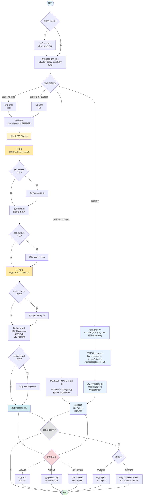

# KDE Workspace 工作流程圖

以下流程圖展示了從啟動環境到部署服務的完整流程：

## 開發流程說明

### 本地 Container 開發流程（DEVELOP_IMAGE）

1. **啟動環境**：使用 `kde project exec <專案名稱> dev <使用的 Port>` 啟動本地 Container 環境（DEVELOP_IMAGE）
2. **本地開發**：進入本地開發容器，支援 Hot Reload 即時測試
3. **對外公開**（可選）：使用 Ngrok 或 Cloudflare Tunnel 對外公開服務

### 本地 K8S 開發流程（kind/k3d）

1. **啟動環境**：使用 `kde start` 啟動本地 K8S 環境（kind 或 k3d）
2. **部署專案**：執行 `kde proj deploy` 部署專案到 K8S
3. **CI/CD Pipeline**：
   - **CI 階段**（使用 `DEVELOP_IMAGE` 或自訂的 `PRE_BUILD_IMAGE`/`BUILD_IMAGE`/`POST_BUILD_IMAGE`）：
     - `pre-build.sh`：CI 前置作業腳本（預設：`DEVELOP_IMAGE`，可自訂：`PRE_BUILD_IMAGE`）
     - `build.sh`：CI 執行腳本，進行編譯/建置（預設：`DEVELOP_IMAGE`，可自訂：`BUILD_IMAGE`）
     - `post-build.sh`：CI 後置作業腳本（預設：`DEVELOP_IMAGE`，可自訂：`POST_BUILD_IMAGE`）
   - **CD 階段**（使用 `DEPLOY_IMAGE` 或自訂的 `PRE_DEPLOY_IMAGE`/`POST_DEPLOY_IMAGE`）：
     - `pre-deploy.sh`：CD 前置作業腳本（預設：`DEPLOY_IMAGE`，可自訂：`PRE_DEPLOY_IMAGE`）
     - `deploy.sh`：CD 執行腳本，進行部署（建立 Namespace、PVC、Helm 部署等）（預設：`DEPLOY_IMAGE`）
     - `post-deploy.sh`：CD 後置作業腳本（預設：`DEPLOY_IMAGE`，可自訂：`POST_DEPLOY_IMAGE`）
4. **服務管理**：使用 K9s、Headlamp 或 Port Forward 管理服務
5. **對外公開**（可選）：使用 Ngrok 或 Cloudflare Tunnel 對外公開服務

### 遠端 K8S 開發流程

1. **連接遠端環境**：使用 `kde start [環境名稱] --k8s` 連接遠端 K8S（需提供 kubeconfig）
2. **使用 Telepresence**：執行 `kde telepresence replace/intercept` 攔截遠端 Pod 流量
3. **本地開發**：進入本地開發容器，流量會攔截到本地開發容器，支援 Hot Reload 即時測試
4. **服務管理與對外公開**：與本地 K8S 流程相同

### 本地 CICD 開發流程（DEPLOY_IMAGE）

1. **啟動環境**：使用 `kde project exec <專案名稱> dep <使用的 Port>` 啟動本地 Container 環境（DEPLOY_IMAGE）
2. **本地開發**：進入本地開發容器，直接執行 CICD script (pre-build.sh、build.sh、post-build.sh、pre-deploy.sh、deploy.sh、post-deploy.sh)

## 相關文件

- [KDE 開發架構說明](./development-architecture.md)
- [透過 Telepresence 擷取遠端 K8S Pod 流量到容器開發環境進行開發](./telepresence.usage.md)
- [使用 Ngrok 建立對外網址](./ngrok.usage.md)
- [使用 Cloudflare Tunnel 建立對外網址](./cloudflare-tunnel.usage.md)
